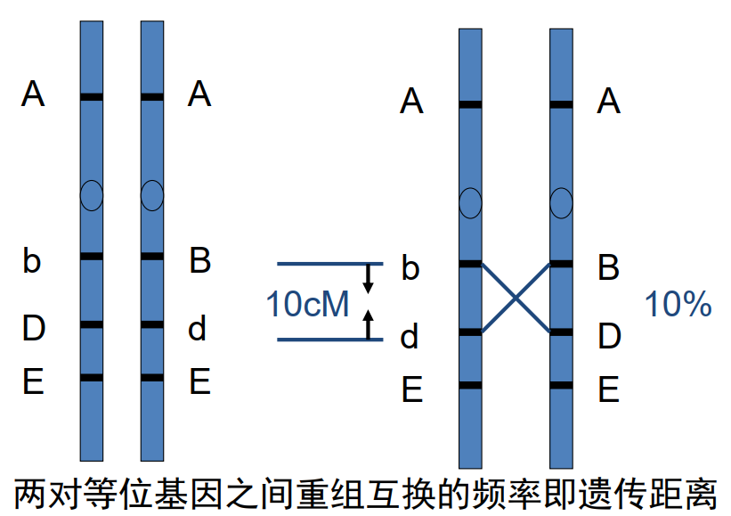
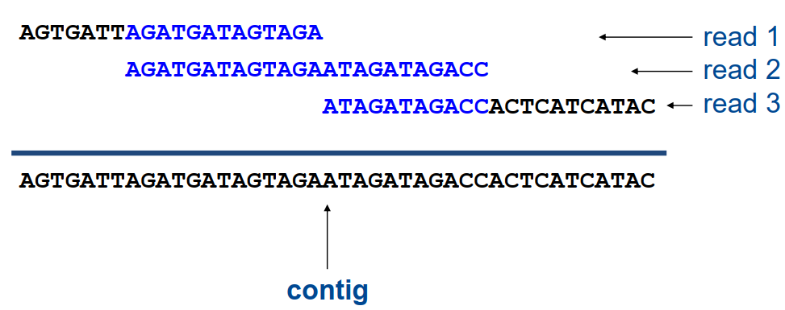
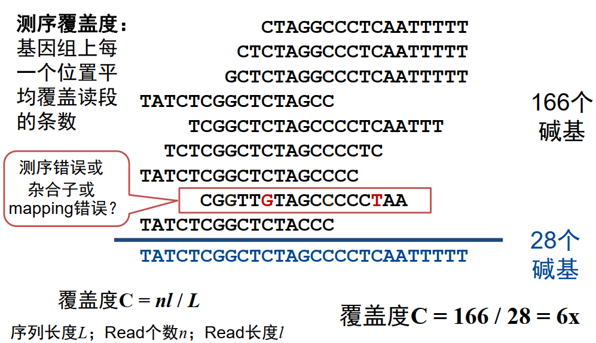
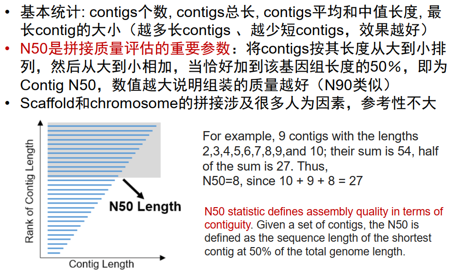
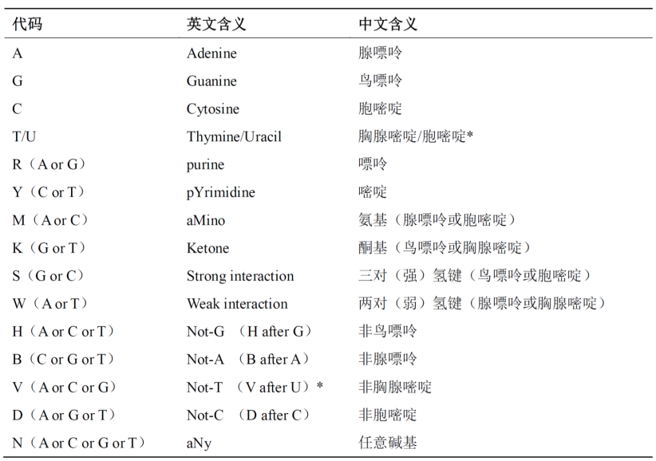

# Ch01 基因组学发展史

## 1.1 基本概念：基因 & 基因组 & 基因组学

- 基因（Gene）：产生一条编码蛋白或RNA产物的核苷酸序列

> A gene is a sequence of nucleotides in DNA or RNA that encodes the synthesis (综合) of a gene product, either RNA or protein.

| 基因组（Genome）     | 书（Book）       |
| -------------------- | ---------------- |
| 染色体（Chromosome） | 章节（Chapter）  |
| 基因（Gene）         | 句子（Sentence） |
| 密码子（Codon）      | 单词（Word）     |
| 碱基（Base）         | 字符（Letter）   |

- 基因组（Genome）：生物体所有遗传物质的总和
  - 核基因组（nuclear）
  - 线粒体基因组（mitochondria）
  - 叶绿体基因组（chloroplast）

> ==A genome is an organism's complete set of DNA (or RNA in RNA viruses).== The genome includes both the genes (the coding regions) and the noncoding DNA, as well as mitochondrial DNA and chloroplast DNA.

- 基因组学（Genomics）：以生物体全部基因为研究对象，研究基因组结构、功能、演化、组装、编辑等方面的交叉学科

> Genomics is an interdisciplinary (多学科/跨学科) field of biology focusing on the structure, function, evolution, mapping, and editing of genomes.

# Ch02 从基因组学到精准医学

## 2.1 人类基因组相关的国际科学计划

| 年份      | 名称                 | 简介                                           |
| --------- | -------------------- | ---------------------------------------------- |
| 1990-2003 | 人类基因组计划       | 测定人类基因组序列                             |
| 2002-2009 | 人类基因组单体型计划 | 构建人类基因组遗传变异目录                     |
| 2003-至今 | DNA元件百科全书      | 建立人类基因组功能元件图谱                     |
| 2005-2018 | 癌症基因组图谱       | 建立多种癌症类型的多维组学数据共享平台         |
| 2006-至今 | 英国生物样本库       | 大规模人群队列的生物医学样本资源库和基因数据库 |
| 2007-2016 | 人类微生物组计划     | 研究人体微生物菌群与人类健康的关系             |
| 2008-2015 | 千人基因组计划       | 建立世界范围内的人类基因组遗传多态性图谱       |
| 2008-2017 | 表观基因组学蓝图计划 | 建立人类参考表观基因组图谱                     |
| 2010-至今 | 人类蛋白质组计划     | 构建人类蛋白质组百科全书                       |
| 2015-至今 | 精准医学计划         | 建立整合基因数据的个性化精准诊疗新模式         |
| 2016-至今 | 人类细胞图谱         | 绘制人类所有细胞类型的位置、功能和特征         |
| 2018-至今 | 人类表型组计划       | 绘制跨尺度、多维度的人类表型组导航图谱         |
| 2019-至今 | 人类泛基因组计划     | 构建高质量的人类参考基因组和人类基因组变异框架 |

# Ch03 基因图谱与测序

## 3.1 遗传图谱和物理图谱

- 遗传图谱（Genetic Map）：又称为连锁图谱（linkage map），指基因或DNA标志在染色体上的相对位置与遗传距离
- 物理图谱（Physical Map）：以定位的DNA标记序列，如STS作为路标，以DNA实际长度，即bp、kb、Mb为图距的基因组图谱
- 序列图谱（Sequence Map）：通过基因组测序得到的，以A、T、C、G为标记单位的基因组DNA序列

> - 遗传标记之间的相对距离，以厘摩（cM，厘摩尔根，centi-Morgan）为单位
>
> 
>
> - STS (Sequence Tagged Site)：序列标签位点
>   - 基因组中长度在200-500bp左右的特异性序列片段
>   - ==基因组中的单拷贝序列，只出现一次==
>   - ==基因组中的位置和序列已知==
>   - 用于构建最为详尽的大基因组物理图谱的主流技术

**遗传图谱和物理图谱的区别：**

|      Map       |   Genetic Map    |  Physical Map  |
| :------------: | :--------------: | :------------: |
|    距离方式    |     相对距离     |    物理距离    |
|    测量原理    | 遗传连锁重组分析 | 分子生物学技术 |
|    距离单位    |        cM        |       bp       |
|     分辨度     |        低        |       高       |
|     精确度     |        低        |       高       |
| 孟德尔遗传信息 |       依赖       |     不依赖     |

## 3.2 一些概念

### 3.2.1 Contigs (重叠群) & Scaffolds (支架)

- A contig (from contiguous) is a set of overlapping DNA segments that together represent a consensus region of DNA. 
- Scaffolds consist of overlapping contigs separated by gaps.

### 3.2.2 测序覆盖度

### 3.2.3 基因组拼接质量评估：Contig N50

## 3.3 核苷酸名称和代码

# Ch04 基因与基因组结构

