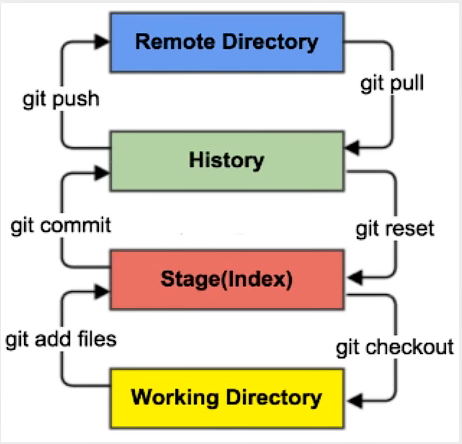

# 分布式版本控制工具：Git

## 1. Git必要配置

- 查看配置文件：

```git bash
git config -l
```

- 查看不同级别的配置文件：

```git bash
# 查看系统配置
git config --system --list

# 查看当前用户（global）配置
git config --global --list
```

- ==设置用户名与邮箱（用户标识，必要）==

🎨当你安装Git后首先要做的事情是设置你的用户名称和e-mail地址。这是非常重要的，因为每次Git提交都会使用该信息。它被永远的嵌入到了你的提交中：

```git bash
git config --global user.name "wpp"  # 名称
git config --global user.email peg2_wu@163.com  # 邮箱
```

## 2. Git工作原理（核心）

Git本地有三个工作区域：工作目录（Working Directory）、暂存区（Stage / Index）、资源库（Repository / Git Directory）。如果再加上远程的git仓库（Remote Directory）就可以分为四个工作区域。文件在这四个区域之间的转换关系如下：



- Workspace：工作区，就是你平时存放项目代码的地方
- Index / Stage：暂存区，用于临时存放你的改动，事实上它只是一个文件，保存即将提交到文件列表信息
- Repository：仓库区（或本地仓库），就是安全存放数据的位置，这里面有你提交到所有版本的数据。其中HEAD指向最新放入仓库的版本
- Remote：远程仓库，托管代码的服务器（==国外Github，国内的Gitee==），可以简单的认为是你项目组中的一台电脑用于远程数据交换


> 工作流程：

git的工作流程一般是这样的：

1. 在工作目录中添加，修改文件
2. 将需要进行版本管理的文件放入暂存区域（`git add .`）==# . 表示全部文件==
3. 将暂存区域的文件提交到git仓库（`git commit`）

因此，git管理的文件有三种状态：已修改（modified），已暂存（staged），已提交（committed）

## 3. Git项目搭建

日常使用只要记住下图6个命令：


> 本地仓库搭建：

创建本地仓库的方法有两种：一种是创建全新的仓库，另一种是克隆远程仓库

1. 创建全新的仓库，需要用Git管理的项目的根目录执行

```git bash
# 在当前目录新建一个Git代码库
git init
```

2. 执行后可以看到，仅仅在项目目录多出了一个.git目录，关于版本等的所有信息都在这个目录里面


> 克隆远程仓库：

1. 另一种方式是克隆远程目录，是将远程服务器上的仓库完全镜像一份至本地！

```git bash
# 克隆一个项目和它的整个代码历史（版本信息）
git clone [url]
```

2. 去gitee或者github上克隆一个测试！

## 4. Git文件操作

> 文件的4中状态

- **Untracked**：未跟踪，此文件在文件夹中，但并没有加入到git库，不参与版本控制。通过`git add`状态变成`Staged`
- **Unmodified**：文件已经入库，未修改，即版本库中的文件快照内容与文件夹中完全一致。这种类型的文件有两种去处，如果它被修改，而变成`Modified`。如果使用`git rm`移出版本库，则成为`Untracked`文件
- **Modified**：文件已经修改，仅仅是修改，并没有进行其它的操作。这个文件也有两个去处，通过`git add`可进入暂存`staged`状态，使用`git checkout`则丢弃修改过，返回到`unmodify`状态，这个`git chekout`即从库中取出文件，覆盖当前修改！
- **Staged**：暂存状态，执行`git commit`则将修改同步到库，这时库中的文件和本地的文件又变为一致，文件为`Unmodify`状态。执行`git reset HEAD filename`取消暂存，文件状态为`Modified`

> 查看文件状态

```git bash
# 查看指定文件状态
git status [filename]

# 查看所有文件状态
git status


# git add .                       添加所有文件到暂存区
# git commit -m "消息内容"         提交暂存区中的内容到本地仓库  -m  提交信息
```

> 忽略文件

有时候我们不想把某些文件纳入版本控制中，比如数据库文件，临时文件，设计文件等

在主目录下建立".gitignore"文件：


## 5. 使用码云

> Github、Gitee，公司中有时候会搭建自己的git服务器（gitlab）

1. 注册登录码云，完善个人信息
2. 设置本机绑定SSH公钥，实现免密码登录！

```git bash
# 进入C:\Users\Administrator\.ssh 目录
# 生成公钥
ssh-keygen
```

3. 将公钥信息public key（id_rsa.pub）添加到码云账户中即可！
4. 使用码云创建一个自己的仓库！

许可证：开源是否可以随意转载，开源但是不能商业使用，......限制！

## 6. IDEA中集成Git

- 将远程克隆的项目文件全部拷贝到项目中即可！

## 7. 说明：Git分支

分支就是科幻电影里面的`平行宇宙`，如果两个平行宇宙互不干扰，那对现在的你也没啥影响。不过，在某个时间点，两个平行宇宙合并了，我们就需要处理一些问题了！

```git bash
# 列出所有本地分支
git branch

# 列出所有远程分支
git branch -r

# 新建一个分支，但依旧停留在当前分支
git branch [branch-name]

# 新建一个分支，并切换到该分支
git checkout -b [branch]

# 合并指定分支到当前分支
git merge [branch]

# 删除分支
git branch -d [branch-name]

# 删除远程分支
git push origin --delete [branch-name]
git branch -dr [remote/branch]
```

- **==主分支、开发用，不同版本的分支......==**
- 如果同一个文件在合并分支时都被修改了则会引起冲突：解决的办法是我们可以修改冲突文件后重新提交！选择保留他的代码还是你的代码！
- master分支比较稳定，用来==**发布新的版本**==，一般情况下不允许在上面工作，工作一般情况下在新建的dev分支上工作（在主分支的基础上进行版本的升级！），工作完成后，比如要发布，或者说dev分支代码稳定后可以合并到主分支master上来

> Gitee上面有很多Git的教程值得学习！
