
<b>📕基因组学 -- Genomics</b>

[[课程链接](https://ngdc.cncb.ac.cn/education/courses/genomics/)]

[TOC]

# Ch01 基因组学发展史

## 1.1 基本概念：基因 & 基因组 & 基因组学

- 基因（Gene）：产生一条编码蛋白或RNA产物的核苷酸序列

> A gene is a sequence of nucleotides in DNA or RNA that encodes the synthesis (综合) of a gene product, either RNA or protein.

| 基因组（Genome）     | 书（Book）       |
| -------------------- | ---------------- |
| 染色体（Chromosome） | 章节（Chapter）  |
| 基因（Gene）         | 句子（Sentence） |
| 密码子（Codon）      | 单词（Word）     |
| 碱基（Base）         | 字符（Letter）   |

- 基因组（Genome）：生物体所有遗传物质的总和
  - 核基因组（nuclear）
  - 线粒体基因组（mitochondria）
  - 叶绿体基因组（chloroplast）

> **A genome is an organism's complete set of DNA (or RNA in RNA viruses).** The genome includes both the genes (the coding regions) and the noncoding DNA, as well as mitochondrial DNA and chloroplast DNA.

- 基因组学（Genomics）：以生物体全部基因为研究对象，研究基因组结构、功能、演化、组装、编辑等方面的交叉学科

> Genomics is an interdisciplinary (多学科/跨学科) field of biology focusing on the structure, function, evolution, mapping, and editing of genomes.

# Ch02 从基因组学到精准医学

## 2.1 人类基因组相关的国际科学计划

| 年份      | 名称                 | 简介                                           |
| --------- | -------------------- | ---------------------------------------------- |
| 1990-2003 | 人类基因组计划       | 测定人类基因组序列                             |
| 2002-2009 | 人类基因组单体型计划 | 构建人类基因组遗传变异目录                     |
| 2003-至今 | DNA元件百科全书      | 建立人类基因组功能元件图谱                     |
| 2005-2018 | 癌症基因组图谱       | 建立多种癌症类型的多维组学数据共享平台         |
| 2006-至今 | 英国生物样本库       | 大规模人群队列的生物医学样本资源库和基因数据库 |
| 2007-2016 | 人类微生物组计划     | 研究人体微生物菌群与人类健康的关系             |
| 2008-2015 | 千人基因组计划       | 建立世界范围内的人类基因组遗传多态性图谱       |
| 2008-2017 | 表观基因组学蓝图计划 | 建立人类参考表观基因组图谱                     |
| 2010-至今 | 人类蛋白质组计划     | 构建人类蛋白质组百科全书                       |
| 2015-至今 | 精准医学计划         | 建立整合基因数据的个性化精准诊疗新模式         |
| 2016-至今 | 人类细胞图谱         | 绘制人类所有细胞类型的位置、功能和特征         |
| 2018-至今 | 人类表型组计划       | 绘制跨尺度、多维度的人类表型组导航图谱         |
| 2019-至今 | 人类泛基因组计划     | 构建高质量的人类参考基因组和人类基因组变异框架 |

# Ch03 基因图谱与测序

## 3.1 遗传图谱和物理图谱

- 遗传图谱（Genetic Map）：又称为连锁图谱（linkage map），指基因或DNA标志在染色体上的相对位置与遗传距离
- 物理图谱（Physical Map）：以定位的DNA标记序列，如STS作为路标，以DNA实际长度，即bp、kb、Mb为图距的基因组图谱
- 序列图谱（Sequence Map）：通过基因组测序得到的，以A、T、C、G为标记单位的基因组DNA序列

> - 遗传标记之间的相对距离，以厘摩（cM，厘摩尔根，centi-Morgan）为单位
>
> 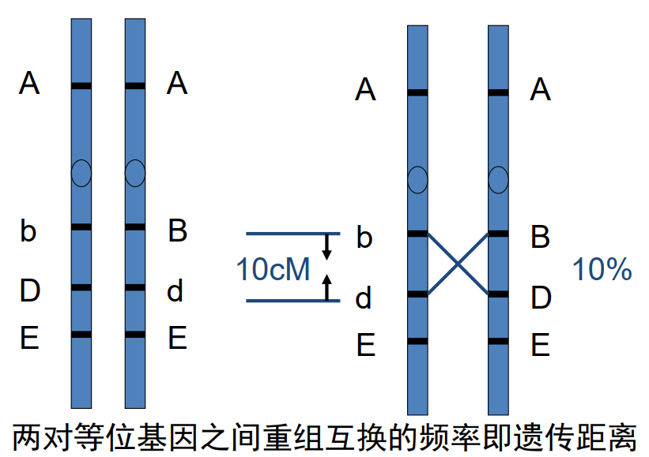
>
> - STS (Sequence Tagged Site)：序列标签位点
>   - 基因组中长度在200-500bp左右的特异性序列片段
>   - **基因组中的单拷贝序列，只出现一次**
>   - **基因组中的位置和序列已知**
>   - 用于构建最为详尽的大基因组物理图谱的主流技术

**遗传图谱和物理图谱的区别：**

|      Map       |   Genetic Map    |  Physical Map  |
| :------------: | :--------------: | :------------: |
|    距离方式    |     相对距离     |    物理距离    |
|    测量原理    | 遗传连锁重组分析 | 分子生物学技术 |
|    距离单位    |        cM        |       bp       |
|     分辨度     |        低        |       高       |
|     精确度     |        低        |       高       |
| 孟德尔遗传信息 |       依赖       |     不依赖     |

## 3.2 一些概念

### 3.2.1 Contigs (重叠群) & Scaffolds (支架)

- A contig (from contiguous) is a set of overlapping DNA segments that together represent a consensus region of DNA. 
- Scaffolds consist of overlapping contigs separated by gaps.

### 3.2.2 测序覆盖度

- 测序覆盖度6x：表示该序列至少被6个reads所覆盖

### 3.2.3 基因组拼接质量评估：Contig N50

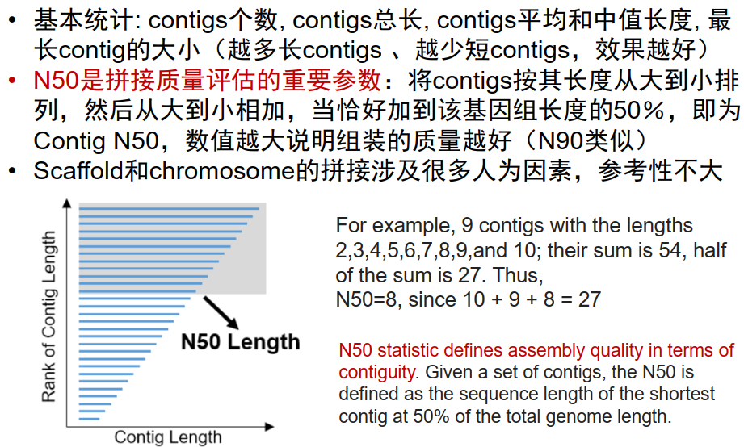

- 拼接质量评估：N50、contig个数、gap数等

## 3.3 核苷酸名称和代码

# Ch04 基因与基因组结构

## 4.1 基因组结构

- 人类基因组是由30亿个碱基（base pair）组成 --> 30亿个碱基 = 3Gbp
- 基因组计量单位：

- 人类染色体编号大体是按照DNA从大到小进行排序
- 人类的基因个数介于鸡和葡萄之间，约22000左右（protein coding genes）

### 4.1.1 病毒基因组

### 4.1.2 原核生物基因组

原核生物 = 细菌 + 古细菌

- 基因组大小和基因数目远少于真核生物
- 基因组结构
  - 基因组紧凑
  - 基因连续编码，不含内含子
  - 极少出现重复序列
  - 重复基因数量也远小于真核生物
- 遗传物质
  - 染色体：大多数为环状DNA，位于细菌核质区，包含细菌生存的必须基因，只有一个复制起始点，大多数只含有单条染色体
  - 质粒：也是双链环状DNA，能在同种或异种细菌中转移，是附加遗传物质
- 原核生物基因组大小和GC含量的大致关系：

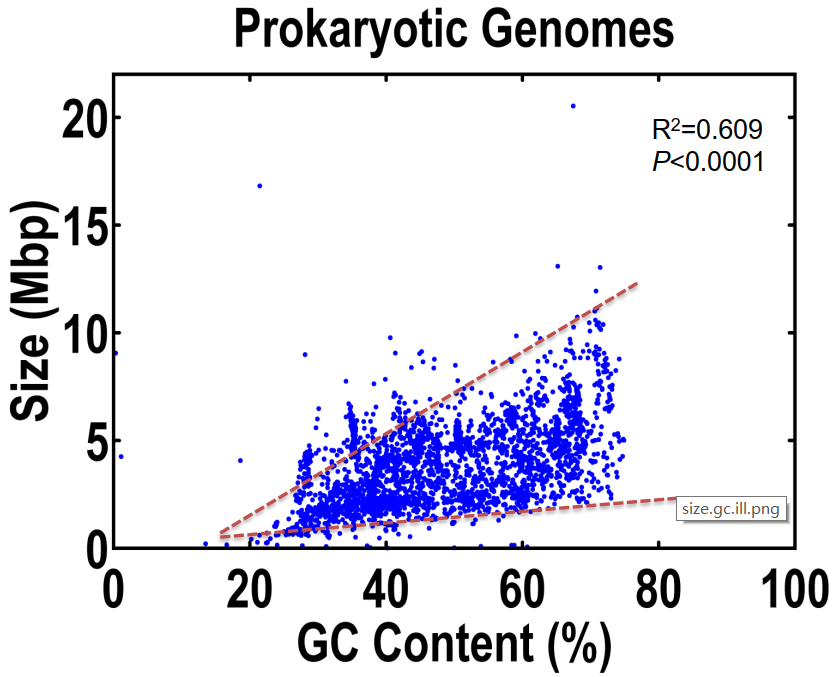

从上图可以看出，GC含量比较低时，基因组大小的变化浮动比较小。

### 4.1.3 真核生物基因组

真核生物：动物、植物、真菌、原生生物

- 真核生物基因组
  - 动物：核基因组 + 线粒体基因组
  - 植物：核基因组 + 叶绿体基因组
- *1pg = 978Mbp ≈ 1Gbp*
- **C值：一个单倍体基因组的DNA质量**
- **C值悖论：高等生物的C值及其生物复杂性之间没有严格的对应关系，在生物界中广泛存在**

## 4.2 基因结构

### 4.2.1 原核生物

- 基因连续紧凑，基因间很少有间隔
- 有利于原核生物基因组的快速复制与繁殖

### 4.2.2 真核生物

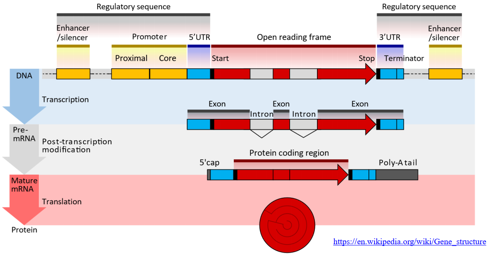

- 蛋白质编码基因非连续排布，由外显子和内含子组合而成且需后续加工
- 多样性体现在基因的多层次调控修饰，形成复杂多样的转录调控机制

## 4.3 CpG island

- CpG island：a region with high frequency of CpG sites
- CpG岛主要位于基因的启动子和外显子区域
- **正常细胞的CpG岛由于被保护而处于非甲基化状态**
- **在癌症中，基因表达往往受到抑制，主要通过甲基化启动子区的CpG岛**

# Ch05 基因组变异

概要：

- 自然变异
  - 基因组（Whole genome duplication）
  - 染色体（Chromosome abnormality）
  - 基因（Gene gain and loss）
  - 碱基（Point mutation）
- 人工变异
  - 基因编辑（Gene editing）

## 5.1 全基因组复制：整倍体基因组加倍

- 染色体组：一组完整的非同源染色体，在形态和功能上各不相同且互相协助，携带者控制生物生长、发育、遗传和变异的全部信息
- 整倍体变异：以染色体组（全部染色体）为单位进行复制或减少
- 多倍体：具有三个或三个以上染色体组的整倍体
  - 同源多倍体：增加的染色体组来自同一物种
  - 异源多倍体：增加的染色体来自不同物种，**生物进化、新物种形成的重要因素**
- 全基因组复制：又称为古多倍体，发生在古时期的基因组成倍复制

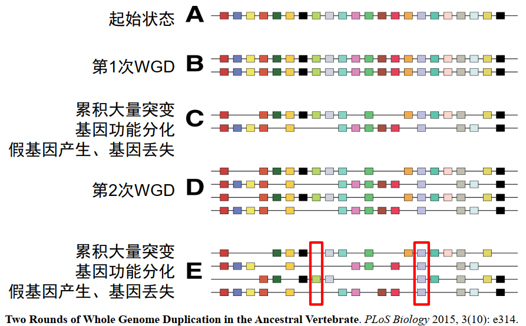

> Video：[同源染色体 & 染色体组](https://www.bilibili.com/video/BV1pv41167Ar/?spm_id_from=333.337.search-card.all.click)

## 5.2 染色体变异和异常

- 数量变异：非整倍体/异倍体变异，染色体组非成倍增加或减少，只增加或减少一条或几条，如21三体综合征、唐氏综合症等
  - 缺失：染色体数目减少
  - 增加：染色体数目增加
- 结构变异
  - 拷贝数变异
    - 插入（Insertion）
    - 缺失（Deletion）
    - 重复（Duplication）
  - 倒位（Inversion）：臂内倒位、臂间倒位，如慢性粒细胞白血病（9q <--> 22q）
  - 易位（Translocation）：如精神分裂症

## 5.3 基因层面：基因复制和重复序列

- 基因家族：来源于同一个祖先，通过**复制**而产生两个或更多的拷贝而构成的一组同源基因
- 复制类型：基因复制、基因家族复制
- 家族成员：经过`突变`和`分化`，在结构和功能上具有明显的相似性，各自具有不同的表达调控模式
- 染色体位置：分散在同一染色体的不同位置，或者存在于不同染色体上
- **同源基因（Homolog）：具有一个共同祖先的多个基因**
- 直系同源基因（Ortholog）：由**`物种分化`**所产生的同源基因 👉 *不同物种！直系同源基因功能相同或相近！*
- 旁系同源基因（Paralog）：由同一物种内的**`基因复制`**而产生的同源基因 👉 *同一物种！旁系同源基因会随着时间的推移在序列组成和功能上可能变得不同！*

- 简单序列重复与人类疾病：亨廷顿舞蹈症（由发生扩增的三核苷酸重复序列CAG引起）

## 5.4 点突变

突变类型：

- 替换：转换和颠换
- 插入
- 删除
- 倒位

>扩展：标准遗传密码表二分法和四分法
>
>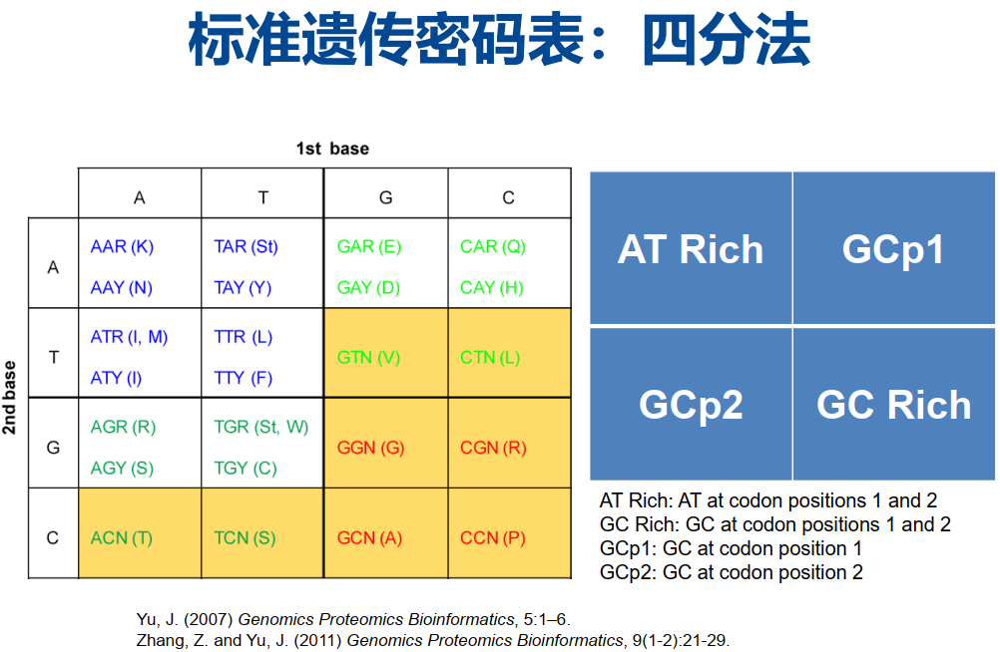
>
>
>
>:star:**GC Rich区域的密码子，最后一个碱基的改变不会影响编码的氨基酸~**:star:

## 5.5 基因编辑👨‍🎓

- 基因编辑或称基因组编辑，是指在活体基因组特定位置中进行DNA片段插入、删除、修改或替换的一项技术，在基因研究，基因治疗、遗传改良等方面展示出了巨大的潜力

### 5.5.1 CRISPR / Cas9🥇

- CRISPR / Cas9是原核生物的一种天然免疫系统

> Video：[CRISPR / Cas9](https://www.bilibili.com/video/BV1QD4y1Q7HT/?spm_id_from=333.337.search-card.all.click)
>
> Read：[CRISPR / Cas9](https://mp.weixin.qq.com/s?__biz=MzUzMjE2ODkxOA==&mid=2247490541&idx=1&sn=1db981f771aab1bf6ff57f070d35f468&chksm=fab63254cdc1bb4243bd7e781027a571dd3a76f2355e38eff36b5bd2635ad5636e8ea9fe914c&token=1724268749&lang=zh_CN#rd)

# Ch06 基因组注释

- 基因组注释（Genome annotation）：利用生物信息学方法和工具，对基因组所有基因的生物学功能进行高通量注释，是当前功能基因组学研究的一个热点
  - **结构注释：基因位置及其结构等**
  - **功能注释：基因功能及其调控等**
- <b style = "color: red">Curation（审编）：包括将数据注释、翻译、展示和发布到数据库中，以便整合科学文献和大型数据集</b>

> Curation (审编) involves the annotation, translation, presentation and publication of the data into a database that enables integration of the scientific literature as well as large data sets.

## 6.1 基因组注释流程

### 6.1.1 原核生物

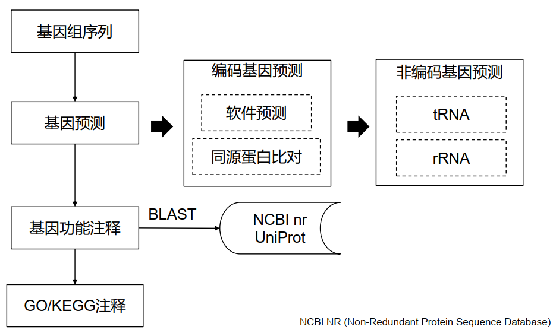

### 6.1.2 真核生物

## 6.2 原核生物基因组结构注释

### 6.2.1 基因预测的方法

1. 湿实验：通过实验分析，看其是否能表达**基因产物**；通量低、成本高
2. 干实验：通过计算机**对DNA序列进行特征搜寻**，分析寻找基因；通量高、成本低（生物信息学）
   - 基于基因结构特征搜寻
   - 基于同源基因搜寻

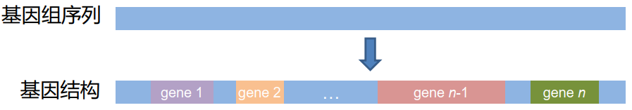

#### 方法一：基于基因结构特征搜寻（基于ORF）

- 基因的核苷酸序列并非随机排列，而是具有明显特征，**可基于开放读码框（Open reading frame，ORF）预测基因**

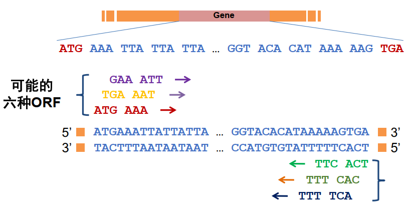

#### 方法二：基于同源基因搜索（基于BLAST）

- 通过将数据库中的基因序列与待查的基因组序列进行比较，从中查找可与之匹配的碱基序列及其比例，用于界定基因的方法称为**同源搜索**

- <b style = "color: green">同源基因有以下几种情况：</b>
  - <b style = "color: green">DNA序列某些片段完全相同</b>
  - <b style = "color: green">ORF排列类似</b>
  - <b style = "color: green">ORF翻译成的氨基酸序列相同</b>
  - <b style = "color: green">模拟多肽高级结构相似</b>

> 几个概念区分：同源性 & 相似性 & 一致性
>
> 1. 同源性（Homology）：进化过程中源于同一祖先的不同分支，用来描述物种之间的进化关系，所以在同源性的表达中只能用“有”或者“无”，属于**定性描述**。
> 2. 相似性（Similarity）：序列之间**相似**位点占整个序列的比例，属于**定量描述**。
> 3. 一致性（Identity）：序列之间**相同**位点占整个序列的比例，相对精确度更高的一个描述，属于**定量描述**。
> 4. 虽然同源基因在序列上是相似的，但是相似的序列不一定是同源，一般来说，序列之间的相似度和一致度越高，序列之间同源的可能性越大。**（同源基因 ----> 序列相似；序列相似 --×--> 同源基因）**

### 6.2.2 编码基因预测软件

- 原核生物基因的各种信号位点（如启动子和终止子信号位点）特异性较强且容易识别，因此相应的基因预测方法已经基本成熟
- ***Prodigal***和***Glimmer***是应用最为广泛的原核生物基因结构预测软件，准确度高

> 多顺反子：
>
> - 在原核细胞中，通常是几种不同的mRNA连在一起，位于同一转录单位内，相互之间由一段短的不编码蛋白质的间隔序列所隔开，享有同一对起点和终点
>
> 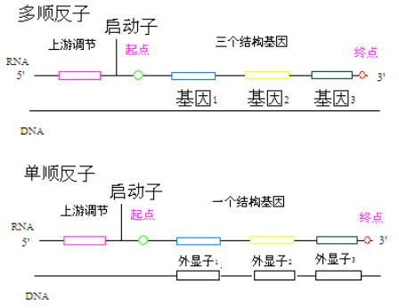

### 6.2.3 非编码RNA序列的预测

#### 6.2.3.1 rRNA预测

- 原核生物中，包含5S rRNA、16S rRNA和23S rRNA
- 工具：RNAmmer（Web server: http://www.cbs.dtu.dk/services/RNAmmer/，Lagesen K, et al. 2007. PMID: 17452365），*此工具目前需要申请使用，在线服务器已停止！*
- 不基于参考序列的从头预测

#### 6.2.3.2 tRNA预测

- 工具：tRNAscan-SE（Web server: http://lowelab.ucsc.edu/tRNAscan-SE/，Chan PP, et al. 2019. PMID: 31020551）
- 据称能识别99%的真tRNA基因

#### 6.2.3.3 非编码RNA预测

- 利用Rfam家族的协方差模型，采用Rfam自带的Interfal软件预测miRNA、snRNA序列等ncRNA
- 缺点：特异性较差，如果有更好的专门预测某一类非编码RNA的软件，建议采用特异性RNA软件进行预测

### 6.2.4 原核基因组注释流程

- PGAP
- RAST：针对细菌和古菌基因组注释工具，可用来预测ORF、rRNA、tRNA以及相应的功能基因，并可以利用这些信息构建代谢网络
- Prokka：原核基因组注释的分析流程，包括基因鉴定、功能注释和基因组配套注释文件生成
- COG：COG曾是原核生物功能注释的常用数据库，目前已停止更新

## 6.3 真核生物基因组结构注释

### 6.3.1 Kozak序列规则：一个关于起始密码子的统计规律

### 6.3.2 重复序列注释方法

- 串联重复序列：微卫星序列、小卫星序列等
- 散在重复序列：又称转座子元件TE
  - DNA转座子（`剪切粘贴`）
  - 反转录转座子（`复制粘贴`）：LTR、LINE、SINE
- :star:几种重复序列的辨析:star:：

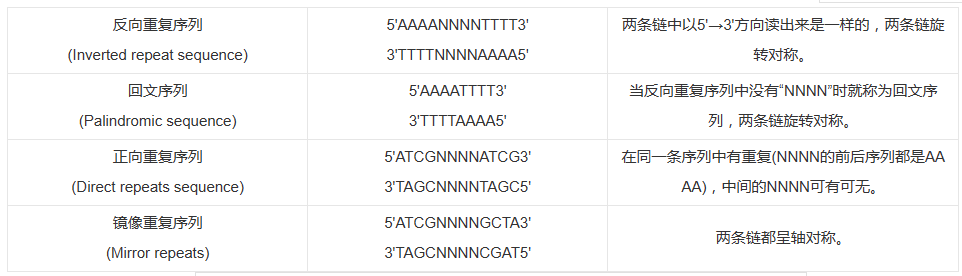

- 识别重复序列的方法：
  1. 序列比对方法：一般采用**Repeatmasker软件**，**识别与已知重复序列相似的序列**。常用**Repbase重复序列数据库**
  2. 从头预测方法：优点在于**不依赖已有的转座子数据库，能够发现未知的转座子元件**。常见的从头预测方法有Recon、RepeatModeler等

- 关于Repbase重复序列数据库：真核生物基因组重复序列数据库，是多种注释工具的参考数据来源
- 重复序列注释：RepeatMasker Web Server（http://repeatmasker.org/cgi-bin/WEBRepeatMasker）

### 6.3.3 真核生物基因结构预测

三种方法：

- 软件预测：从基因结构出发预测序列中某一个部分是否存在基因，代表软件：GlimmerHMM（http://ccb.jhu.edu/software/glimmerhmm/）、Genscan、Augustus（http://augustus.gobics.de/）
- 同源预测
- 转录本预测：PASA（http://pasapipeline.github.io/）

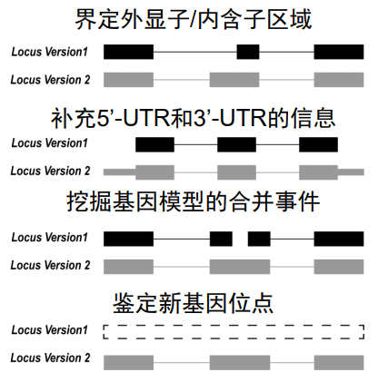

- <b style = "color: red">通过整合软件预测、基于同源注释和转录本预测三种方法的预测结果，得到最终的基因结构模型</b>

## 6.4 基因组功能注释概述

- 基因功能注释：通过比对的方法根据已知功能的蛋白质编码基因序列预测未知蛋白质编码基因的功能
  - 功能序列（Functional Motif Detection）
  - 基因本体（Gene Ontology Annotation）
  - 代谢通路（KEGG Enrichment Analysis）

> 普遍采用BLAST比对方法对预测出来的编码基因进行功能注释，通过与各种功能数据库（NCBI nr、Swiss-Prot等）进行蛋白质比对，获取该基因的功能信息

Video1：[蛋白质的四级结构](https://www.bilibili.com/video/BV18K4y1J7fM/?spm_id_from=333.337.search-card.all.click)

Video2：[蛋白质一级结构到四级结构的折叠过程直观呈现](https://www.bilibili.com/video/BV1124y187WK/?spm_id_from=333.337.search-card.all.click&vd_source=71ef231609c4f6a95ebfadad530deed2)

- 蛋白质的功能与其结构密切相关，一个蛋白质的**保守结构域**在一定程度上体现了该蛋白质的功能
  - InterPro：集成了蛋白质家族、结构域和功能位点的非冗余**蛋白质特征序列数据库**（http://www.ebi.ac.uk/interpro/）
  - CDD：**蛋白质保守结构域数据库**，收集了大量保守结构域序列信息和蛋白质序列信息（https://www.ncbi.nlm.nih.gov/cdd/）

## 6.5 基因本体论和代谢途径

### 6.5.1 本体论（Ontology）

- Ontology是<b style = "color: red">特定领域信息组织</b>的一种形式，是领域知识规范的抽象和描述，是表达、共享、重用知识的方法
- Ontology是知识体系构建的关键技术，Ontology就是一种**<u>对知识建模，使计算机能够识别人类知识的方法</u>**
- Ontology通过对于**概念、术语及其相关关系的<u>规范化</u>描述**，勾画出某一领域的基本知识体系和描述语言

### 6.5.2 基因本体（Gene Ontology）

- 基因本体，简称GO，是一种***系统地对物种基因及其产物属性进行注释的方法和过程***，基因本体知识库是世界上最大的基因功能信息资源，这些知识既是`人类可读`的，也是`机器可读`的

> 🎐本人理解：不同数据库的基因注释方式不同，注释的信息，以及语言的表述都有所出入，GO就是为了整合不同数据库的基因注释信息，以一种**<u>标准化的语言</u>**进行“重新表述”，便于学术上的交流~

#### 6.5.2.1 GO的组成

- 一个基因可能出现在多个Ontology中
- Term之间存在两种关系：is_a（包含关系），part_of（部分关系），如：膜包含线粒体膜和叶绿体膜，叶绿体膜是叶绿体的一部分

- GO是有向无环图，一个term可以有多个parent

> 🎄个人理解，GO是一个巨大的“信息树”，最底部有三个大的分支，分别是***分子功能，细胞组件和生物过程***，树的每一个根节点和叶节点都对应了一个描述信息，每个描述信息都对应了一个GO编号。当有一个新的基因时，我们根据它的功能对其进行注释，即根据它所处在“信息树”的位置赋予它一些GO编号！***一个基因可以对应很多的GO编号，一个GO编号也可以对应很多的基因！***
>
> - 🔔查看GO树状列表：https://amigo.geneontology.org/amigo/dd_browse

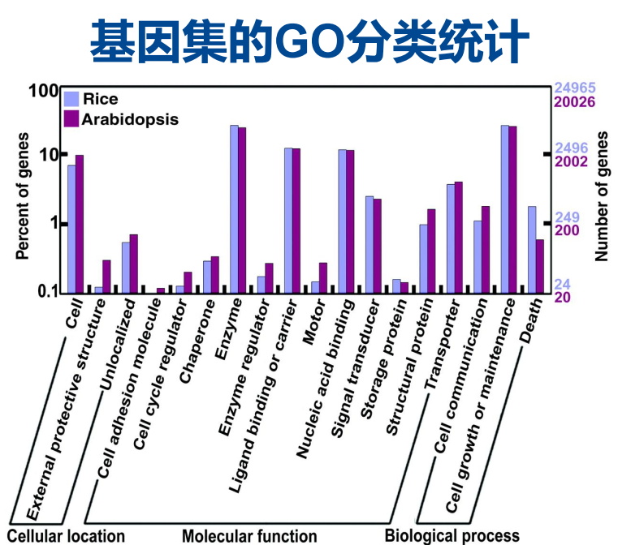

#### 6.5.2.2 GO注释数据库

- GOA：https://www.ebi.ac.uk/GOA
- GO注释程序旨在为UniProt知识库中的蛋白（UniProtKB）、RNACentral的RNA分子和其他蛋白质复合体提供高质量的基因本体（GO）注释！

### 6.5.3 KEGG Pathway代谢途径

- KEGG存在三大类代谢图**（分子路径）**，每个数据路的pathway都有相应的唯一编号

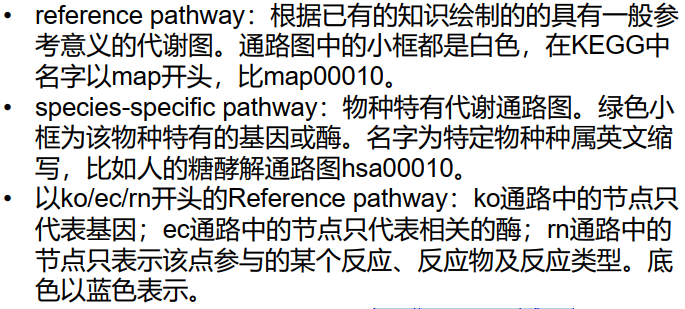

- 数据结构一览（https://www.kegg.jp/kegg/pathway.html）

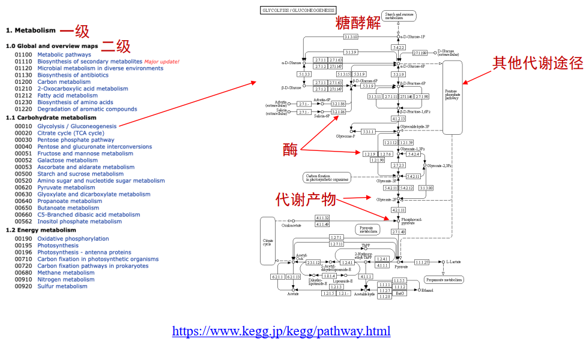

### 6.5.4 GO/KEGG富集分析

- 由于GO/KEGG中**每种功能类别/代谢途径中的背景基因数量不同**，因此基因的绝对数量不能用来衡量基因在某种类别中的富集程度，需要通过统计计算来进行富集分析

- 要统计富集在某个GO功能类别的基因占该物种所有基因的比例~

- 基因注释和功能富集在线服务器：

  - DAVID Bioinformatics Resources：https://david.ncifcrf.gov

  - KOBAS：http://kobas.cbi.pku.edu.cn/kobas3

## 6.6 扩充：人类长非编码RNA注释集

# Ch07 基因组信息学与数据资源

## 7.1 生物信息学研究方向

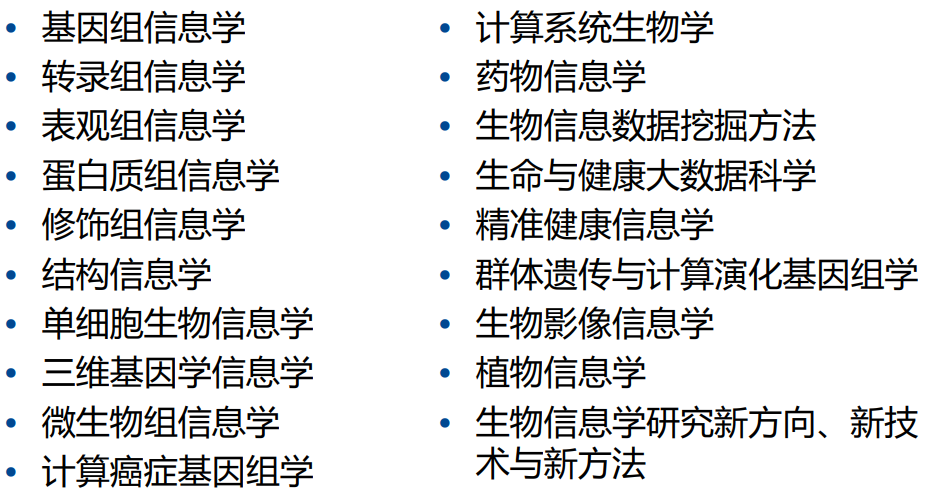

## 7.2 基因组数据资源

### 7.2.1 国外主要生物信息中心概况

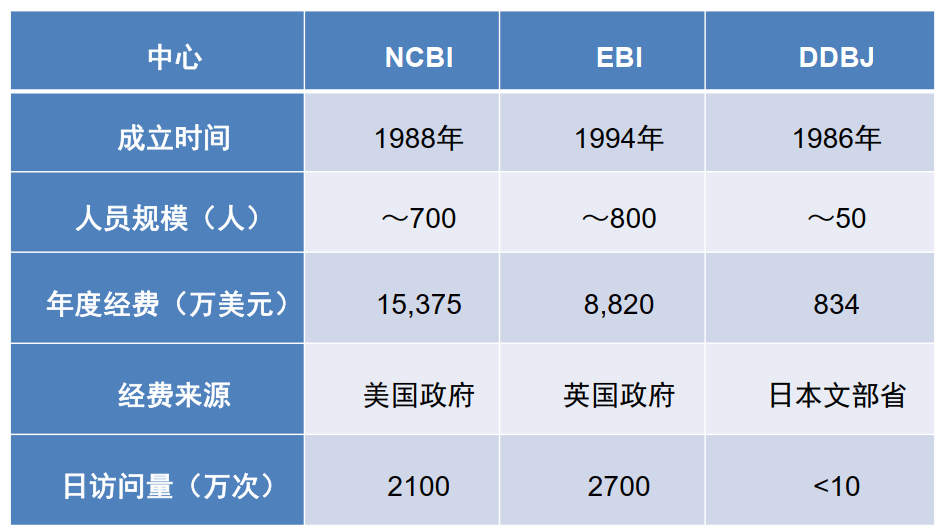

### 7.2.2 国内主要生物信息数据资源机构

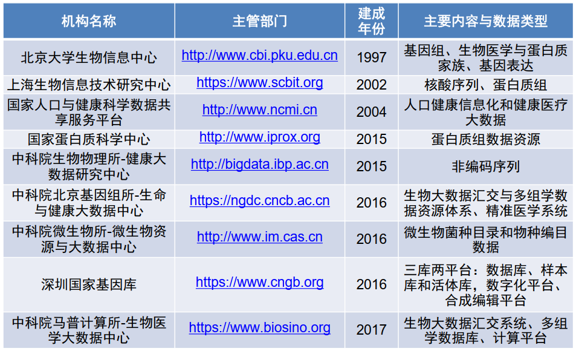

### 7.2.3 国际主要生物信息中心

## 7.3 生物信息数据库

### 7.3.1 分类：一级数据库和二级数据库

- 一级数据库：数据库中的数据直接来源于实验获得的原始数据，只经过简单的归类整理和注释（直接测完放在那）
  - NCBI：GenBank，SRA
  - EBI：ENA
  - DDBJ：DRA
  - CNCB/NGDC：GSA
- 二级数据库：对原始生物分子数据进行整理、分类的结果，是在一级数据库、实验数据和理论分析的基础上针对特定的应用目标而建立的

### 7.3.2 美国国家生物技术信息中心：NCBI

> NCBI、EBI、DDBJ组成了国际核苷酸序列数据库联盟，每天实时更新，同步交换数据，实现全球生物数据汇交整合共享
>
> 

- NCBI代表性资源

1. GeneBank：收集注释所有公开可利用的核苷酸序列和蛋白质序列，是最有影响力的生物领域数据库之一
2. RefSeq：人工注释，人工审编，高质量的数据！！！
3. SRA：高通量测序原始数据提交与数据编号获取
4. dbSNP：单核苷酸变异、微卫星、小插入或删除，目前只接收人类！！！
5. dbVar：结构变异数据库，大于50bp变异，包括插入、删除、复制、倒位、易位，目前只接收人类！！！
6. dbGap：基因变异与表型关联信息（某个基因变异与疾病有没有关联）
7. OMIM：染色体显性/隐性遗传、X连锁、Y连锁、线粒体、染色体等

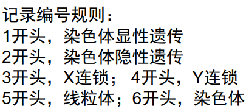

8. Taxonomy：物种分类信息的标准化、结构化规范描述
9. PubMed/PMC：PMC（PubMed Central）要求提供全文（期刊只要拿了NIH的基金，就必须在12个月内主动将论文全文上传PMC，强制措施），而PubMed只提供摘要

> ⚙PubMed提供趋势图，可以查看如CRISPR/Cas9在过去几年有多少文章研究；还提供了相关论文

10. BLAST

> NCBI数据资源总览：https://www.ncbi.nlm.nih.gov/guide/all/

### 7.3.3 欧洲生物信息学研究所：EBI

1. Ensembl：可以很便捷的下载各个物种的DNA、cDNA、CDS、ncRNA等

2. UniProt：有经过人工质控审编的，也有通过程序自动化注释未审核的，分开存储

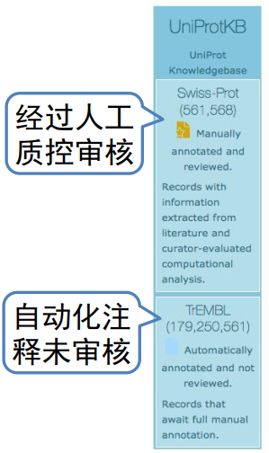

3. GWAS Catalog：基于文献资料采用人工质控和审编的方法，提供高质量的基因型与表型关联信息

### 7.3.4 国家生物信息中心/国家基因组科学数据中心（CNCB/NGDC）

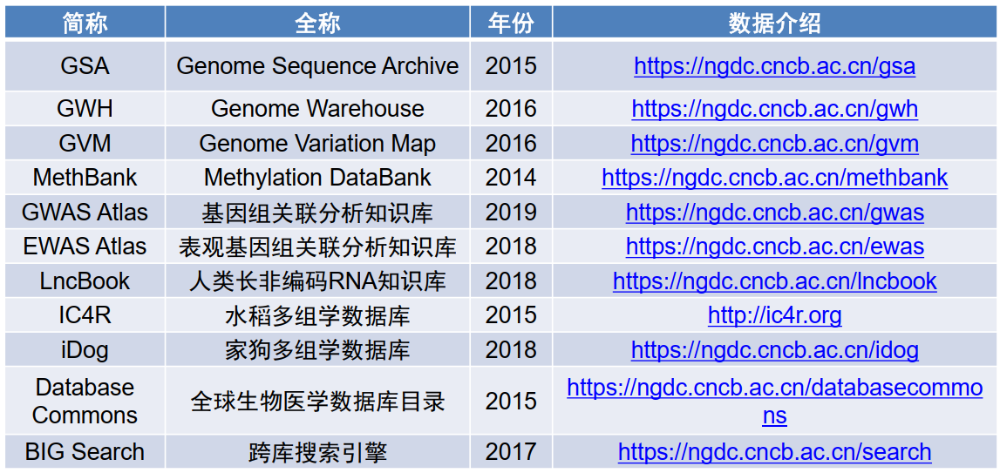

- 组织结构：

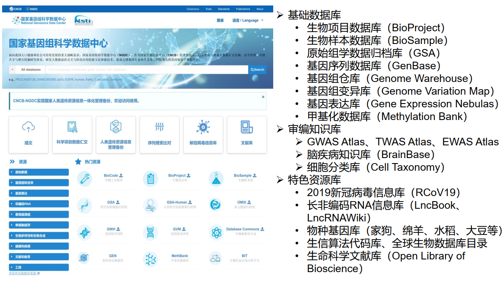

### 7.3.5 国内外其它主要数据库资源

🏆全球生物数据库目录Database Commons：https://ngdc.cncb.ac.cn/databasecommons

# Ch08 比较基因组学与分子演化

## 8.1 比较基因组学与分子演化

### 8.1.1 关于Evolution（演化、变演、进化）

- 如何定义Evolution？Evolution = Change Over Time！
- 宏进化和微进化：

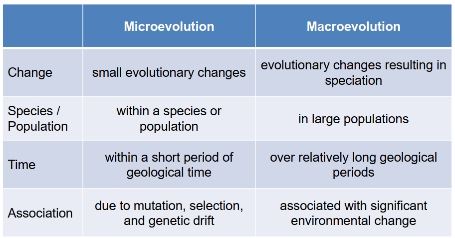

### 8.1.2 比较基因组学

- 比较基因组学是通过比较基因特征和基因组结构了解基因功能、表达机制和不同物种亲缘关系的生物学研究
  - 种间比较：通过对不同亲缘关系物种的基因组序列比较，研究**进化保守区域、物种特有区域以及物种进化关系等**
  - 种内比较：鉴定同种群体内基因组存在的**变异和多态性**，基于这些变异研究个体与群体对疾病的**易感性**和对药物与环境因子的**不同反应**

### 8.1.3 分子演化

- Molecular evolution is the area of evolutionary biology that **studies evolutionary change at the level of the DNA/protein sequence.**
- Molecular evolution is **the process of change** in the sequence composition across generations.

## 8.2 演化学说与分子钟

### 8.2.1 自然选择 -- 适者生存（形象展示）

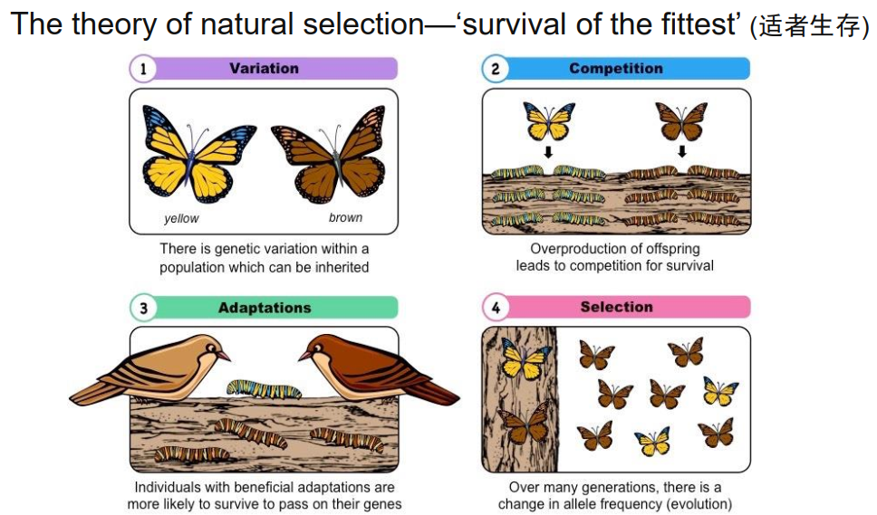

### 8.2.2 中性理论

- 中性突变不会影响一个生物体生存和繁殖的能力（突变未影响蛋白质的功能）
- 大多数进化过程中分子水平发生的变化是由于中性突变随机的遗传漂变造成的，进而引起了遗传的多态性
- 物种内大多数进化上的变化和多态性不是由于自然选择导致的，而是由于**随机的遗传漂变**

> 遗传漂变：是指种群中基因库在代际发生随机改变的一种现象。由于任何一个个体的生存与繁殖都受到随机因素影响，繁殖过程可看做一种抽样，子代携带的等位基因即是对亲代抽取的一种样本。这一过程中的抽样误差使***子代中的等位基因频率与亲代并不相等***，尤其是在小种群中。  
>
> ***遗传漂变可能改变某一等位基因的频率，甚至致其完全消失，进而降低种群的遗传多样性。***一般情况下， 种群的生物个体数量越少，遗传漂变的效应就越强。遗传漂变是生物进化的关键机制之一。  
>
> 

### 8.2.3 分子钟

- The rate of evolution in any protein (or later, DNA) molecule is approximately constant over time and over evolutionary lineages.
  - 血红蛋白进化演化过程中，氨基酸数量上的差异与时间是大致线性的关系（根据不同时间的化石分析推算而来）

- 分子钟假说：
  - 序列之间的遗传差异的数量是自分化以来的时间的函数
  - 分子序列的变化速率稳定，可以用来**预测物种分化的时间**

> 例如：
>
> - 人和小鼠血红蛋白β链的一致性是81.7%
>
> 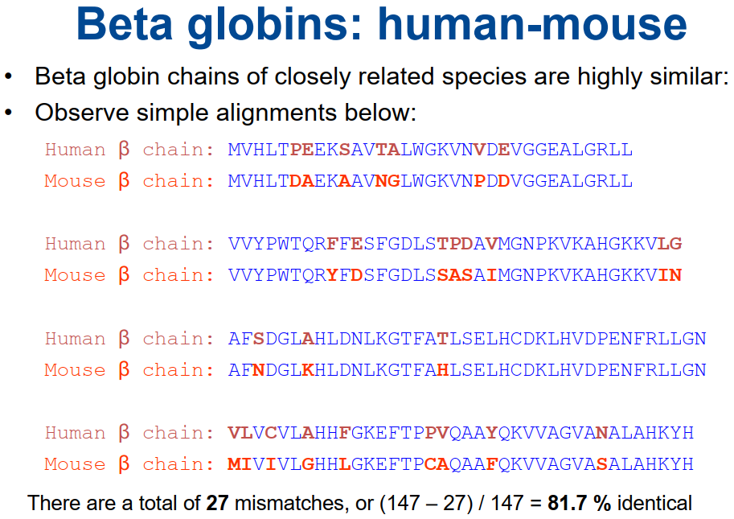
>
> - 人和鸡血红蛋白β链的一致性是70.1%
>
> 
>
> - 因此，小鼠和人的遗传距离会更近
>
> 
>
> - 取9个脊椎动物和人之间做比较，可以看到：序列差异性（从上到下：同义突变，氨基酸变化，非同义突变）和时间大体呈线性关系，因此出现了“分子钟”的概念

## 8.3 分子序列演化

### 8.3.1 序列演化模型

- 两条序列分化/差异程度（p） = 不同碱基对的数量 / DNA序列的长度
- 由于分化参数p未考虑：<b style = "color: red">观测到的替换数小于真实发生的替换数。</b>因此，需要构建数学模型进行模拟演化变异。

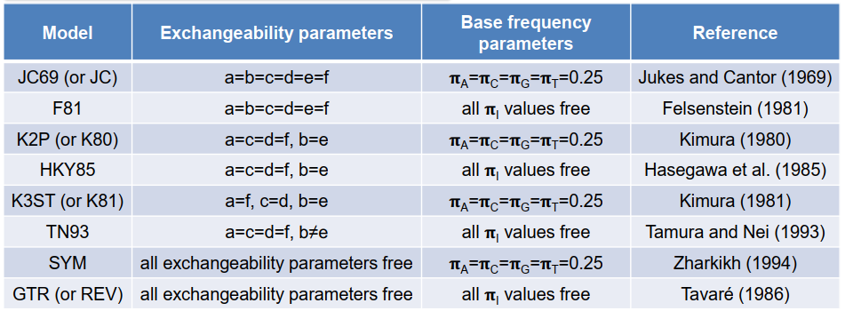

### 8.3.2 密码子简并性

- 64个密码子编码20种氨基酸
- 编码同一种氨基酸的密码子：不同物种有使用偏好（Codon Usage Bias）
  - 原因1：Mutation -- DNA链富含GC等
  - 原因2：Selection -- 倾向使用tRNA种类多的，提高翻译效率等
  - 可以利用Codon Usage Bias预测蛋白质表达水平

## 8.4 选择压力、同义和非同义替换率

- <b style = "color: green">同义替换率（Ks or Sd） = 同义替换数 / 同义位点数</b>
- <b style = "color: green">非同义替换率 （Ka or Nd）= 非同义替换数 / 非同义位点数</b>
- <b style = "color: green">选择压力 = Ka / Ks（非同义替换率 / 同义替换率）</b>
  - Ka > Ks：正选择/适应性进化
  - Ka = Ks：中性突变
  - Ka < Ks：负选择/纯化选择

> 注意：密码子变化的过程有多种方式，如GGC变成AGA，可能先变化的第一个碱基G，也可能先变化的最后一个碱基C。实际观测的突变要小于已经发生的，例如：A分化出了两个C，但是其中一个A是直接分化形成的C，而另一个A先分化形成了B，接着由B分化形成了C，因此最后计算的同义突变率和非同义突变率需要做校正~

> 🎨步骤：
>
> - **关于同义突变位点数和非同义突变位点数的计算：**
>
> 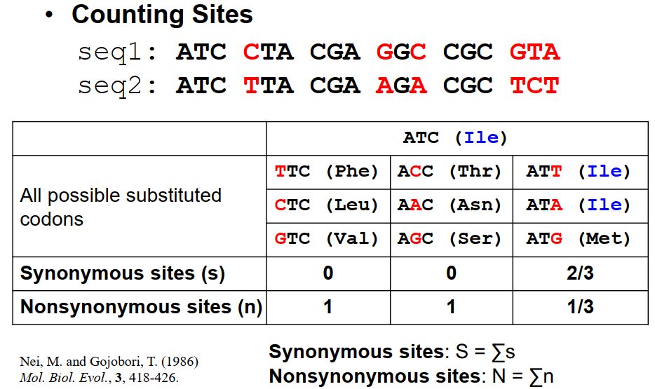
>
> - **关于同义替换数和非同义替换数的计算：**
>
> 
>
> - **对观测值进行校正（JC模型）：d0为观测值，d为校正后的值**
>
> 
>
> 👓注意：仅适用于进化较近的序列~
>
> 🕶软件：KaKs_Calculator 3.0: coding & non-coding sequences (https://ngdc.cncb.ac.cn/biocode/tools/BT000001)

- **进化时间计算：**

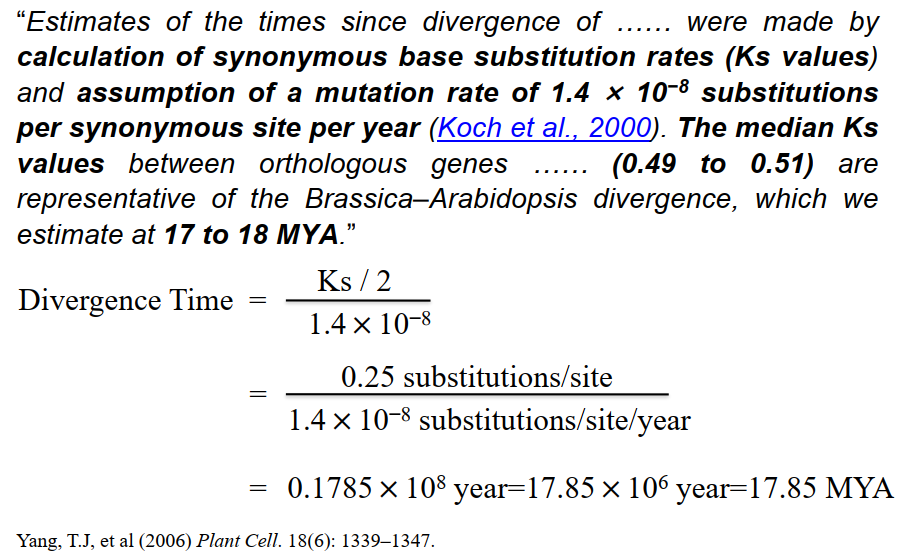

> 🎭约17.85百万年前，物种发生了分化~

## 8.5 系统发育树

### 8.5.1 有根树 & 无根树

### 8.5.2 系统发育树的构建

- 系统发育树：亦称系统发生树、分子演化树、分子进化树
- 依据分子序列分化程度，重构演化关系，预测分子序列功能
- 建树方法：
  - 距离法
  - 最大简约法
  - 最大似然法

### 8.5.3 常用软件

- MEGA (Molecular Evolutionary Genetics Analysis): www.megasoftware.net
- PAML (Phylogenetic Analysis by Maximum Likelihood): http://abacus.gene.ucl.ac.uk/software/paml.html
- iTOL (Interactive Tree Of Life): an online tool for the display, annotation and management of phylogenetic trees: https://itol.embl.de
- 392 tools: http://evolution.gs.washington.edu/phylip/software.html

# Ch09 RNA与转录组

## 9.1 RNA基本概念与RNA世界假说

### 9.1.1 RNA与DNA的区别

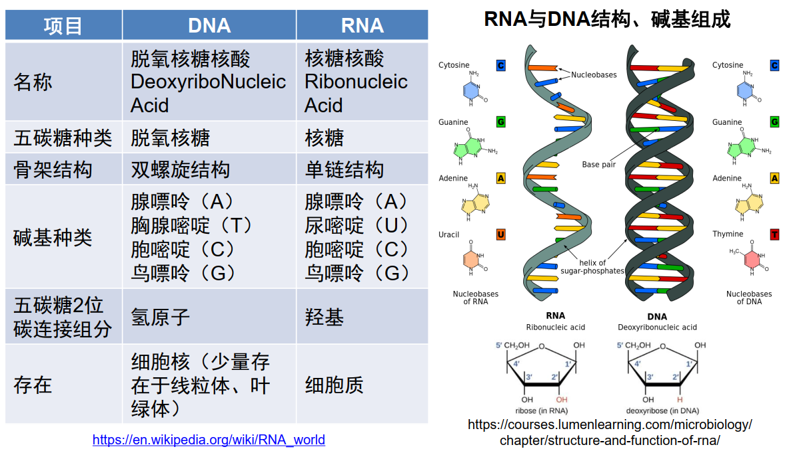

###  9.1.2 RNA世界学说

- 1967年，Carl Woese提出RNA世界学说，指出最早的生命形式可能依赖于RNA，携带遗传信息和催化生化反应
- RNA世界假说：认为RNA是地球早期生命分子，这些早期RNA分子同时拥有DNA遗传信息存储功能，及蛋白质的催化能力，从而支持早期细胞或前细胞生命的运作
- **RNA作为酶：**
  - 可自我复制
  - 可催化简单化学反应
  - 可催化肽键形成

- **RNA作为信息存储介质：**
  - 比较脆弱，易水解
  - 不稳定，变异可能性大
- **RNA作为调控物质：**
  - 核糖开关：基因表达的调控物质之一，在细菌、植物和古菌中发现，改变其二级结构以响应所结合的代谢物，从而影响转录
  - RNA温度计：受温度变化而调节基因表达

> - RNA温度计是一类对温度敏感的非编码RNA，能随温度变化调控基因表达。主要调控与热休克和冷休克反应有关的基因，但与致病性、饥饿状态等过程相关的基因调控也有关系
> - 二级结构随温度的变化而改变，使RNA上核糖体结合位点（RBS）等重要区域暴露或遮蔽，进而改变对应编码基因的翻译速率
>
> 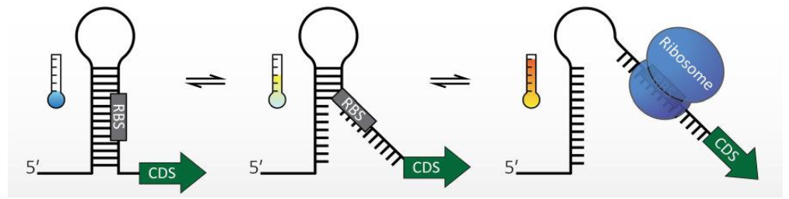

###  9.1.3 转录组（Transcriptome）

- 概念：所有转录产物的集合，包括信使RNA、核糖体RNA、转运RNA及非编码RNA

- **RNA组：全生命周期合成的RNA分子和共价结构集合**

##  9.2 RNA主要类型和功能

###  9.2.1 RNA分类

- https://en.wikipedia.org/wiki/List_of_RNAs

###  9.2.2 非编码RNA分类

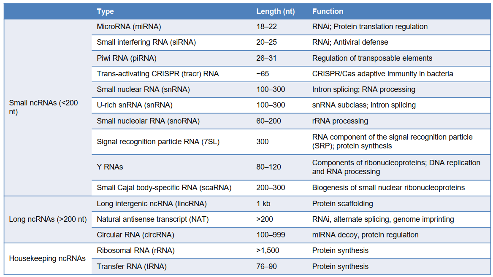

- https://www.bio-rad.com/en-uk/applications-technologies/coding-non-coding-rna?ID=Q1070M70KWE7

### 9.2.3 mRNA：信使RNA

- mRNA占细胞总RNA的2%-5%，种类多，代谢活跃，半衰期短，合成后数分钟至数小时即被分解

### 9.2.4 rRNA：核糖体RNA

###  9.2.5 tRNA：转运RNA

- 将密码子所对应氨基酸转运至核糖体合成多肽链

###  9.2.6 miRNA：微小RNA

- **内生**小非编码RNA分子，22nt
- miRNA大多具有**茎环结构**，其加工过程包含三个阶段：
  - 原始pri-miRNA（300-1000nt）
  - 前体pre-miRNA（70-90nt）
  - 成熟miRNA（20-24nt）
- **miRNA在RNA沉默和基因表达转录后调控中发挥作用**，通过与mRNA互补配对，诱导mRNA链被切割，或促使mRNA缩短其poly(A)尾巴而降低稳定性，或降低mRNA翻译成蛋白质的效率

- 一个miRNA可以有多个靶基因，多个miRNA也可调控同一个基因
- miRNA高度的保守性与其功能的重要性有着密切的关系
- miRNA在细胞分化、生物发育及疾病发生发展过程发挥重要作用

###  9.2.7 lncRNA：长非编码RNA

- 长度大于200个核苷酸的非编码RNA
- 在表观遗传调控、细胞周期调控和细胞分化调控等众多生命活动中发挥重要作用，是目前研究热点
- lncRNA分类：
  - 反义长lncRNA
  - 内含子lncRNA
  - 基因间lncRNA
  - 启动子相关lncRNA
  - 非翻译区lncRNA
- **95243** lncRNA genes & **323950** transcripts in human (LncBook数据库)
- LncRNA基因也有像蛋白质编码基因一样的内含子和外显子👨‍🎓

###  9.2.8 siRNA：小干扰RNA

- 也称短干扰RNA或沉默RNA，是一类双链非编码RNA分子，长度是20-25个核酸对
- 与miRNA相似，siRNA在RNA干扰通路中起作用
- siRNA干扰具有互补核苷酸序列的特定基因的表达，降解转录后mRNA，从而阻止蛋白翻译过程

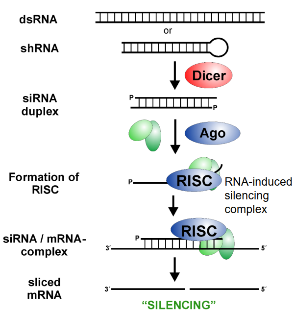

###  9.2.9 circRNA：环形RNA

- 是一种单链RNA，分子呈封闭环状结构，表达稳定，不易降解，是RNA领域最新研究热点
- 功能上，circRNA分子富含microRNA结合位点，在细胞中起到**miRNA海绵**（miRNA sponge）的作用，可解除miRNA对其靶基因的抑制作用，称为竞争性内源RNA（ceRNA）机制
- 人类：421501 circRNAs （circAtlas数据库）http://circatlas.biols.ac.cn
- circRNA生物合成：https://en.wikipedia.org/wiki/Circular_RNA

###  9.2.10 编码和非编码RNA在细胞中的分布

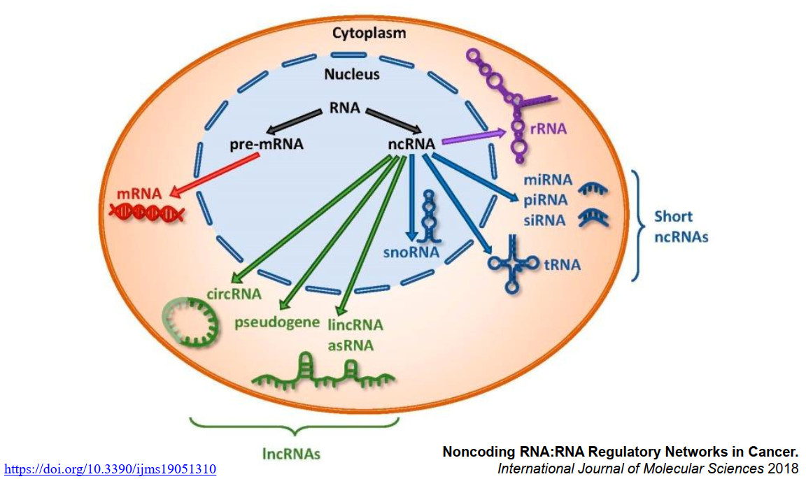

##  9.3 RNA生命动态

###  9.3.1 RNA合成（转录）

- 启动：RNA聚合酶和**通用转录因子**与**启动子**的结合
- 延伸：RNA聚合酶从3‘到5’端的方向读取模板链，并以5‘到3’端的方向合成与之反向平行互补的RNA链，称为转录本（Transcript）
- 终止：转录终止于DNA**非编码序列末端附近的终止子**处

###  9.3.2 转录调控

- 转录调控：指通过**改变转录效率**从而调控RNA转录本表达水平的过程。转录调控可以控制基因**时空动态表达**。
- 顺式作用元件（CRE）：位于基因旁侧序列中能影响基因表达的**DNA序列**，可影响基因转录活性
- 反式作用元件（TRE）：转录模板上游基因编码的一类**蛋白调节因子**，又称为转录因子，通过与特异的顺式作用元件相互作用反式激活基因转录
  - 通用转录因子：所有mRNA转录启动共有
  - 特异转录因子：个别基因转录所必须，决定基因的时空特异性表达
  - **转录因子数据库：AnimalTFDB**
- 原核生物转录调控：操纵子（多个基因可位于同一转录单元上）
- 真核生物转录调控：
  - 局部调控：特定细胞**单个基因**的打开或关闭
  - 全局调控：维持**染色质水平**的基因表达模式

- 通用转录因子和RNA聚合酶组成基础转录复合体，**转录激活因子**和**阻遏因子**与其作用激活或抑制转录

- **增强子**远离其所控制的基因，与转录激活因子结合增强基因转录
- **沉默子**作为负调控序列，与阻遏因子结合，抑制基因转录

###  9.3.3 转录后加工与修饰

🕵️‍♂️加工修饰类型：（初级RNA转录本转化为成熟RNA的加工过程）

- 5‘端加帽
- 3’端加尾
  - 研究发现，同一基因Poly(A)的长度在不同组织的长度不同，并且在大多数物种中，核内Poly(A)尾巴长度几乎为核外的两倍
- 剪接
  - 剪接体：由蛋白质和小核RNA（snRNA）聚合而成，识别剪接位点（GU-AG）

- 化学修饰：RNA分子合成后发生的化学组分的变化，具有**改变RNA结构、功能和稳定性**等作用，目前已知的RNA化学修饰类型包含**100多种**

- RNA编辑：对RNA分子内特定核苷酸序列进行修饰的分子过程，包括核苷酸和插入、删除和碱基替换
- RNA降解：真核生物mRNA降解由Poly(A)尾缩短引起

###  9.3.4 RNA交互网络

##  9.4 转录组及研究方法

- 转录组学：研究在单个细胞，或特定类型细胞、组织、器官或发育阶段的细胞群内所产生的<b style = "color: red">各类RNA分子的类型和数量</b>

- 研究方法：Microarray和RNA-seq（利用高通量测序技术来检测组织或细胞在特定状态中所有的转录产物）- 

- RNA-seq可以发现新的转录本和可变剪切异构体，DNA芯片只能检测**已知转录本**的表达

##  9.5 基因表达

- 基因表达是一个基因合成有功能的基因产物的过程
- 基因表达调控是对功能基因产物的**量**、出现的**时间**和表达的**位置**的调控
- 基因表达有助于研究基因型和表型的关联
- 因此，转录组学也被称为”***基因表达谱***“，检测一个特定条件下的RNA表达水平

- https://gtexportal.org，记录人的基因表达的组织和个体差异

- 基因表达调控：

###  9.5.1 基因表达的定量计算

> - 目前：TPM用的比较多
>
> 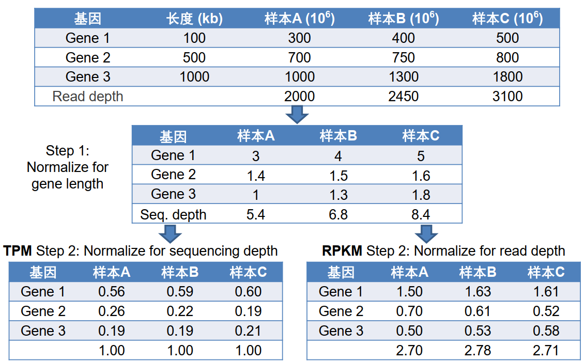
>
> 上表中样本ABC可以视为不同条件下的reads数，由于基因的长度不同，直接比较覆盖的reads数没有意义，首先将其长度归一化，以样本A为例，计算单位长度覆盖的reads数，即样本A列 / 长度列，但是每个样本总共的reads数也不同，因此，接着对reads总数进行归一化，以样本A列为例，计算：3 / 5.4，1.4 / 5.4，1 / 5.4即可得到每个基因的表达水平TPM

###  9.5.2 聚类分析

- 聚类分析是为了鉴定表达模式上发生共同变化趋势的基因，这些基因有可能是功能相同，共同调控的基因。聚类分析是在鉴定完毕差异表达基因的基础上做的。数据形式为log2(sample1/sample2)。

> Step1：转换为log(ratio)数据形式
>
> 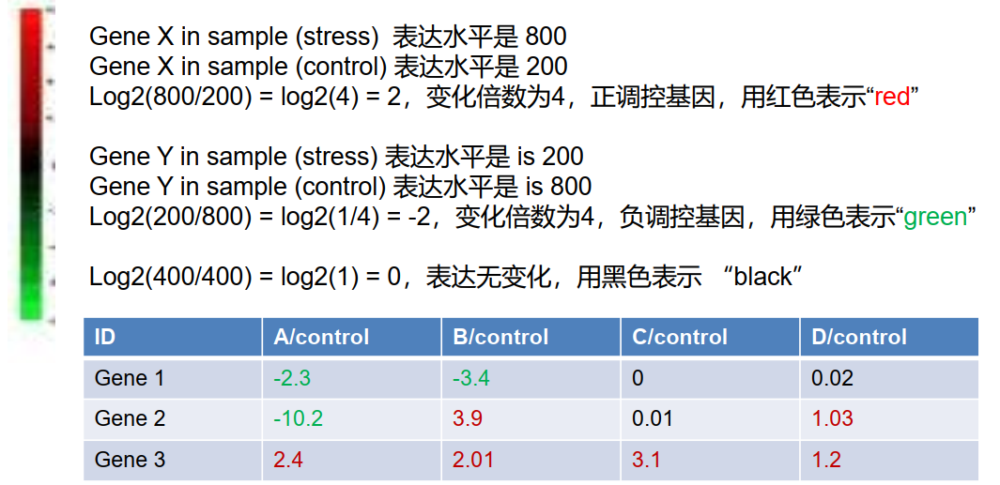
>
> Step2：计算基因对间相关系数并聚类
>
> 

###  9.5.3 基因表达模式

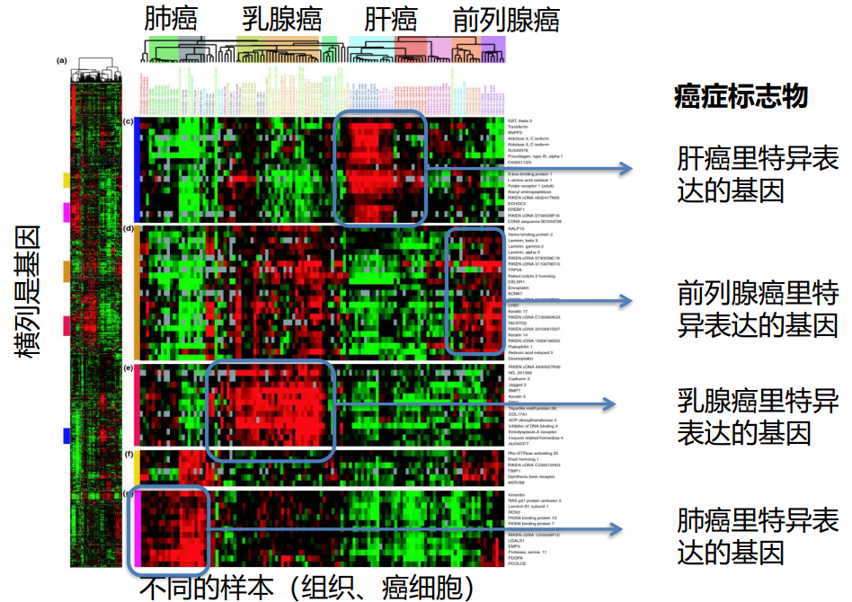

###  9.5.4 转录调控影响基因表达模式

- 管家基因（Housekeeping genes）：多组织表达基因
- 组织特异性基因（Tissue-specific genes）

##  9.6 单细胞转录组

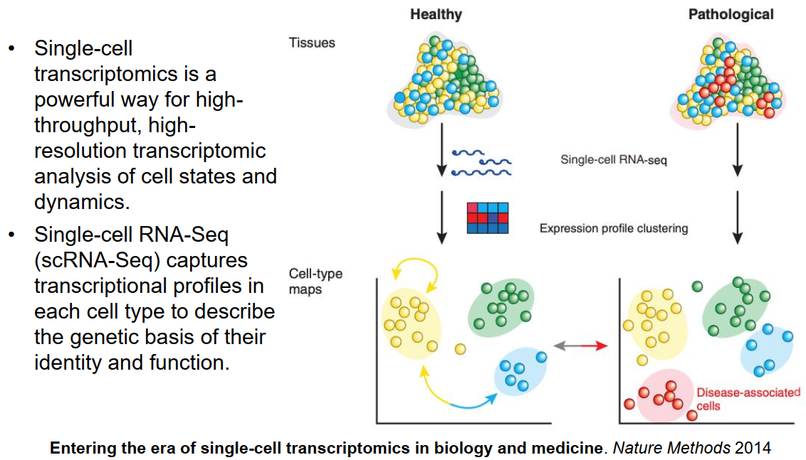

# Ch10 表观基因组

人类有上亿个细胞，每个细胞的基因组都一样但却发挥不同的“角色”，**每个细胞在特定状态或时间内开启并且利用不同的基因**

## 10.1 表观基因组学（Epigenomics）

- 定义：在核苷酸序列不发生改变的情况下，研究基因组上的**化学修饰和空间结构变化**如何影响基因功能和表达调控的一门学科
- 研究内容：
  - 化学修饰：DNA、RNA、蛋白质
  - 空间结构：核小体、染色质、基因组
- 表观特点：**DNA序列不变**、可逆、可遗传、动态变化

## 10.2 DNA修饰

### 10.2.1 甲基化（Methylation）

- DNA甲基化通常会发生在**碱基C**上
- DNA甲基化能引起**染色质结构、DNA构象、DNA稳定性及DNA与蛋白质相互作用方式**的改变，从而控制基因表达

- **CG甲基化**：在DNA甲基转移酶的作用下，在基因组CpG二核苷酸的胞嘧啶5‘碳位共价键结合一个甲基基团
- DNA甲基化一般不做特殊说明是指胞嘧啶形成**5-甲基胞嘧啶**（N5-mC）的过程

- **非CG甲基化：**CHG、CHH（H = A、T、C）

- 5-甲基胞嘧啶（5mC）是表观遗传最重要的一种修饰，由于与基因的表达调控密切相关，又被誉为“**第五碱基**”
- 5mC测序：Bisulfite（重亚硫酸盐）处理能够将基因组中的**未发生甲基化的C碱基转换成U，进行PCR扩增后变成T，**与原本具有甲基化修饰的C碱基区分开来，再结合高通量测序技术，可绘制单碱基分辨率的全基因组DNA甲基化图谱
- 单个位点甲基化水平本质上是不同甲基化状态**细胞的比例**

- 人类5mC甲基化的特点：

  - 除了胚胎和脑组织，其它组织的5mC甲基化通常发生在**CpG二核苷酸**上
  - 人类基因组中大约含有3千万个CpG二核苷酸
  - **CpG岛（一段CpG含量较高的区域）甲基化水平较低，非CpG岛甲基化水平较高**
  - 人类一生5mC的含量动态变化
  - 受精过程中会发生5mC重编程

  

  - 从上图中可以看到，CpG岛还有固定转座子的作用

- DNA甲基化的功能：**调控表达**（在**大多数情况**下，启动子区域的甲基化与表达呈负相关）

- DNA甲基化的功能：**调控剪切**（DNA甲基化调控剪切的机制还未明确，不同基因甲基化对剪切的影响也不同）

- DNA甲基化的功能：**抑制转座**（DNA甲基化能抑制新转座元件的转座，防止其对物种产生有害效应）

- DNA甲基化：**衰老**
  - **DNA甲基化能够精确预测实际年龄，总体误差小于三年**

- DNA甲基化**重编程**（reprogramming） -- **精细化调控**的一个过程：不同的生长发育阶段，甲基化水平不同

- DNA甲基化：基因组印记👨‍🔧👩‍🔧 -- 印记基因
  - 基因组印记（Genomic imprinting）：基因表达具有亲本特异性的表观遗传现象（**基因的表达与否取决于来自父本还是母本**）

## 10.3 RNA修饰（表观转录组学） -- 何川老师

### 10.3.1 mRNA上有多种化学修饰

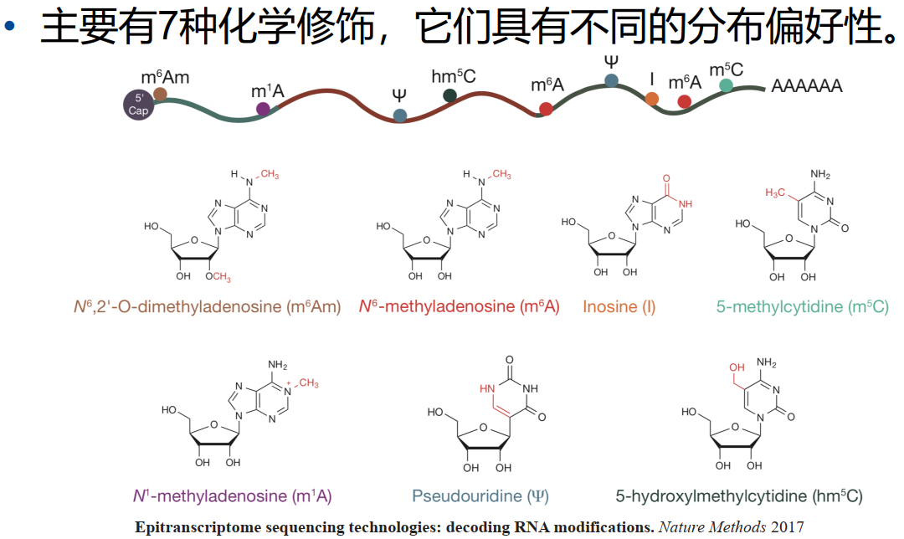

### 10.3.2 RNA编辑（C-to-U and A-to-I/G）

- RNA编辑是一种转录后加工过程，通过碱基替换、核苷酸插入和缺失修改RNA序列
- RNA编辑在不同物种广泛存在，发生在tRNA、rRNA、mRNA、miRNA等

## 10.4 蛋白质修饰

### 10.4.1 翻译后修饰

- 翻译后修饰（Post-Translational Modificaiton, PTM）：共价化学反应过程，由蛋白酶水解或将修饰基因添加到一个核苷酸上
  - PTM作用：**改变氨基酸的化学性质或结构**，扩阔蛋白质功能，是细胞信号传导中的重要组成部分
  - 修饰阶段：蛋白质修饰可以发生在**翻译过程中或翻译后**，但大部分发生在翻译和折叠之后，因此统称为PTM
  - PTM类型：到目前为止，已发现**350多种PTMs**。它们通过改变大多数真核生物蛋白质的活性、定位、降解、以及与其他蛋白质的相互作用从而调节蛋白功能
  - PTM蛋白：目前已报道**63490个蛋白存在修饰现象**，涉及1077种蛋白酶，被35588篇文献报道

### 10.4.2 翻译后修饰在不同物种中的分布

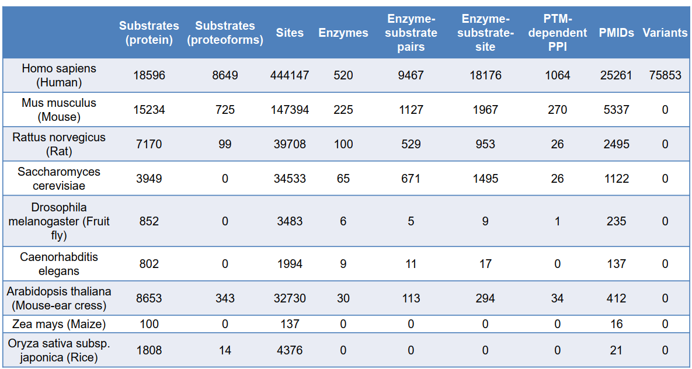

- https://research.bioinformatics.udel.edu/iptmnet/

### 10.4.3 翻译后修饰类型

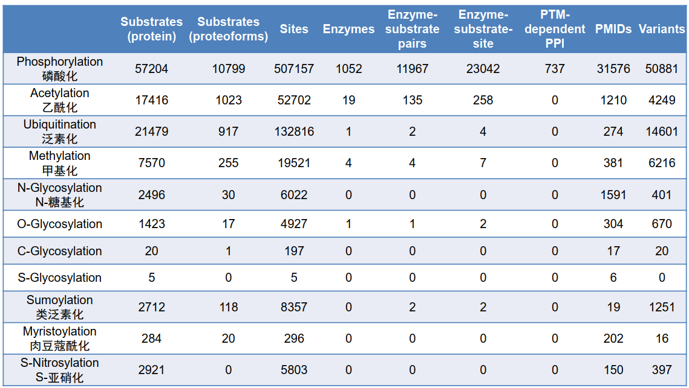

- 根据蛋白质分子是否全部被修饰、同一个氨基酸的修饰种类、修饰的稳定性，制定以下分类和描述：
  - 部分修饰：细胞中某一蛋白的部分分子被修饰
  - 可变修饰：同一个氨基酸位点含有多种修饰类型
  - 瞬时修饰：不稳定的修饰状态

## 10.5 组蛋白修饰

+ 组蛋白：是包装DNA的一类蛋白质，能够改变DNA的结构；真核生物细胞染色质与原核细胞中的碱性蛋白质，和DNA共同组成核小体结构
+ 存在五个主要的组蛋白家族：H1/H5、H2A、H2B、H3和H4
  + H2A、H2B、H3和H4被称为**核心组织蛋白**
  + H1/H5被称为**连接组织蛋白**

> 
>
> - N末端氨基酸残基可发生多种共价修饰
> - 组蛋白修饰作用：
>   - 改变与DNA及其他核蛋白的相互作用
>   - 改变染色质结构和活性
>   - 调控基因表达

### 10.5.1 组蛋白修饰及其命名规则

### 10.5.2 组蛋白修饰的相互作用

一个位点修饰可能引起另一些位点的修饰，或者一个位点的修饰，引起另一些位点修饰的抑制~

## 10.6 三维基因组学

### 10.6.1 基因组三维空间结构

- 染色体由DNA与组蛋白共同组成
- 染色体从一级结构（绳珠模型）到四级超螺旋折叠结构
- DNA分子一共被压缩了8400倍，形成了复杂的三维空间结构
- 正是这些压缩和折叠，使得基因在细胞中的分布复杂而有序

### 10.6.2 三维基因组学（3D Genomics）

- 基因组三维空间结构与功能的研究简称**三维基因组学**
  - 在考虑基因组序列、基因组结构及其调控元件的同时，对基因组序列在细胞核内的三维空间结构，及其对基因转录、复制、修复和调控等生物过程中功能的研究
- 为什么要研究三维基因组？
  - 科学家们发现，调控元件在空间结构上并不是在染色体上呈线性地一字依次排开，这些离散的调控元件并不能有效地解释很多基因的调控结果和机制。因此，猜测其与基因组的三维空间结构相关

> 三维基因组基本实验技术：
>
> - 荧光显微实验方法：荧光原位杂交技术（FISH）、2D-FISH、3D-FISH
> - 染色体构象捕获：通过消化和重连空间上接近的染色体片段来确定**不同位点之间的空间交互**（3C、4C、5C、Hi-C、ChIA-PET）
>
> 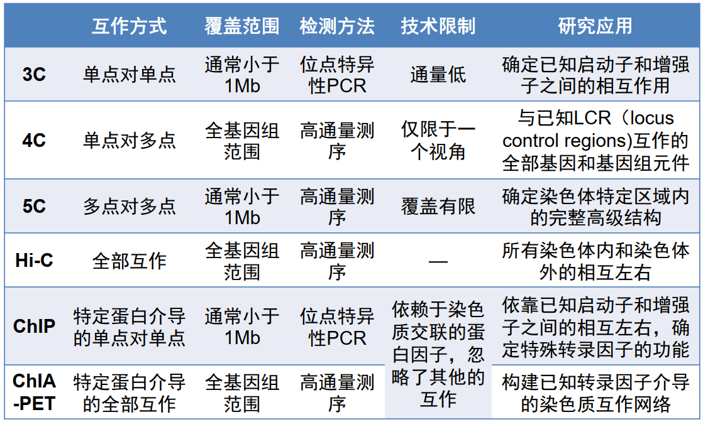

### 10.6.3 染色质三维空间结构

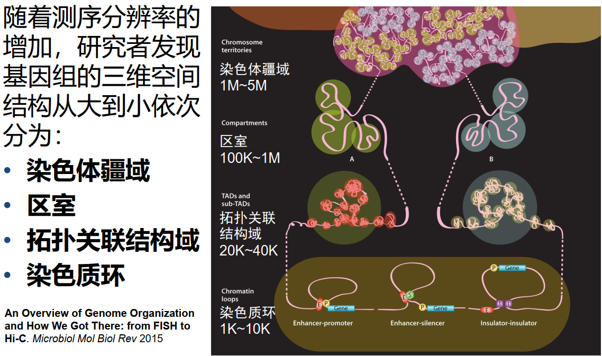

> 1. 染色体疆域
>
> 
>
> 2. 区室
>
> 
>
> 3. 拓扑关联结构域（TAD）
>
> 
>
> 4. 染色质环
>
> 
>
> 总结：
>
> 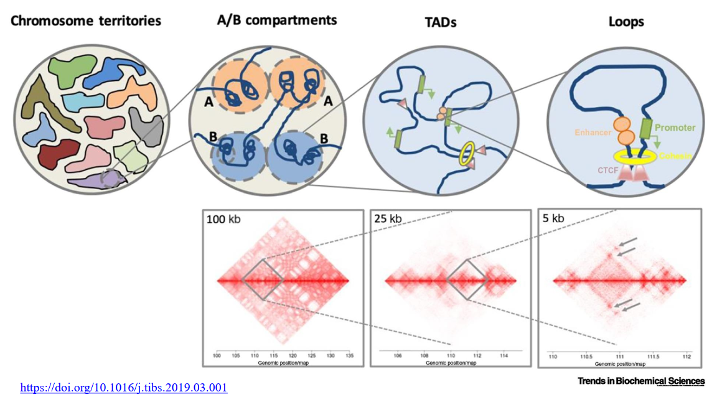

## 10.7 4D基因组学

基因表达和调控随着时间的变化而变化，研究**时间动态变化下的基因组三维结构和功能**，称之为4D基因组学

- 细胞周期过程
- 细胞发育和分化的不同阶段
- 正常细胞向疾病细胞的转变过程
- 细胞受到外界刺激

## 10.8 单细胞表观基因组学

- 不同类别细胞之间做比较，找到不同细胞之间的表观调控差异

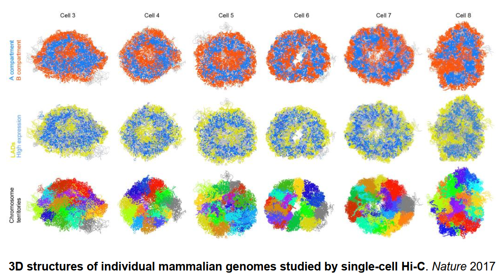

# Ch11 基因型与表型关联分析

## 11.1 全基因组关联分析：GWAS

### 11.1.1 基因型和表型

- **基因型：**是指某一生物体全部基因信息的总称，反映生物体的遗传构成，遗传学中具体使用的基因型，往往是指某一形状的基因型
- **表型：**具有特定基因型的个体，在一定环境条件下，所表现出来的**性状**特征（形态，结构，生理，生化，行为等）或**疾病**状态
- **表型 = 基因型 + 环境**，表型主要受生物基因型和环境影响

### 11.1.2 GWAS基本概念

- Genome-Wide Association Study
- 研究复杂表型性状关联基因变异的方法，通过对照分析或相关性分析，在全基因组范围内找出存在的序列变异，从中筛选出与**复杂表型性状相关**的基因变异

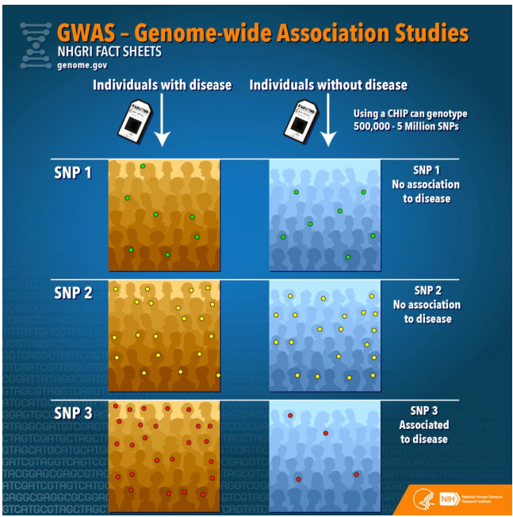

### 11.1.3 GWAS优势

- 全基因组关联分析
  - 对多个个体在**全基因组范围**的遗传变异（标记）多态性进行检测，获得基因型
  - 将基因型与可观测的性状，即表型，进行群体水平的统计学分析
  - 根据统计量或显著性P值**筛选出最有可能影响该性状的遗传变异**（标记），挖掘与性状变异相关的基因
- GWAS优势：
  - 分辨率高（单碱基水平）
  - 研究材料来源广泛，可捕获的变异丰富
  - 节省时间

### 11.1.4 GWAS研究基础

- 定义复杂性状的表型：尽可能选择可定量反映疾病危险程度的指标、可用于分析疾病临床亚型的特征、或可用于诊断鉴别疾病的表型特征
- 高密度分子遗传标记：包括SNP、indel、CNV等

- GWAS适用于数量性状和质量性状：

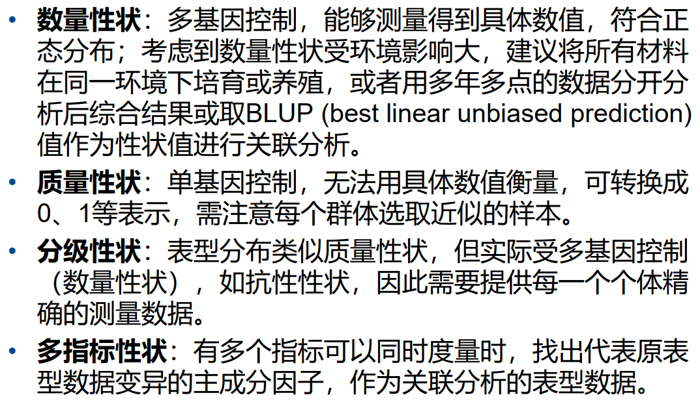

### 11.1.5 GWAS研究方式

### 11.1.6 GWAS统计分析方法

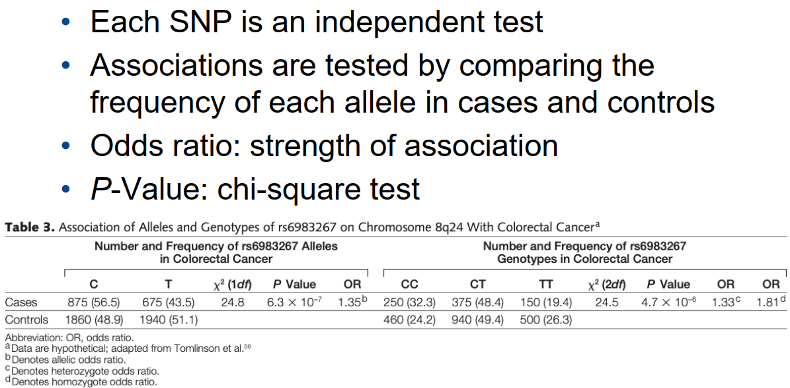

> - Odds ratio (OR)以及95%置信区间的公式：<b style = "color: red">（反映关联强度）</b>
>
> 
>
> - Chi-square test：（左边是观测值，右边是期望值）
>
> 
>
> - 一个实际的例子：
>
> 
>
> - 多重检验校正（Multiple Hypothesis Testing）:
>
> 人类全基因组每一个SNP位点都做假设检验(至少有对上千万个位点做假设检验)，**可能有部分位点会出现假阳性的结果**，多重检验校正就是为了避免这种情况发生~
>
> **If multiple hypotheses are tested, the chance of observing a rare event increases, and therefore, the likelihood of incorrectly rejecting a null hypothesis increases.**
>
> 方法：Bonferroni correction👇
>
> 🧔增加惩罚，拉低显著性水平/**加倍p-value**：testing m=10 hypotheses with a desired α=0.05, then the Bonferroni correction would test each individual hypothesis at α=0.05/10=0.005
>
> 还有其他的方法（其中**r是排序的序号**）：
>
> 
>
> 曼哈顿绘图（直接给p-value一个cut-off，而不进行设定初始值和调整）：
>
> 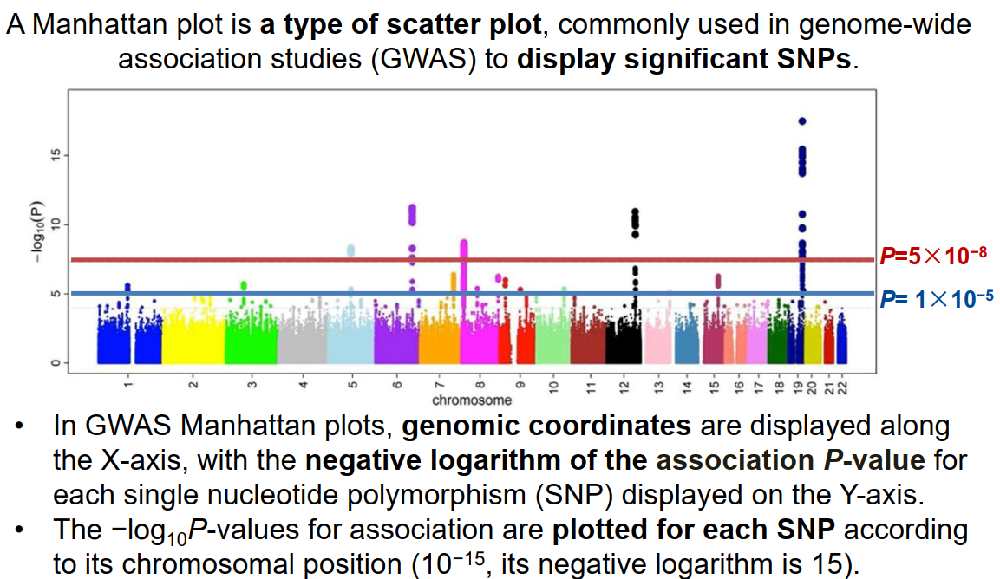
>
> 👮‍♂️从图中可以看出在不同的显著性水平下，具有强关联性的SNP位点（P-value线上方）

### 11.1.7 连锁不平衡

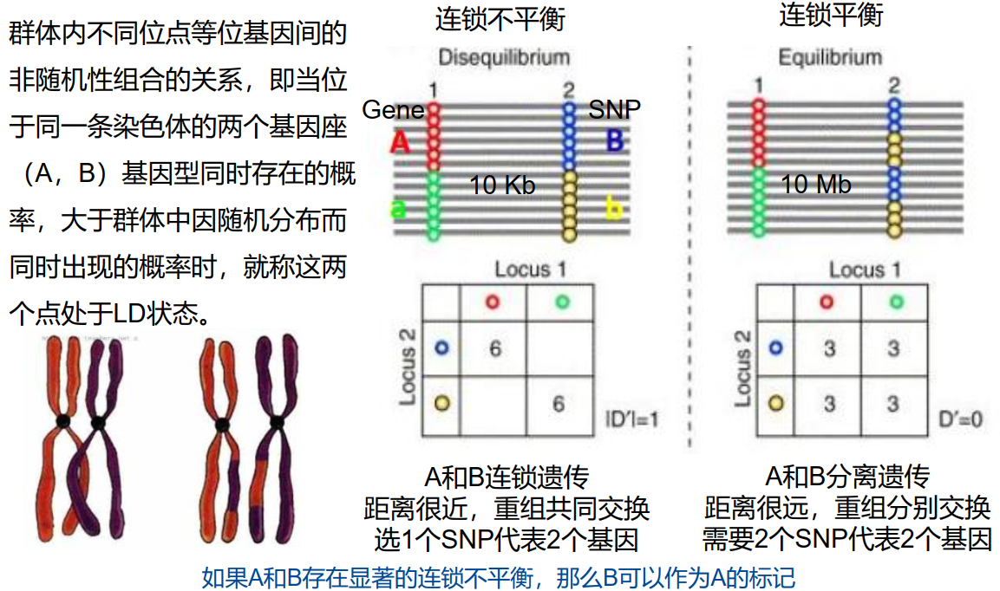

### 11.1.8 GWAS - Drugs

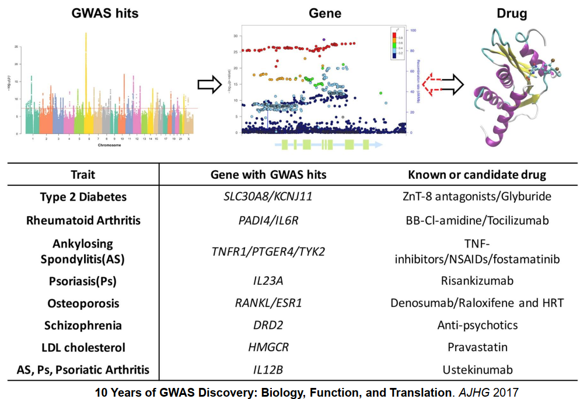

- 更近一步，使用GWAS找到了显著相关性SNPs位点对应的基因，接下来就可以利用这些基因去进行药物研发

### 11.1.9 GWAS存在的问题

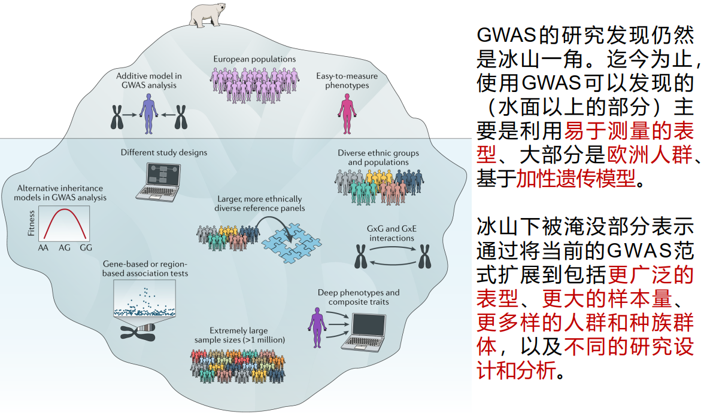

- 优缺点：

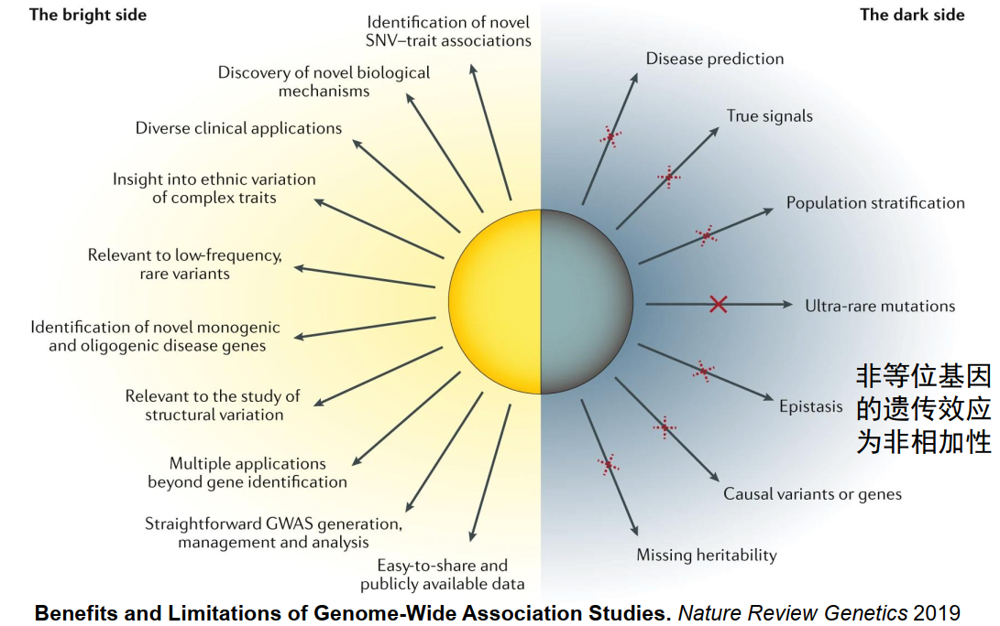

## 11.2 WAS系列

### 11.2.1 表观组：EWAS

- 将**表观遗传学变异**和**复杂疾病或性状**进行关联
- 找到与致病原因相关或复杂性状相关的表观遗传学变异位点
- 通过检测整个基因组成千上万特异表观修饰差异（比如DNA核苷酸上甲基分布），来**鉴别出疾病中常见的表观突变或与复杂性状密切相关的表观修饰**

- 研究难点：
  - 由于**表观修饰容易受环境、行为和表型的影响**，因此在选择样本时需要控制这些因素
  - **表观修饰水平受细胞比例的影响**，研究时需要分析细胞比例是否变化
  - **表观修饰的变化不一定发挥功能**，对因果关系的解析非常重要

### 11.2.2 转录组：TWAS

### 11.2.3 蛋白质组：PWAS

### 11.2.4 表型组：PheWAS

- 表型：基因和环境相互作用决定的人体特征
- 表型组：是生物体**从胚胎发育到出生、成长、衰老乃至死亡过程中**，形态特征、功能、行为、分子组成规律等**所有生物、物理和化学特征**的集合
- 和GWAS颠倒：揭示**表型组之间的关联，找并发症**

## 11.3 关联知识库

### 11.3.1 全基因组/表观组关联知识库

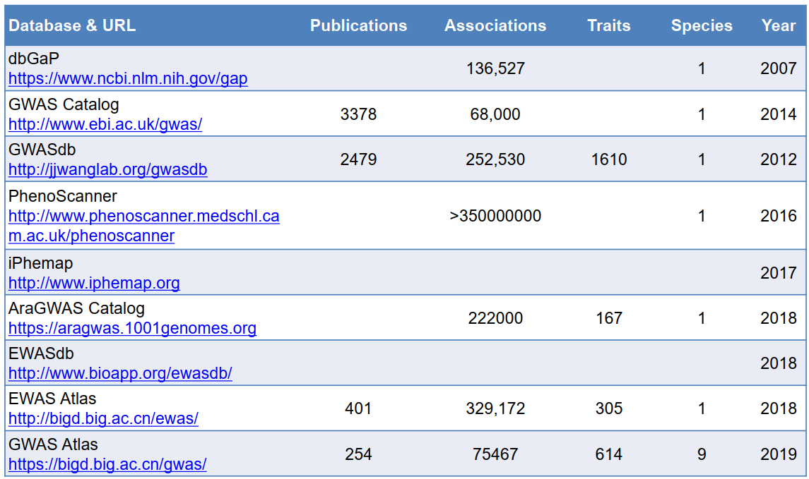

### 11.3.2 GWAS Atlas -- 数据统计信息

- 综合多物种的变异-性状关联知识库：https://ngdc.cncb.ac.cn/gwas/browse/species

### 11.3.3 EWAS Atlas

- https://ngdc.cncb.ac.cn/ewas
- EWAS Data Hub: https://ngdc.cncb.ac.cn/ewas/datahub

### 11.3.4 TWAS Atlas

- https://ngdc.cncb.ac.cn/twas

### 11.3.5 其他相关数据库

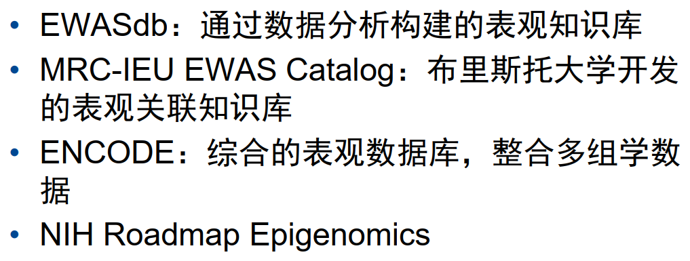

### 11.3.6 PheWAS

- PheWeb：https://pheweb.org/UKB-SAIGE/pheno/278.1

# Ch12 泛基因组与宏基因组

## 12.1 泛基因组（Pangenome）

- 某一物种**全部基因**的集合
- A pangenome refers to a collection of genomic sequences in the entire species or population rather than in a single individual
  - Core genome（核心基因组）：保守基因，在全部的个体中都有
    - 高度保守，在同一种细菌所有菌株中都存在(***shared by all individuals***)
    - 保持生命体基本功能，代表物种的基本表型特征
  - Accessory/Dispensable genome：有些个体有，有些个体没有 (***shared by some individuals***)
  - Strain-specific genes：只在一个个体中出现(***unique to an individual***)
- 非必须基因组：
  - 在细菌整个进化史上，为适应环境条件而不断发生**水平转移**（<b style = "color: blue">遗传物质传递给非其子代</b>）和基因缺失
  - 使不同菌株间在表型、生活方式、代谢等方面发生明显的分化，最终表现为丰富的遗传多样性
- Essential genes(必需基因)：Essential genes are those genes of an organism that are thought to be **<u>critical for its survival</u>**. 核心基因包含必须基因

## 12.2 宏基因组（Metagenome）

- 宏基因组，也称环境基因组或元基因组，定义为**生境中全部微小生物遗传物质的总和**，包含可培养的和未可培养的微生物的基因组

- 宏基因组学就是一种以环境样品中的**微生物群体基因组**为研究对象，以功能基因筛选和/或测序分析为研究手段，以微生物多样性、种群结构、进化关系、功能活性、相互协作关系及与环境之间的关系为研究目的的新的微生物研究方法
- 人类宏基因组：**人体内所有微生物菌群基因组的总和**。人类宏基因组学的目标是把人体内共生菌群的基因组序列信息都测定出来，研究与人体发育和健康相关的基因功能
- Genome & Pangenome & Metagenome

- 取样来源：土壤、水体、空气、肠道、口腔、皮肤等
- 应用：人类健康、农业、生物多样性、生态环境、生化燃料、生物技术、人工生物环境等
- 微生物组：

- 数据库：https://www.ebi.ac.uk/metagenomics/

# Ch13 癌症基因组学与精准医学

- 癌症：又名恶性肿瘤，指的是**细胞不正常增生**，这些增生的细胞可能**侵犯身体的其他部分**
- 肿瘤（Tumor） vs 癌症（Cancer）
  - 肿瘤 = 良性肿瘤 + 恶性肿瘤
  - 恶性肿瘤 = 癌 + 肉瘤 + 癌肉瘤
    - 凡是来源于上皮组织的恶性肿瘤统称为癌
    - 来源于中胚叶组织如脂肪、肌肉、骨等部位呃恶性肿瘤，统称为肉瘤
    - 如果某一恶性肿瘤既有癌的成分，又有肉瘤的成分，则被称为癌肉瘤

- 中国发生率及死亡率最高的5种癌（2015年）：肺癌、胃癌、食管癌、肝癌、直肠癌

## 13.1 癌症基因组学

- 定义：通过高通量测序技术将**基因与癌症关联**起来研究
- 目标：鉴定**原癌基因**和抑**癌基因**，揭示癌症发生发展的分子机制，理解癌症异质性的生物学基础，提供**个性化的精准治疗**策略，为癌症诊断、癌症临床结果预测和癌症靶标治疗提供新的方法
  - 致癌基因（Oncogene）：或叫**癌基因**，是一类能使正常细胞转化为癌细胞的基因，是**功能异常的原癌基因**。原癌基因一般与细胞的增殖生长相关，功能正常的原癌基因并不会导致癌症。当原癌基因发生片段丢失、点突变、复制等突变后，就可能转化为致癌基因。
  - 抑癌基因（Tumor suppressor gene）：也称**肿瘤抑制基因**，一类抑制细胞生长过度、增殖从而遏制肿瘤形成的基因。当这类基因在发生突变、缺失或失活时可引起细胞恶性转化而导致肿瘤的发生。例如：*TP53（基因组守护者）*
  - 原癌基因和抑癌基因相互制约和配合

## 13.2 精准医学

- 精准医学：通过分析癌症基因组学信息为患者量身定制更好的诊断和治疗策略
- 现已开发出多种方法来对抗癌症，例如：
  - 抑制癌细胞异常生长和生存的酶
  - 阻断癌细胞异常基因表达
  - 停止癌细胞中过度驱动的分子信号通路

- 癌症基因组图谱（TCGA）：包含33种癌症84000多个体的基因组、转录组、表观组、蛋白质组等数据

	# Ch14 健康基因组学与人口健康

- 研究如何利用基因组学实现**健康生活、疾病预防**等
- 我国四类重大慢性病：
  - 心脑血管疾病
  - 糖尿病
  - 慢性呼吸系统疾病
  - 癌症
- <b style = "color: red">健康基因组学：利用基因组学数据和技术研究如何保障人类健康</b>

# Ch15 药物基因组学与精准用药

- 精准医学：根据个体基因信息实现精准诊疗和用药
- 药物基因组学：研究基因组在药物反应中的作用，分析个体的遗传构成如何影响个体对药物的反应，通过将基因表达或单核苷酸多态性与**药动学**和**药效学**以及药物受体靶效应相关联，处理后天获得性的与先天性的遗传变异对药物反应的影响

- 药动学：药物的吸收、分布、代谢和消除
- 药效学：药物作用与药理效应（即药物对机体的作用及作用机制）、治疗效果和不良反应

# Ch16 法医基因组学与公共安全

- 法医：运用基础医学、临床医学以及相关的刑事科学技术、司法鉴定技术对与法律相关的人体或犯罪现场进行**勘察鉴别**并作出**鉴定**
- 法医物证：通常包括血液、精液、阴道分泌液、乳汁、唾液、鼻涕、尿液、 毛发、指甲、骨骼、 牙齿等**人体各种组织器官及其碎块**等。由于案件类型的多样性和犯罪现场的复杂性，使法医物证检材不可避免地受到环境的影响以致**污染或被破坏**
- 法医基因组学：是以法医物证为研究对象，以提供科学证据为目地， 研究如何应用基因组学的最新技术解决与案件有关的人体和动物、植物及微生物等非人源生物检材鉴定的一门学科，其研究内容属法医学中的物证检验部分，是法医学研究的主要内容之一
- 基因组学助力法医物证两大基本任务：

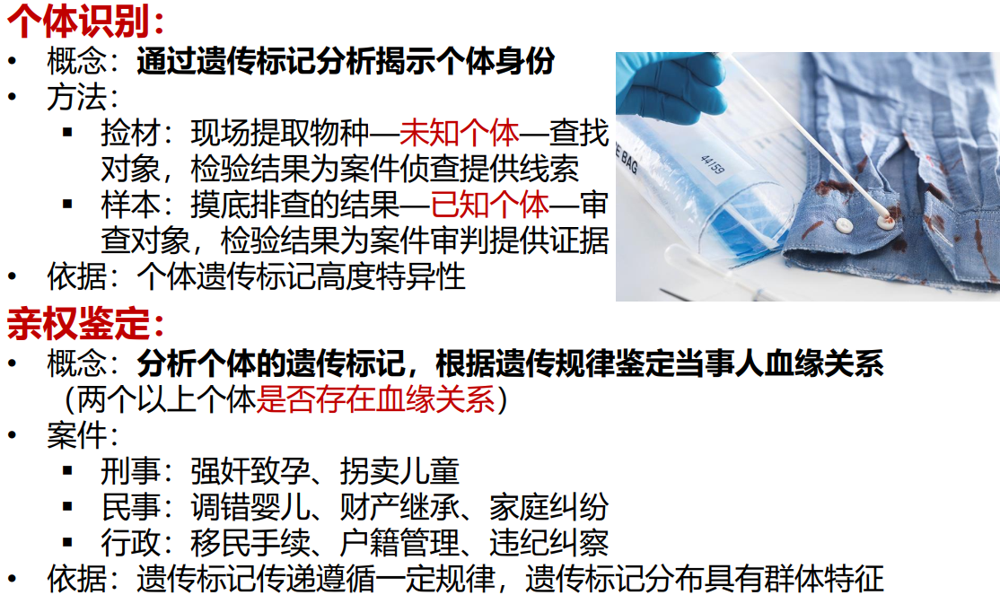

# Ch17 作物基因组学

- 以农作物为研究对象的基因组学研究，主要包括：
  - 解析作物基因组的序列、结构和演化
  - 揭示作物生长发育与复杂农艺性状形成的分子机理与调控网络
  - 挖掘用于作物分子设计育种的重要基因资源
  - 建立作物组学数据库平台和分析平台
- 水稻是中国第一大粮食作物，稻生南方则为籼，稻生北方则为粳（geng）
- 小麦是中国第二大粮食作物
- 玉米原产于美洲

