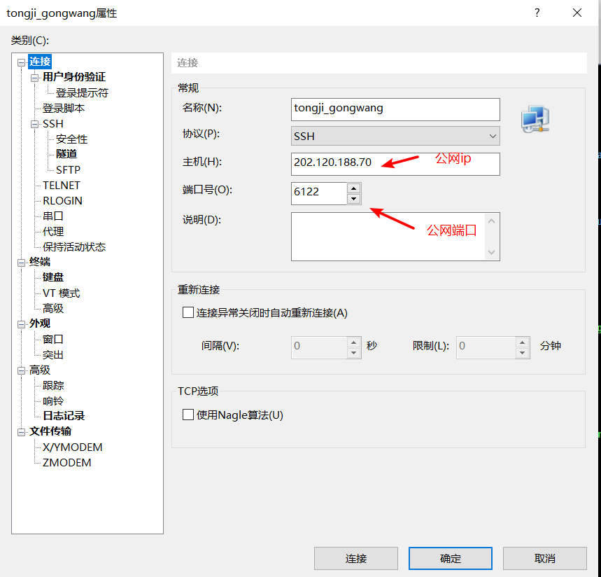
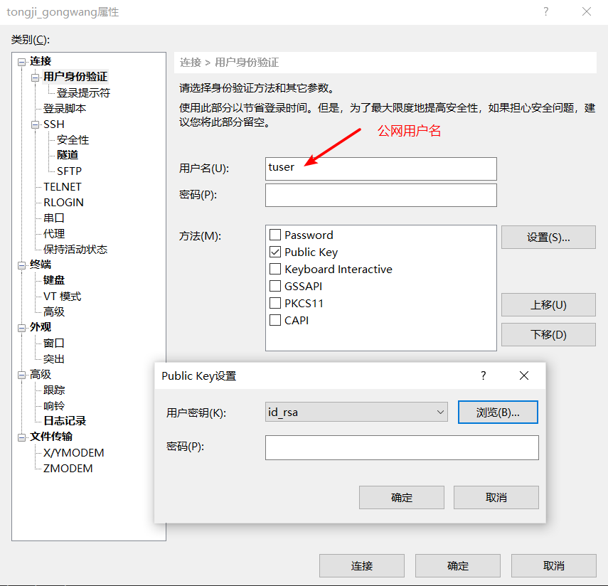
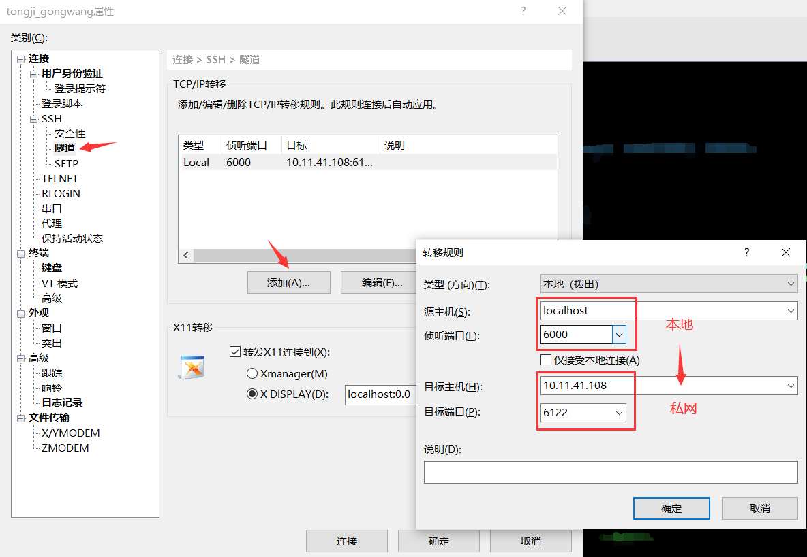
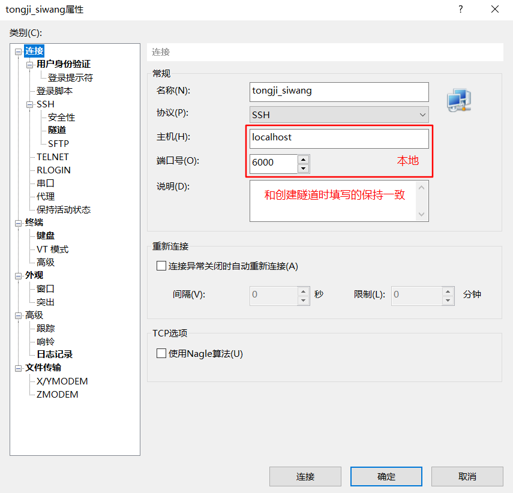
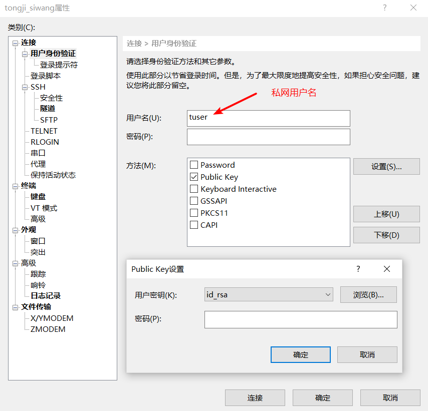
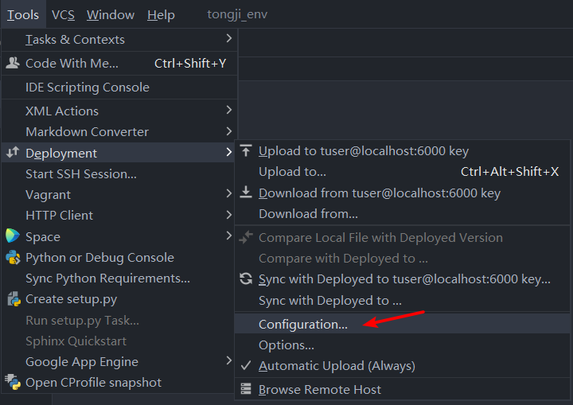
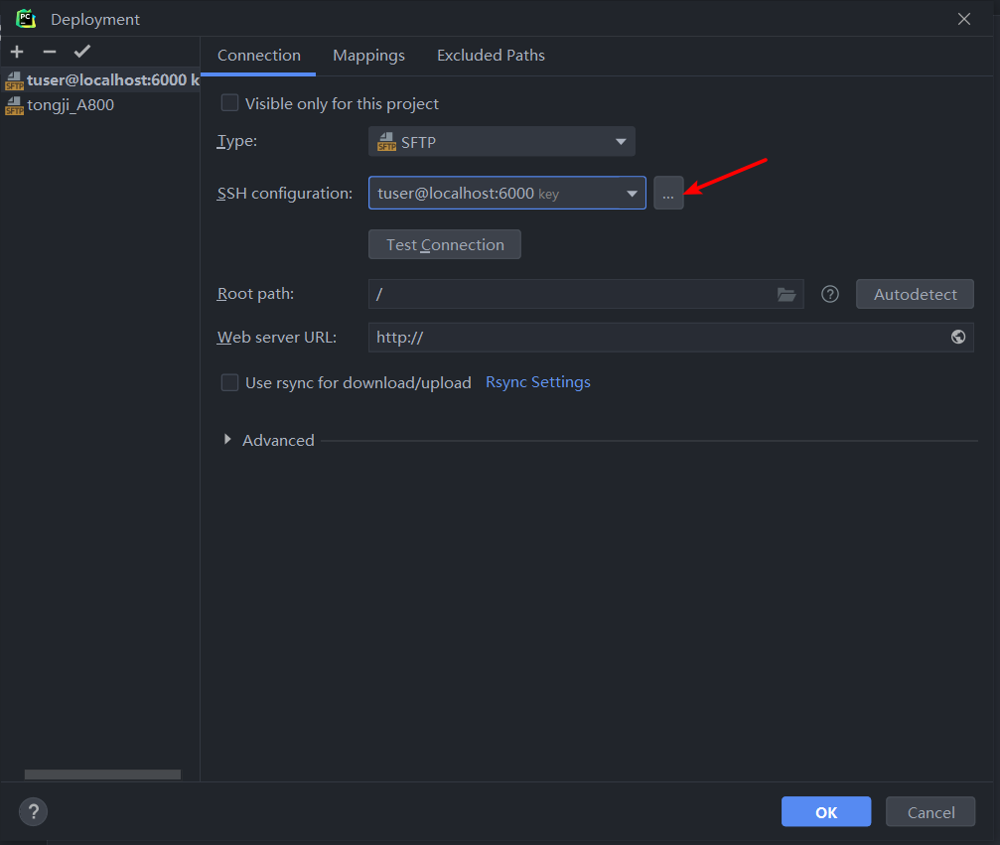
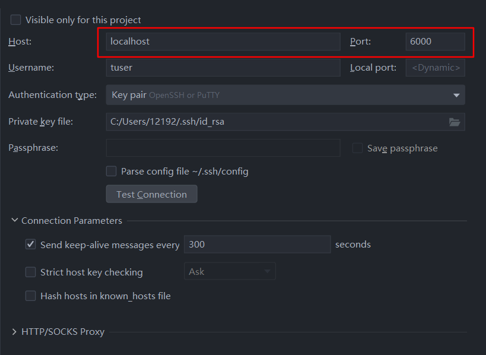
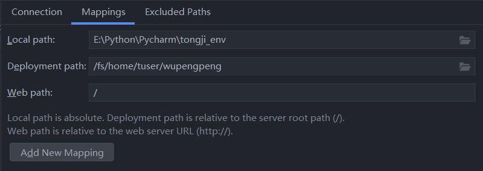

# PyCharm通过跳板机连接服务器

🎈参考博客：[CSDN](https://blog.csdn.net/qq_39407107/article/details/115468254)

## 1. 准备

- Xshell
- PyCharm专业版

## 2. Xshell中的操作

### 2.1 创建跳板机

### 2.2 创建隧道

### 2.3 创建连接内网服务器

## 3. PyCharm中的操作

> 🎁最后去配置python解释器即可！