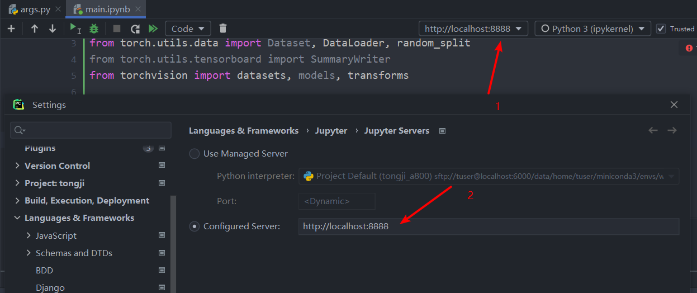

- 在服务器上安装jupyter（官网查看安装指令）
- 生成配置文件：

```shell
jupyter notebook --generate-config

# 注意生成配置文件的路径
```

- 设置密码：（建议不要设置）

```shell
juptyer notebook password

# 连续两次回车即可
```

- 修改配置文件的内容

```shell
vim 配置文件路径

# 在文件末尾（esc -> :$）添加如下代码：
c.ServerApp.ip = '*'  # 允许访问此服务器的ip，星号表示任意ip
c.ServerApp.password = ''  # 不设置密码
c.ServerApp.open_browser = False  # 运行时不打开本机浏览器
c.ServerApp.port = 9636  # 使用的端口，不要和别人冲突即可
c.ServerApp.enable_mathjax = True  # 启用MathJax
c.ServerApp.allow_remote_access = True  # 允许远程访问
c.ServerApp.notebook_dir = '/fs/home/tuser/wupengpeng/'  # 设置默认工作目录
```

- 启动jupyter notebook

```shell
jupyter notebook
```

- 打开本地cmd，映射到本地

```shell
# ssh -L 本地端口:远程ip:远程端口 用户名@跳板机ip -p 端口号 
ssh -L 8888:10.11.41.108:9636 tuser@202.120.188.70 -p 6122
```

- 本地浏览器打开

```http
localhost:8888
```

- Pycharm远程连接jupyter

> 🧨将本地浏览器打开后的网址拷贝到如下位置即可：
>
> 