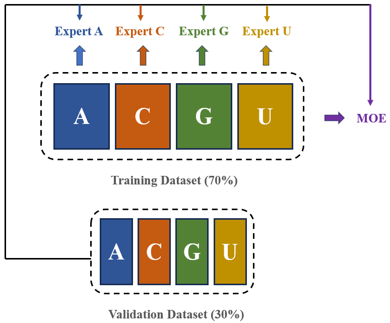

# 预测人类RNA中2'-O-甲基化(2OM)位点

- 基于Mixture Of Experts (MOE) 模型
  - Expert专家模型，**模型待完善中...**
  - Gate门控模型，**模型待完善中...**
  - 该模型包含4个Experts，每个Expert模型架构目前是一致的，**这4个专家分别处理A2OM、G2OM、C2OM和U2OM数据**
- 训练请运行`train.py`
- 测试请运行`test.py`
- 本项目提供了MOE模型训练可视化，在训练过程中，会生成`./train_logs`文件夹，请使用`Tensorboard`查看
- 测试时会将控制台的输出结果写入`./test_logs`文件夹中

## 1. 数据集划分策略



## 2. 训练策略说明

1. 第一阶段：训练Expert模型
2. 第二阶段：训练MOE模型
3. 训练过程中采用了`early_stop`策略，如果验证集准确率在`m`个epochs后没有提升，则提前终止训练，保存验证集准确率最高的模型的参数 

## 3. 序列嵌入方式

| 嵌入方式                      | 嵌入维度 | URL                                                          |
| ----------------------------- | -------- | ------------------------------------------------------------ |
| OneHotEmbedder                | 4        | \                                                            |
| DNABertEmbedder/3mer          | 768      | https://huggingface.co/zhihan1996/DNA_bert_3                 |
| DNABertEmbedder/4mer          | 768      | https://huggingface.co/zhihan1996/DNA_bert_4                 |
| DNABertEmbedder/5mer          | 768      | https://huggingface.co/zhihan1996/DNA_bert_5                 |
| DNABertEmbedder/6mer          | 768      | https://huggingface.co/zhihan1996/DNA_bert_6                 |
| DNABert2Embedder              | 768      | https://huggingface.co/zhihan1996/DNABERT-2-117M             |
| NucleotideTransformerEmbedder | 1280     | https://huggingface.co/InstaDeepAI/nucleotide-transformer-500m-human-ref |
| GENALMEmbedder/bigbird        | 768      | https://huggingface.co/AIRI-Institute/gena-lm-bigbird-base-t2t |
| GENALMEmbedder/bert           | 768      | https://huggingface.co/AIRI-Institute/gena-lm-bert-base-t2t  |
| GROVEREmbedder                | 768      | https://zenodo.org/records/8373117                           |
| ConvNetEmbedder               | \        | BEND仓库暂未提供                                             |
| AWDLSTMEmbedder               | \        | BEND仓库暂未提供                                             |
| HyenaDNAEmbedder              | \        | 暂未实现                                                     |

- 序列嵌入实现基于[BEND](https://github.com/frederikkemarin/BEND)仓库，Thanks！

## 4. 训练过程🎄

> 数据组织格式：

data/
├─2OM_Test/
│  ├─csv/
│  │      A2OM_test.csv
│  │      C2OM_test.csv
│  │      G2OM_test.csv
│  │      U2OM_test.csv
│  │
│  └─fasta/
│          A2OM_test.fasta
│          C2OM_test.fasta
│          G2OM_test.fasta
│          U2OM_test.fasta
│
└─2OM_Train/
    ├─csv/
    │      A2OM_train.csv
    │      C2OM_train.csv
    │      G2OM_train.csv
    │      U2OM_train.csv
    │
    └─fasta/
            A2OM_train.fasta
            C2OM_train.fasta
            G2OM_train.fasta
            U2OM_train.fasta

> 原始数据仅包含fasta文件，csv文件由`file_process.py`生成，命令如下：

```bash
cd tools/
# 处理训练数据
python file_process.py --fasta_path="../data/2OM_Train/fasta" --csv_path="../data/2OM_Train/csv" --need_convert_U2T=True
# 处理测试数据
python file_process.py --fasta_path="../data/2OM_Test/fasta" --csv_path="../data/2OM_Test/csv" --need_convert_U2T=True
```

> 运行`downloads.py`下载预训练模型：

```bash
cd tools/
python downloads --save_path='../pretrained_models'
```
- 我们使用了国内的镜像网站进行下载：https://hf-mirror.com/
- 你也可以通过huggingface官网进行手动下载：https://huggingface.co/
- 注意：预训练模型约占`6.7G`，请预留足够的内存

> 运行`seq_embedder.py`对所有的训练数据和测试数据进行编码，结果会保存在`h5`文件中：

```bash
cd tools/
python seq_embedder.py --data_root='../data' --model_root='../pretrained_models' --h5_file='../embed.h5' --device='cuda:0'
```

- 你可以使用`h5py`模块对h5文件进行操作，具体见[官方文档](https://docs.h5py.org/en/stable/index.html)
- 注意：h5文件约占`13.82G`，请预留足够的内存

> 运行`train.py`训练模型：

```bash
python train.py
```

- 由于参数较多，请进入脚本内部更改参数！

> 通过tensorboard查看训练结果：

```bash
tensorboard --logdir=...
```

## 5. 测试过程🎄

> 运行`test.py`进行测试

- 由于参数较多，请进入脚本内部更改参数！
- 测试时控制台的输出会写入日志文件中

## 6. 结果展示 (测试集)

> Expert模型基于**CNN-Transformer_Encoder**

- 详情见`test_logs`文件夹！

