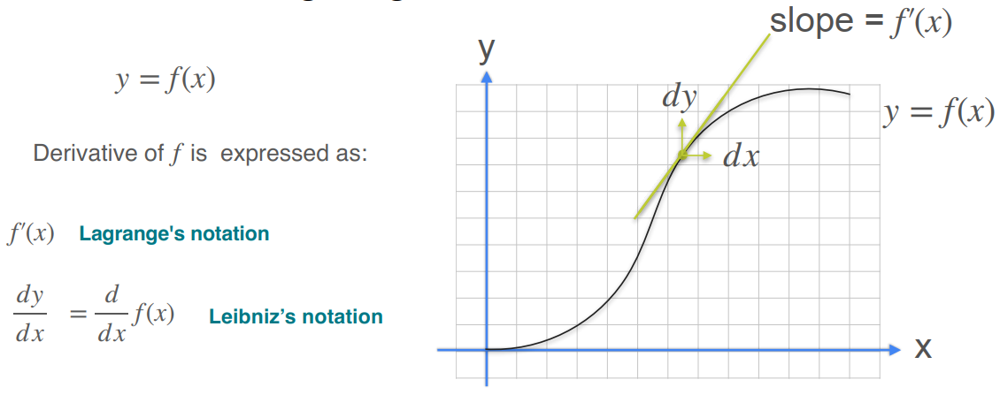
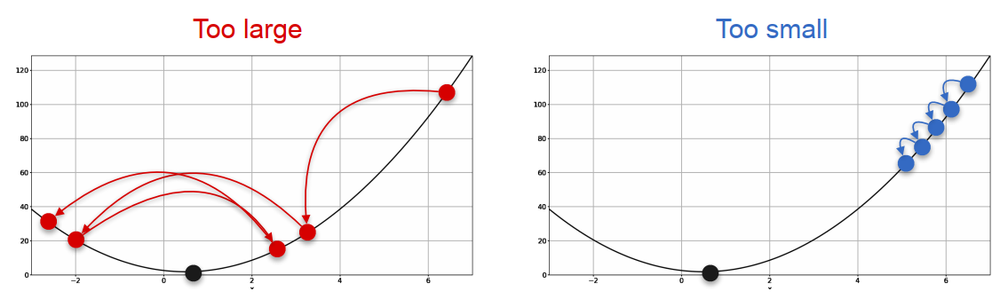
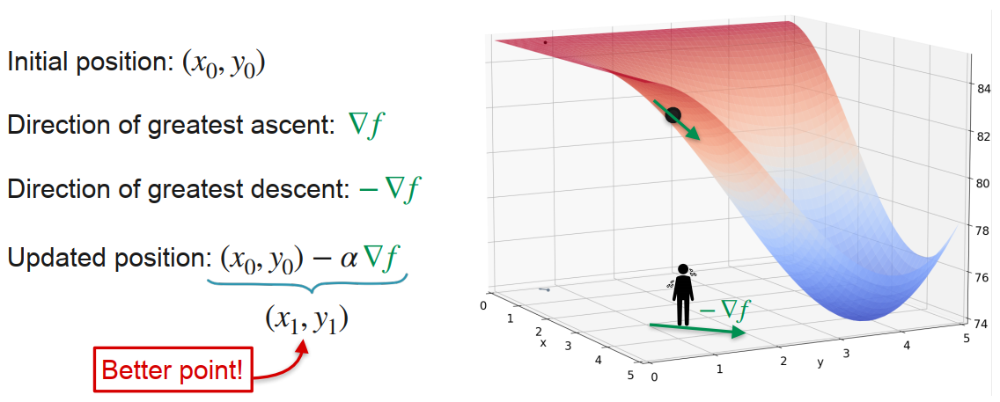
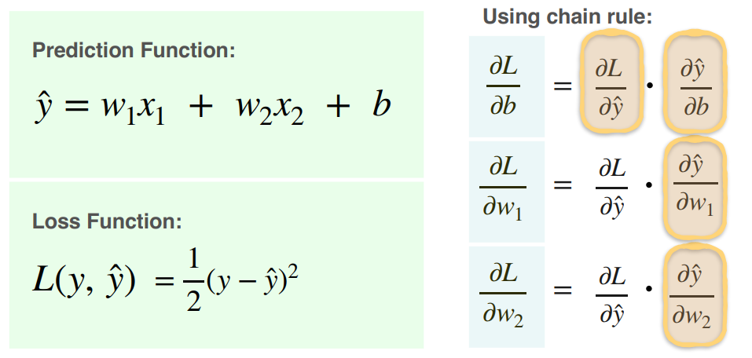
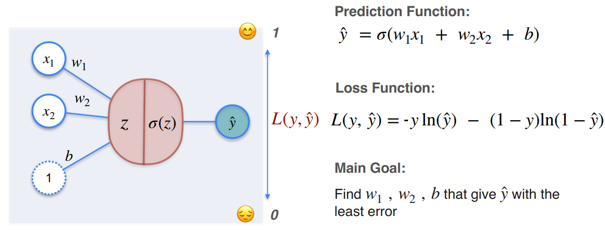
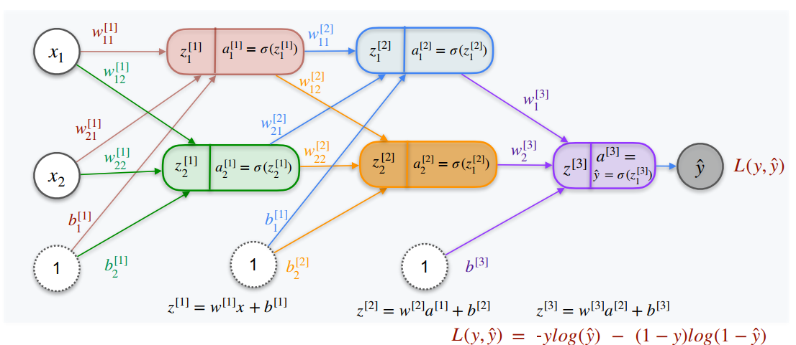

<b>📕机器学习--微积分</b>

[[课程链接: Coursera](https://www.coursera.org/specializations/mathematics-for-machine-learning-and-data-science)]
[[课程链接: Bilibili](https://www.bilibili.com/video/BV1Pg4y1X7Pa?p=1)]
[[课程链接: Github](https://github.com/Ryota-Kawamura/Mathematics-for-Machine-Learning-and-Data-Science-Specialization)] -- Homework

[TOC]

# Week 1: Derivatives and Optimization

## 1.1 导数的表示方法：Derivative notation

> 上述分别是**拉格朗日表示法**和**莱布尼茨表示法**

## 1.2 反函数：Inverse Function

> 反函数的性质：
>
> 如果f(x)和g(x)互为反函数：
>
> - <b style = "color: red; background-color: yellow">性质1：g(f(x)) = x</b>
>
> - <b style = "color: red; background-color: yellow">性质2：如果(a, b)在f(x)上，则(b, a)在g(x)上</b>
>
> - <b style = "color: red; background-color: yellow">性质3：如果(a, b)在f(x)上，且f(x)在x = a处的导数为m，则g(x)在x = b处的导数为1/m</b>
>
> 例如：
>
> $$
> x^2和sqrt(x)互为反函数
> $$
> $$
> e^x和ln(x)互为反函数
> $$

## 1.3 欧拉数：e

> 👩银行存款中的应用：
>
> 

## 1.4 导数的存在性：Existence of the derivative

**For a function to be differentiable (可微) at a point:**

- The derivative has to exist for that point

**For a function to be differentiable (可微) at an interval:**

- The derivative has to exist for *every* point in the interval

> 1. <b style = "color: green">Generally, when a fuction has a corner (角) or a cusp (尖), the function is not differentiable at that point.</b>
>
> 
>
> 2. <b style = "color: green">不连续的函数是不可微的</b>
>
> 
>
> 3. <b style = "color: green">切线和y轴平行的函数也是不可微的</b>
>
> 
>
> [关于切线的一个知乎回答](https://www.zhihu.com/question/317987526)：切线可以看做一小段曲线的近似

:star:总结：有尖点，不连续，有垂直切线的函数不可微

## 1.5 Chain Rule

## 1.6 平方损失优化

- Question：已知有三个电塔，距离原点的距离分别是a, b, c，现有一个房子需要确定选址，要求铺设电缆花费最少，其中：铺设电缆的费用与房子与电塔距离的平方成正比

- Solution：

> 平方损失：
>
> 

## 1.7 对数损失优化

- Question：投10次硬币，7次正面，3次反面则游戏胜利。要求设计一枚特殊的硬币，其正面向上的概率为p，使得游戏获胜的概率最大

- Solution 1：

- Solution 2：另一种更简便的方式是对g(p)取对数，最大化g(p)相当于最大化log(g(p))

> 总结：<b style="color: blue">为什么要取对数？</b>
>
> 1. Derivative of products is hard, derivative of sums is easy. (一堆式子相乘的导数很难求，但一堆式子相加的导数相对容易)
>
> 
>
> 2. Product of lots of tiny things is tiny! (一堆很小的数字相乘会导致很小的结果，计算机可能无法处理，将一个很小的数取对数就可能将这个数变成很大的一个负数)

# Week 2: Gradients and Gradient Descent

## 2.1 Partial derivatives

- 求对x的偏导数，就是将y视为常数（用垂直于y轴的平面切割曲面），求f对x的一元导数，对应右图抛物线的导数
- 求对y的偏导数，就是将x视为常数（用垂直于x轴的平面切割曲面），求f对y的一元导数，对应左图抛物线的导数

## 2.2 Gradient

- 一元函数的切线，对应二元函数的切平面，如上图，二元函数在某一点处的两个切线（偏导数）构成了切平面
- <b style = "color: red">梯度就是由偏导数构成的向量▽</b>，英文为Nabla，“奈不拉”
- <b style = "color: blue">梯度的方向是函数值增长最快的方向</b>

## 2.3 Optimization using Gradient Descent in one variable

- 对于上图中的cost function，直接使用导函数=0求最小值无法实现，此时我们可以使用梯度下降法

- 如上图，左边的点应该向右行走才能使函数值降低，右边的点应该向左走才能使函数值降低
- 左边点处的斜率为负数（应该向正方向行走，即：x增加），右边点处的斜率为正数（应该向负方向行走，即：x减少）
- 因此**点的移动方向（x增加/减少）应该与斜率的方向相反**，点移动的距离就等于该点处导数的值
- 也就是说，越陡峭的地方移动的距离越大，越平坦的地方移动的距离越小
- 我们不希望在陡峭的地方一次移动的距离过大，从而错过了最低点，因此，我们引入了学习率进行步长的调整

- 但是，学习率太小也不行，这会影响模型收敛的速度

> 👨‍🏫对于只有一个变量的梯度下降法：
>
> 
>
> - 初始位置的选取很重要，单一的初始位置可能会使得梯度下降算法陷入**局部最小值（local minima）**
>
> 

## 2.4 Optimization using Gradient Descent in two variables

- 沿着梯度的反方向行走~

> 🕵️‍♂️对于含有两个变量的梯度下降法：
>
> 

## 2.5 梯度下降法应用于线性回归

# Week 3: Optimization in Neural Networks and Newtown's Method

## 3.1 感知机

### 3.1.1 分类问题

- 多元线性回归问题（损失使用平方损失）：

- 反向传播计算梯度：

- 计算结果：

### 3.1.2 分类问题

- 二分类问题（激活函数使用sigmoid，损失使用对数损失）：

- 关于sigmoid函数：
  - 函数图像：
  - 导函数：
- 关于对数损失：

- 反向传播计算结果：

## 3.2 神经网络

- 反向传播：

## 3.3 牛顿方法：Newton's method

<b style = "color: red; background-color: yellow">牛顿方法原本是用来找函数零点的！！！</b>

- 牛顿方法用于优化：

> 找到函数g(x)的最小值点，相当于找g'(x)的零点，这样以来就把优化问题转换成了找零点问题，牛顿方法便可派上用场！

## 3.4 二阶导数

- 表示方法（一元函数）：

- 表示方法（二元函数）：

- 👼含义：二阶导数可以用于衡量**曲线和直线的偏离量，即：曲率**

- **二阶导数>0为凹函数，二阶导数<0为凸函数**

> 当我们找到了一些使得一阶导数等于0的点，我们并不能确定这些点是局部最大值还是局部最小值，这时候我们可以计算该点处的二阶导数，如果二阶导数大于0，则为局部最小值点，反之为局部最大值点！
>
> - 一阶导数反映单调性，二阶导数反映凹凸性
>
> 

## 3.5 海森矩阵：Hessian Matrix

> 一元函数和二元函数对比：
>
> 

## 3.6 海森矩阵和凹凸性

## 3.7 牛顿方法用于两个变量的函数

> 注意：Hessian矩阵和梯度向量的乘积顺序，海森矩阵形状为2x2，梯度向量形状为2x1
