
<b>📕机器学习--概率论与数理统计</b>

[[课程链接: Coursera](https://www.coursera.org/specializations/mathematics-for-machine-learning-and-data-science)]
[[课程链接: Bilibili](https://www.bilibili.com/video/BV1WH4y1q7o6/?spm_id_from=333.999.0.0&vd_source=71ef231609c4f6a95ebfadad530deed2)]
[[课程链接: Github](https://github.com/Ryota-Kawamura/Mathematics-for-Machine-Learning-and-Data-Science-Specialization)] -- Homework

[TOC]

# Week 1: Introduction to Probability and Probability Distributions

## 1.1 互斥事件 & 非互斥事件

- ∪可以理解为“或”
- ∩可以理解为“且”

## 1.2 独立（Independence）

- <b style = "color: blue">定义：一个事件的发生不影响另一个事件发生的概率</b>
- 独立：投硬币，第一次是正面还是反面并不影响第二次是正面还是反面
- 不独立：下棋，第10步下棋的位置会影响第11步下棋的位置

> :star:注意：A和B事件必须是独立的上述公式才会生效！

## 1.3 条件概率

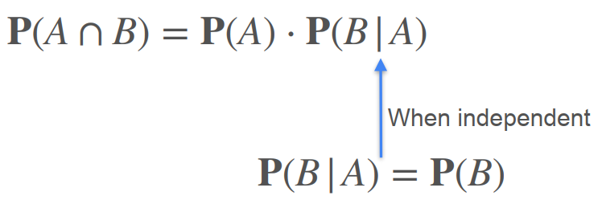

- 上式是更一般的形式，当然也可以表示成：P(AB) = P(B)P(A|B)

## 1.4 贝叶斯定理

### 1.4.1 贝叶斯定理直觉

- 假如你去医院看病，医生诊断的正确率是99%，如果某一次你被诊断结果为阳性，那么你得病的概率是多少？

从上图可以看到，这种病的患病率是**1/10,000**，即1,000,000人中只有100个人患病：

由于医生诊断的正确率是99%，那么**100个实际生病的人中，有1个会被误诊；999,900个实际健康的人中，有9,999个会被误诊**；

因此，如果被诊断为阳性，得病的概率为：99 / (99 + 9,999) = 0.0098，如下图：

### 1.4.2 贝叶斯定理数学公式

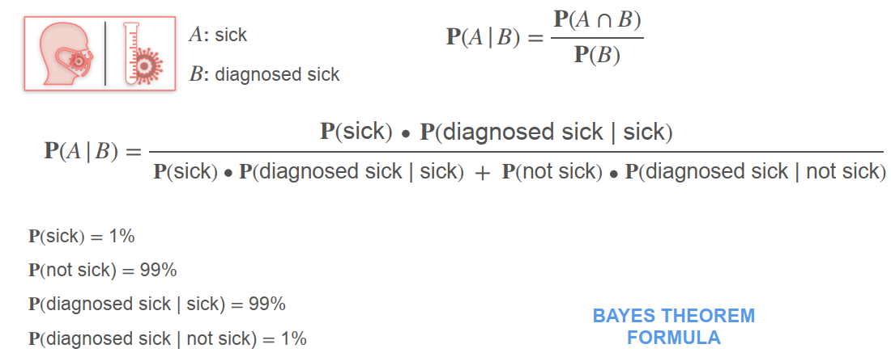

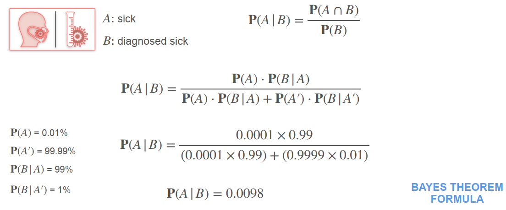

> Video: [贝叶斯定理和全概率公式](https://www.bilibili.com/video/BV1a4411B7B4/?spm_id_from=333.337.search-card.all.click&vd_source=71ef231609c4f6a95ebfadad530deed2)

### 1.4.3 先验概率 & 事件 & 后验概率

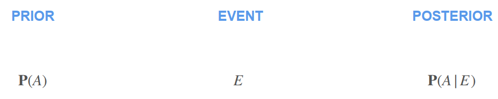

> - 对于一个垃圾邮件分类系统，我们可以只根据邮件中是否含有彩票(lottery)单词来进行构建，也就是说：先验概率是P(垃圾邮件)，事件是邮件中含有lottery，后验概率是P(垃圾邮件|lottery)，这里的事件只有一个，如果使用多个事件该怎么办？
> - 例如：我们将事件改为邮件同时含有lottery和winning字眼，或者使用更多的特征w1, w2, ..., wn？
> - 我们可以做一个Naive assumption：所有单词的出现都是独立的，也就是说：P(w1w2...wn) = P(w1)P(w2)...P(wn)
> - 这里构建的模型就是Naive Bayes
>
> 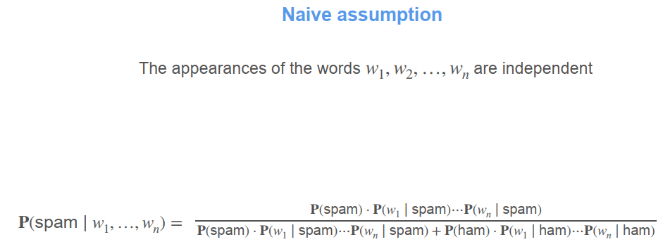

## 1.5 随机变量

- Discrete（离散变量）：Can take only a **countable** number of values
- Continuous（连续变量）：Take values on an interval

> 注意：<b style = "color: red">“离散变量的取值是有限的”，这种说法是错误的！</b>例如X表示硬币投出正面向上时实验的次数，此时X可以取1，2，3，...

## 1.6 离散分布（Events are a list）

### 1.6.1 二项分布：Binominal Distribution

❤❤❤**5次抛硬币，2次正面向上的概率？**

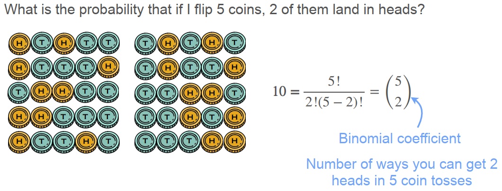

> - 二项分布（二项分布系数）：
>
> 
>
> - :star:二项分布具体表达式（n和p是二项分布的参数）：
>
> 
>
> - <u>**二项分布的均值：np**</u>
> - <u>**二项分布的方差：np(1-p)**</u>

### 1.6.2 伯努利分布：Bernoulli Distribution

> 💫二项分布和伯努利分布的区别：
>
> 1. **试验次数不同：**伯努利分布只描述一次试验的结果，而二项分布描述了多次重复试验的结果
> 2. **取值个数不同：**伯努利分布的取值只有两个可能的结果，成功和失败，而二项分布的取值可以是0次成功、1次成功、2次成功，直到n次成功
> 3. **概率计算方法不同：**伯努利分布的概率计算只需要考虑一次试验的结果，而二项分布的概率计算需要考虑多次试验的结果，并在此基础上计算成功的次数

## 1.7 连续分布（Events are a interval）

### 1.7.1 Probability density function, PDF (概率密度函数)

> 😴PMF（概率质量函数） v.s. PDF（概率密度函数）
>
> 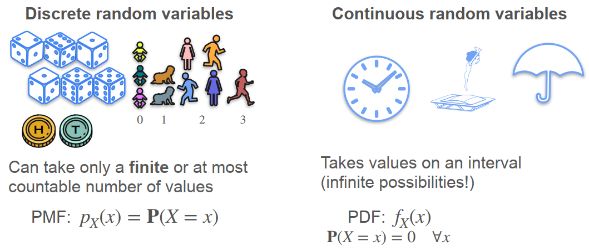

## 1.8 Cumulative Distribution Function, CDF：累积分布函数

### 1.8.1 离散分布的CDF

- 左图显示了一个离散分布的概率质量函数：通话时间在0-1分钟的概率，1-2分钟的概率，...，4-5分钟的概率
- 右图为其对应的**累积**分布函数：通话时间在0-1分钟的概率，0-2分钟的概率，...，0-5分钟的概率

### 1.8.2 连续分布的CDF

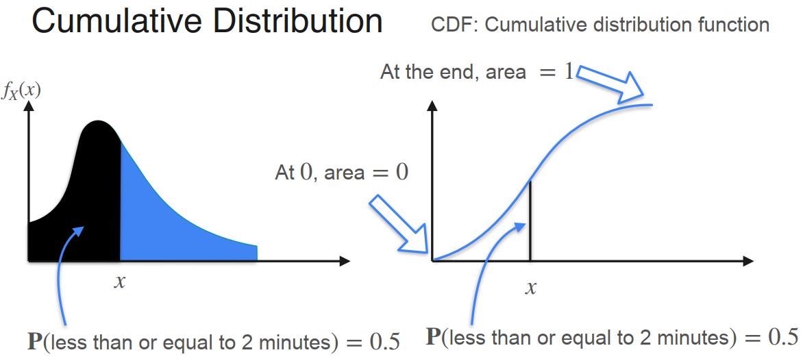

### 1.8.3 总结

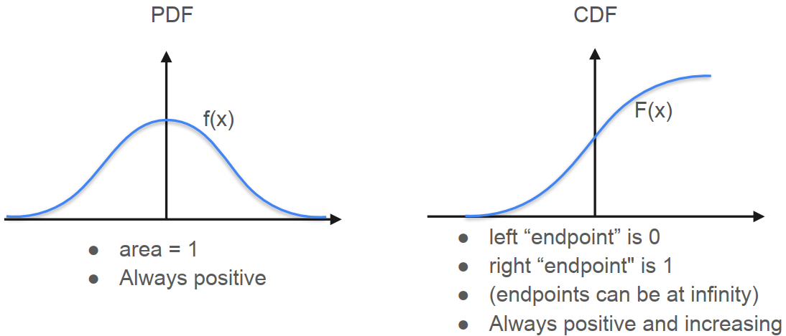

## 1.9 均匀分布：Uniform Distribution

- 假设每隔10分钟有一辆公交车经过，那么一个人等待任何时间的概率都是1/10，换句话说：如果今天有100000个人在该站台等公交车，以等待的时间为横轴，人数的占比为y轴，可以发现等待各个时间段的人数占比几乎一致~
- <b style = "color: red; background-color: yellow">均匀分布的PDF和CDF：</b>

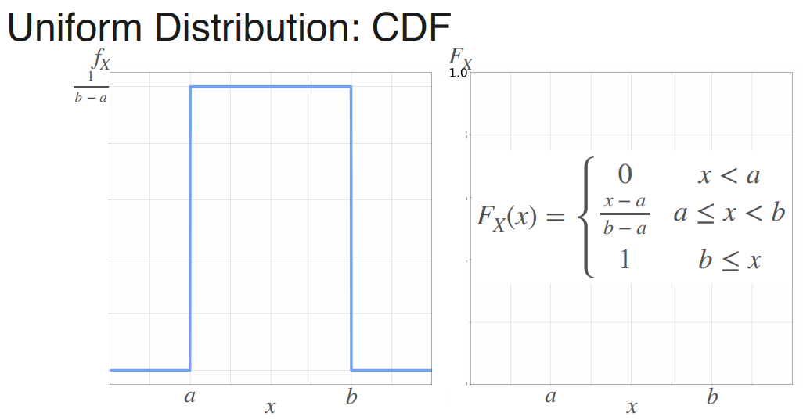

## 1.10 正态分布：Normal Distribution / Gaussian Distribution

- 前面学过二项分布（Binominal Distribution），我们将二项分布理解为了n次投硬币试验正面向上的次数，以下是它的概率质量函数PMF：

- 上图展示的是2次试验的一个PMF图，如果是n次试验，那么PMF会近似为一个**“钟形”**，这个钟形曲线就被定义为高斯分布：

- <b style = "color: green">因此，这意味着，当n非常大时，二项分布可以很好的用高斯分布来近似~</b>

- 正态分布的概率密度函数PDF：

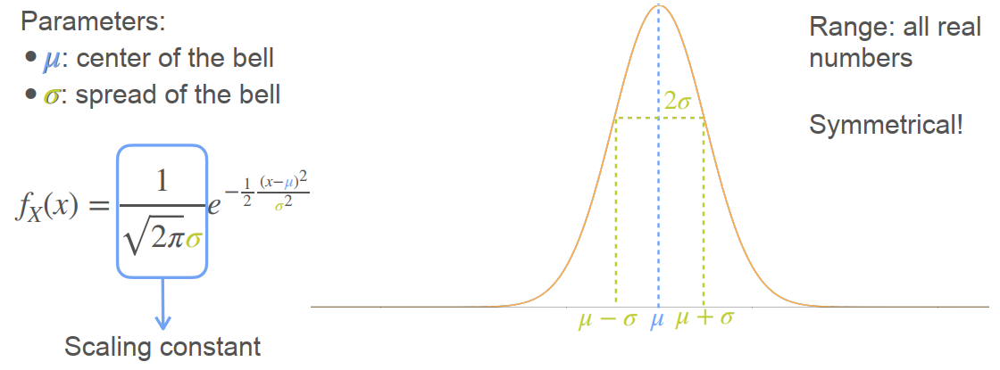

- <b style = "color: brown">标准正态分布：</b>

- <b style = "color: darkblue">将任意正态分布转化成标准正态分布：</b>

## 1.11 卡方分布：Chi-squared Distribution

- **卡方分布由标准正态分布衍生而来，由标准正态分布的平方和组成，**有几个标准正态分布自由度就是几

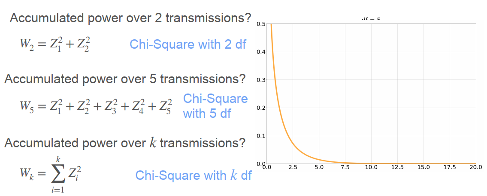

> Video: [卡方分布](https://www.bilibili.com/video/BV1aa4y1v7Pf/?spm_id_from=333.337.search-card.all.click&vd_source=71ef231609c4f6a95ebfadad530deed2)

## 1.12 从分布中采样

- 离散分布中采样：
  - 方式一：
  - 方式二：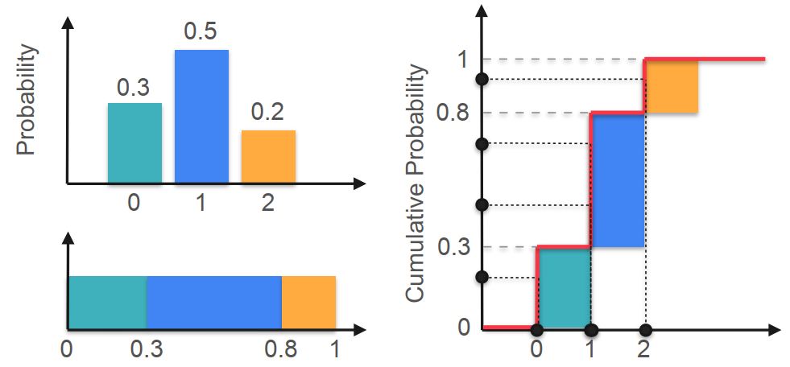
- 连续分布中采样：
  - 方式一：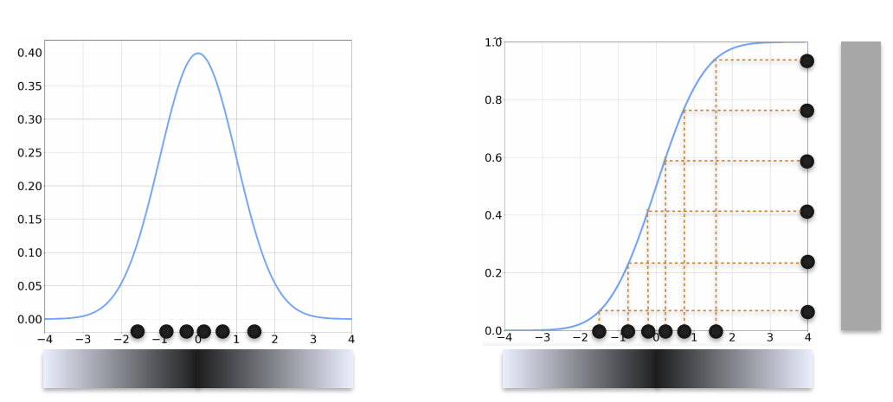

> 😁因此：无论是离散分布还是连续分布，**利用CDF进行采样**都是一个有效的方法~

# Week 2: Describing probability distributions and probability distributions with multiple variables

## 2.1 期望值

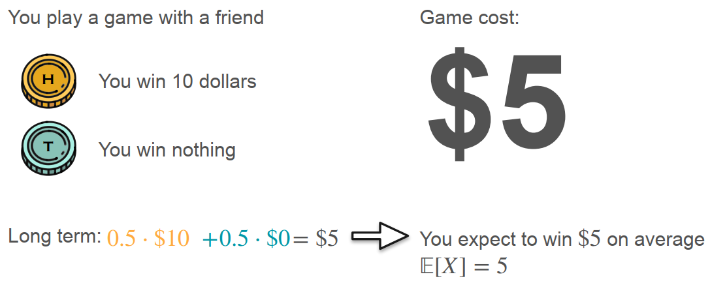

### 2.1.1 函数期望值的计算

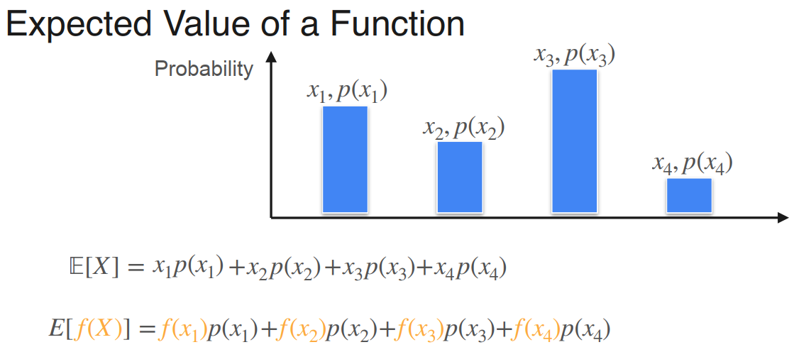

### 2.1.2 期望值的和

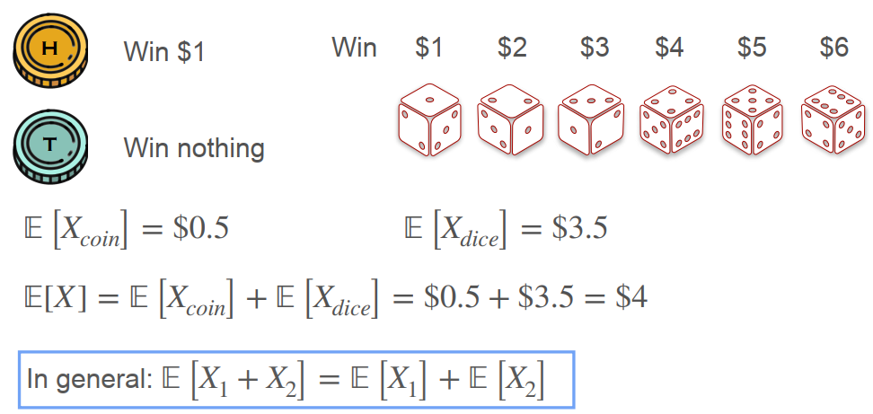

## 2.2 方差

### 2.2.1 Variance Motivation：Measuring Spread

- It is roughly a measure of **how spread the distribution is around its center**
- 方差与概率密度函数在其均值附近的集中程度有关。方差较大的分布可能使得数据点更分散，而方差较小的分布可能使得数据点更集中~(**数据偏离均值的程度**)

### 2.2.2 方差的计算

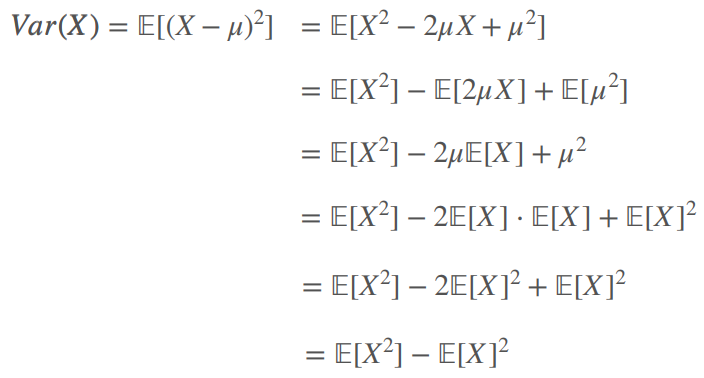

- 性质：😁😁😁

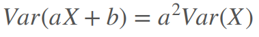

### 2.2.3 标准差

- The standard deviation is a pretty useful way to measure the spread of a distribution using the same **units** of the distribution

- Normal Distribution: **68-95-99.7 Rule**

## 2.3 两个正态分布相加

## 2.4 Standardize a Distribution

## 2.5 Skewness(偏度) and Kurtosis(峰度)

第一矩（the first moment）：$$E(x)$$

第二矩（the second moment）：$$E(x^2)$$

......

第k矩（the kth moment）：$$E(x^k)$$

### 2.5.1 偏度

- 离散分布：

- 连续分布：

- 正式定义偏度（**正偏、无偏、负偏**）：

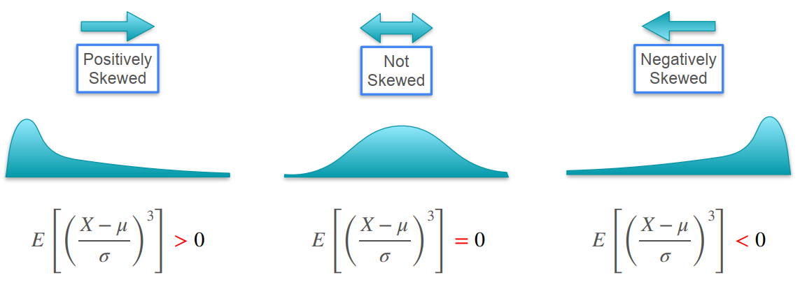

> - 偏度是用来衡量概率分布或数据集中不对称程度的统计量
> - 它描述了数据分布的**尾部（tail）在平均值的哪一侧更重或更长**，即：<b style = "color: blue">数据相对于平均值的分布情况</b>

### 2.5.2 峰度

- When the distribution **has very large numbers very far away from the center**, even if their probabilities are tiny, $$E(x^4)$$ captures this.

- 两个分布之间的第一矩、第二矩和第三矩都相同，那么如何区分这两个分布？：

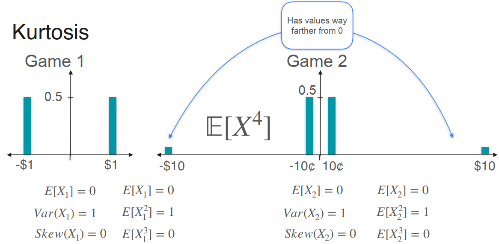

- 峰度和第四矩基本类似，但仍需要标准化：<b style = "color: red">（厚尾峰度大，瘦尾峰度小）</b>

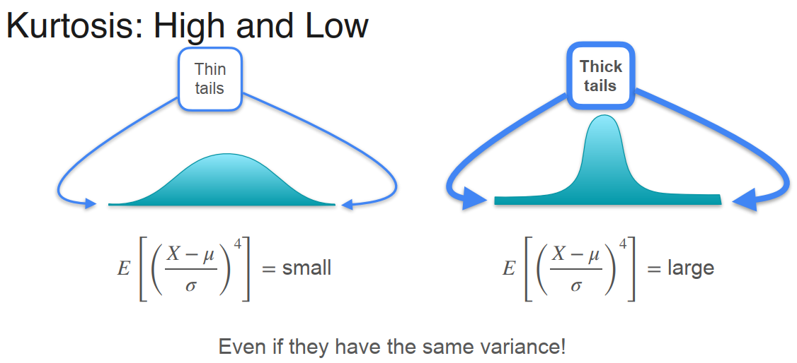

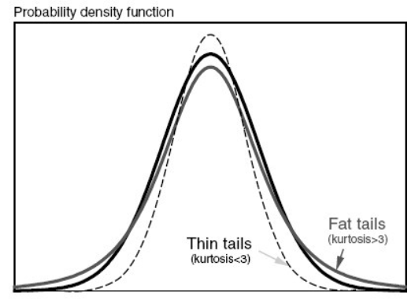

## 2.6 Quantiles and box-plots

### 2.6.1 分位数

- 定义：

- 从PDF中看分位数：（面积的占比）

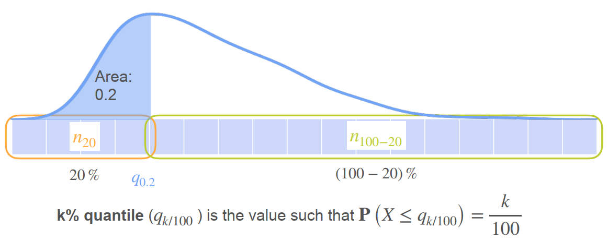

### 2.6.2 箱线图

- 首先计算Q1、Q2、Q3、**IQR(四分位距)**、max、min：

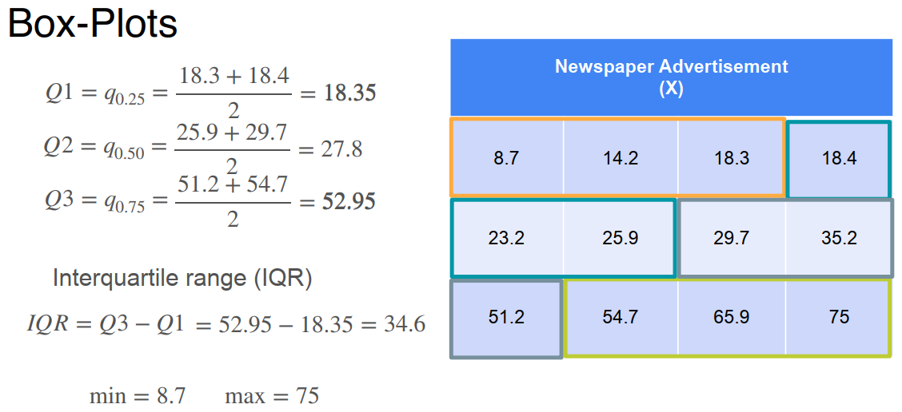

- 注意：箱线图的胡须不应超过最大值和最小值，**位于胡须之外的数据被认为是异常值~**

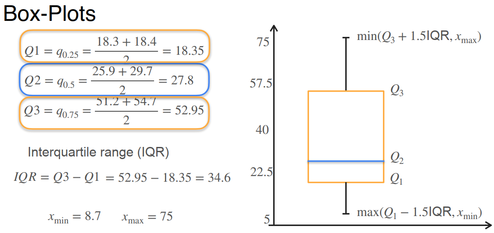

## 2.7 Kernel Density Estimation（KDE）

- 如何从直方图中近似计算出我们数据的PDF？

- 核密度估计是一种<b style = "color: green">根据数据对PDF进行近似计算</b>的方法

> 🧐🧐🧐步骤：
>
> step1：
>
> 
>
> step2：
>
> 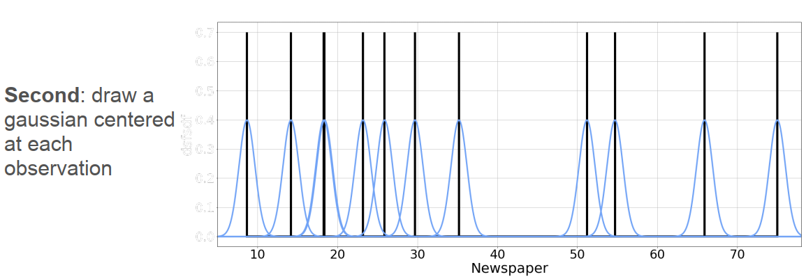
>
> step3：
>
> 

## 2.8 Violin Plots

- 小提琴图**同时包含核密度估计信息和箱线图信息**

## 2.9 QQ图(Quantile-Quantile plots)

- QQ图用来**检验一列数据是否服从正态分布**

> :star:一些模型都假设变量服从正态分布：
>
> - 线性回归
> - 逻辑回归
> - 高斯朴素贝叶斯
> - ......
>
> Some tests used in Data Science also assume normality

- 步骤：👼
  1. Standardize your data: $$(x-μ)/σ$$
  2. Compute quantiles
  3. Compare to gaussian quantiles

## 2.10 联合分布

### 2.10.1 离散变量（Both variables are discrete）

- 一个例子：

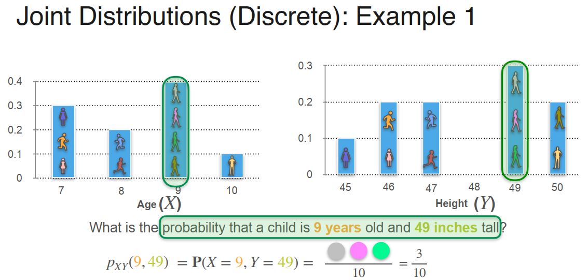

- 离散变量的联合分布：

- 如果**两个离散变量是独立的**，那么这两个离散变量的联合分布 = 各自的概率质量函数（PMF）相乘，如下：

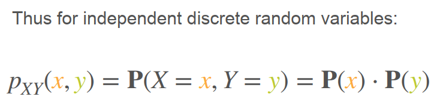

### 2.10.1 连续变量（Both variables are continuous）

- 一个例子：X是客户接通客服电话所用的时间（0-10min，连续变量），Y是客户的满意度评分（0-10分，连续变量）

- 用热力图（heatmap）展示：

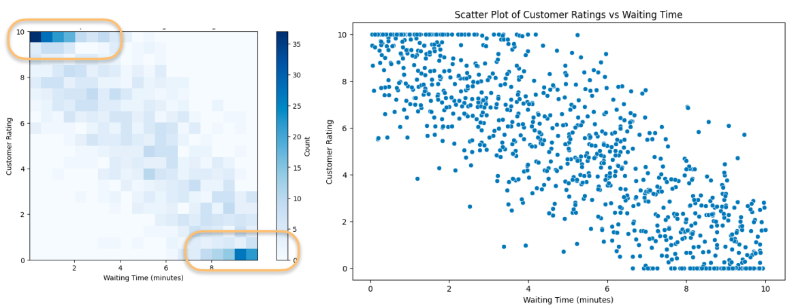

- 用概率密度函数热力图（即：PDF的投影图/等高线图）展示：

- 用三维图（即：PDF）展示：

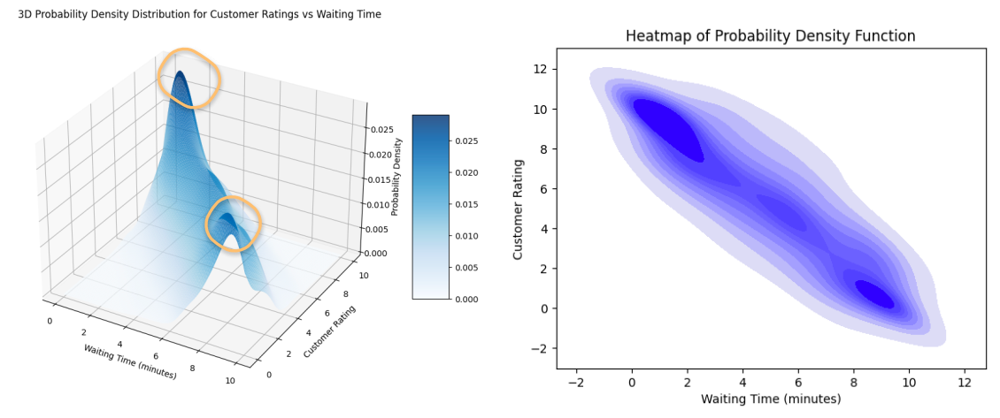

## 2.11 边缘与条件分布

### 2.11.1 边缘分布（Marginal Distribution）XY -- X

- 概念：Distribition of one variable while ignoring the other
- 从联合分布中计算边缘分布（离散变量）：

> - 求X的边缘分布，就是将每一行的概率值相加
> - 求Y的边缘分布，就是将每一列的概率值相加

- 连续变量的边缘分布：

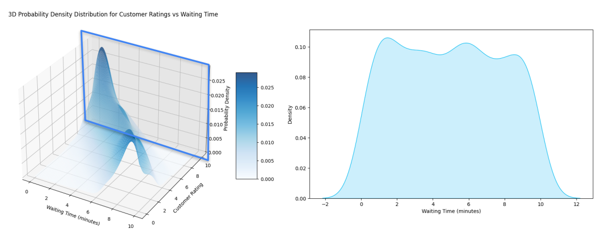

### 2.11.2 条件分布（Conditional Distribution）XY -- X|Y

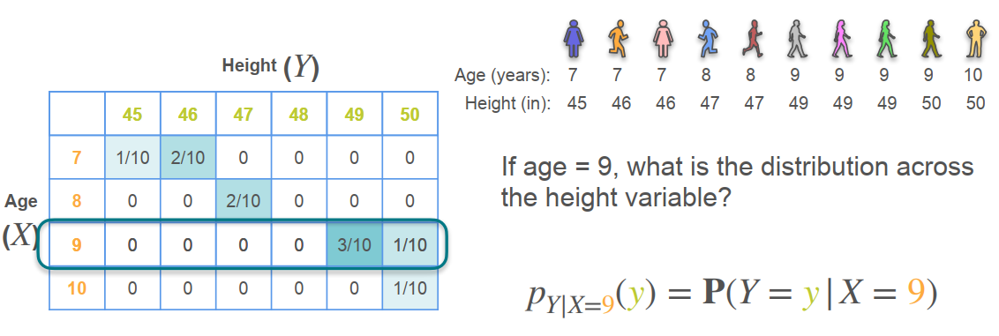

> - 求联合分布的某一条件分布，就相当于固定了某一个随机变量的取值
> - 我们只要**在联合分布表格中取特定的行/列**即可
> - 但是，需要注意的是：取出某一行/列后，这一行/列的概率之和应为1，因此，我们**需要做Normalize**，如下：
>
> 
>
> - 相当于在使用贝叶斯定理~
> - 更一般的公式表达形式：**（条件分布 = 联合分布 / 边缘分布）**
>
> 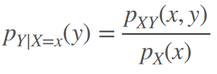

> :star:对于连续变量：
>
> 
>
> - 在PDF图中做一个切片操作，切片对应的曲线**近似等于**条件概率分布，同样的，**需要进行归一化**~
> - 和离散变量的公式相同，连续变量的条件分布也有如下计算方式：
>
> 

## 2.12 Covariance: 协方差/相关性

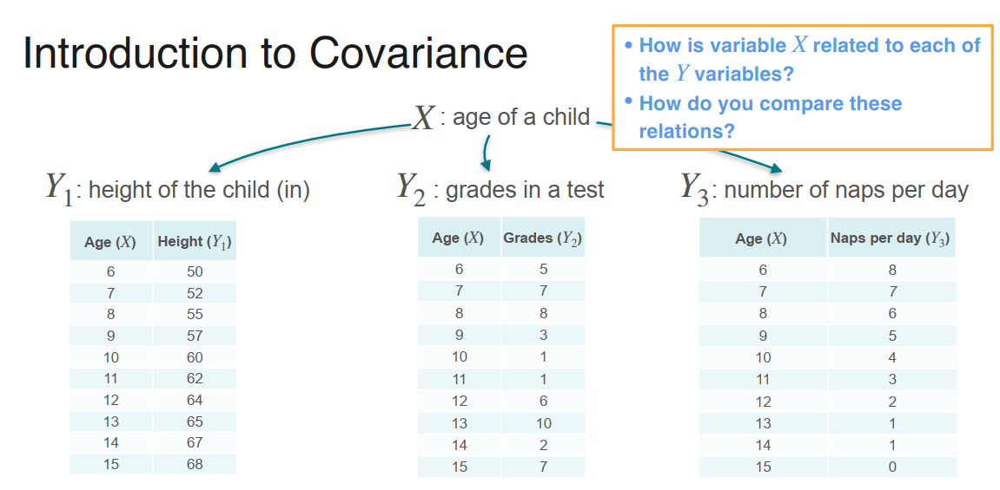

用单个随机变量的均值和方差均无法捕捉两者之间的关系！

Covariance可以捕捉**X和Y1、Y2、Y3之间的关系**：

1. 如果**Covariance > 0**；则X和Y呈现**正相关**
1. 如果**Covariance ≈ 0**；则X和Y**无线性关系**
1. 如果**Covariance < 0**；则X和Y呈现**负相关**

如下图所示：

那么该如何计算Covariance呢？

- Step1: Center them（类似于计算方差，需要将数据居中）

- Step2：Notice Trend

> - 第一个图中，x和y始终同号，即xy > 0
> - 第二个图中，x和y的符号关系不明，即xy ≈ 0
> - 第三个图中，x和y始终异号，即xy < 0
>
> 我们似乎只需要将x，y相乘，并对所有的样本点求和，判断最终结果的正/负/零，即可将这三张图区分出来
>
> 该表达式和Covariance的计算方式非常接近！

👦👦👦Covariance的实际计算方式：

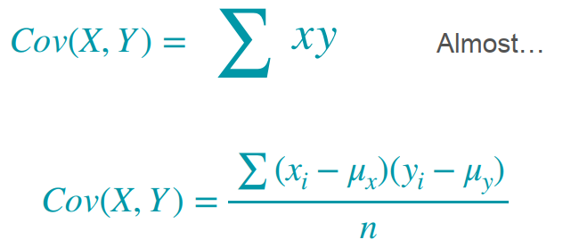

> - 一个计算小案例：
>
> 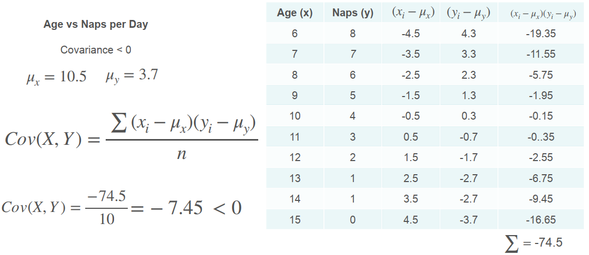

## 2.13 概率分布的协方差

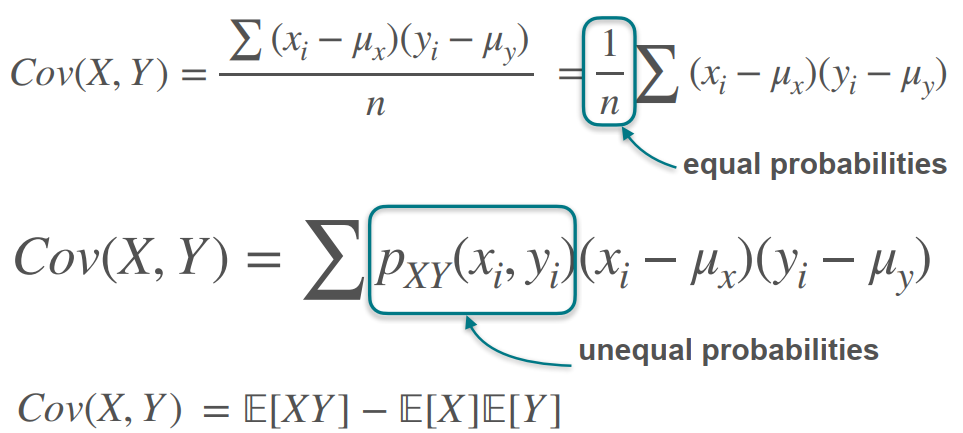

## 2.14 协方差矩阵：Covariance Matrix

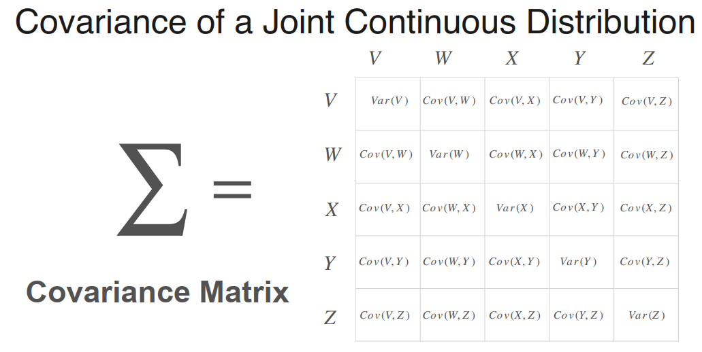

## 2.15 相关系数：Correlation Coefficient

- 因为我们无法通过直接比较Cov(X, Y)的大小而说明两个随机变量之间的相关性，因此引入了相关系数
- 相关系数的取值范围是-1到1

## 2.16 多元高斯分布

- 两个变量：

- 多个变量：👦

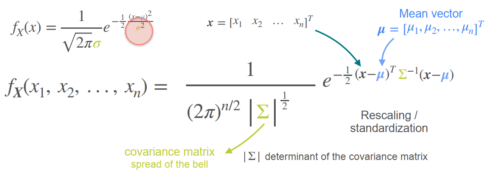

# Week 3: Sampling and Point estimation

## 3.1 Population & Sample

## 3.2 Sample Mean, Proportion, and Variance

### 3.2.1 Sample Mean

- Population Mean: $$μ$$（总体的均值）
- Sample Mean: $$\overline{x_1}、\overline{x_2}、...$$（第一个样本的均值、第二个样本的均值、...）
- 样本的体量越大，其均值越接近于总体的均值

### 3.2.2 Sample Proportion

- $$p=\frac{number\ of\ items\ with\ a\ given\ characteristics\left( x \right)}{population\left( n \right)}$$，例如：计算人群（总体）中骑自行车的人的占比
- Sample Proportion：$$\widehat{p}$$

### 3.2.3 :star::star::star:Sample Variance

- 当我们用样本估计总体的方差时，方差的计算公式需要进行调整：**分母的n需要变成(n-1)**，这样往往会有更好的估计~

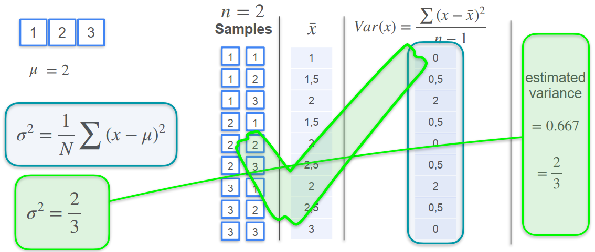

- 计算公式：

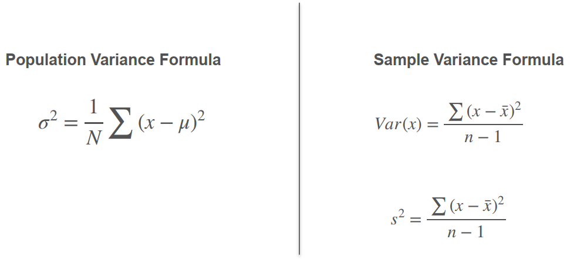

## 3.3 Law of Large Numbers：大数定律

- As the **sample size** increases, the average of the sample will tend to get closer to the average of the entire population

***<u>Under Certain Conditions:</u>***

- Sample is randomly drawn.
- Sample size must be sufficiently large.
- Idependent observations.

***<u>公式：</u>***

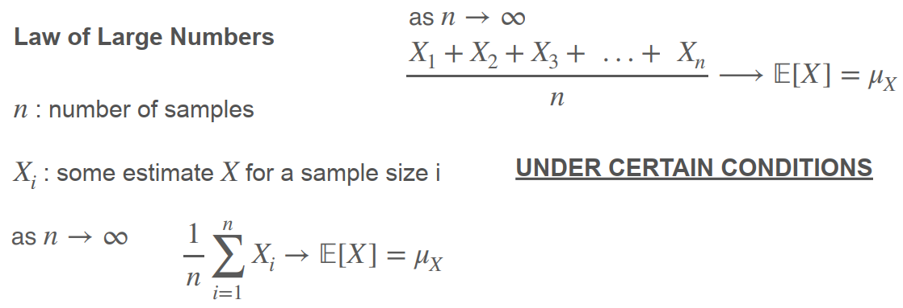

**n是样本的容量！！！*

## 3.4 Central Limit Theorem（CLT）：中心极限定理

- 离散变量：

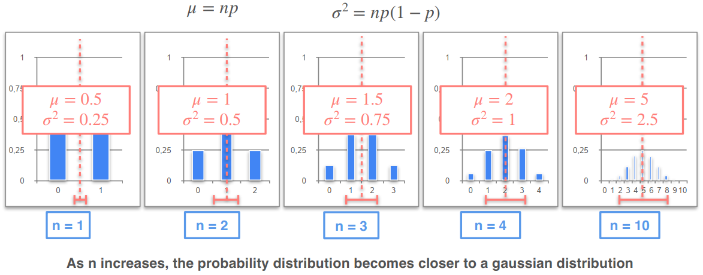

> 以二项分布为例，当n足够大时，我们将会得到一个正态分布：均值为np，方差为np(1-p)

- 连续变量：

>- 直观理解：从任意一个分布中采样，每次采样的样本尺寸相同(n > 30)，每个样本有一个样本均值，这些样本均值服从正态分布
>- 这个正态分布的均值就是原分布的均值，方差是原分布方差的1/n倍，其中：n是样本尺寸，如下：
>
>
>
>Video: [中心极限定理的直观理解](https://www.bilibili.com/video/BV1ah411q7tp/?spm_id_from=333.788&vd_source=71ef231609c4f6a95ebfadad530deed2)
>
>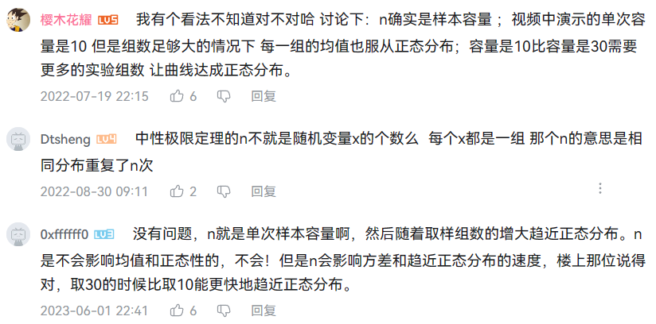

## 3.5 Point Estimation：点估计

### 3.5.1 Maximum Likelihood Estimation（MLE）

- 现有两个观测值-1和1，这两个观测值最有可能来自于哪个分布？N(10, 1)还是N(2, 1)?

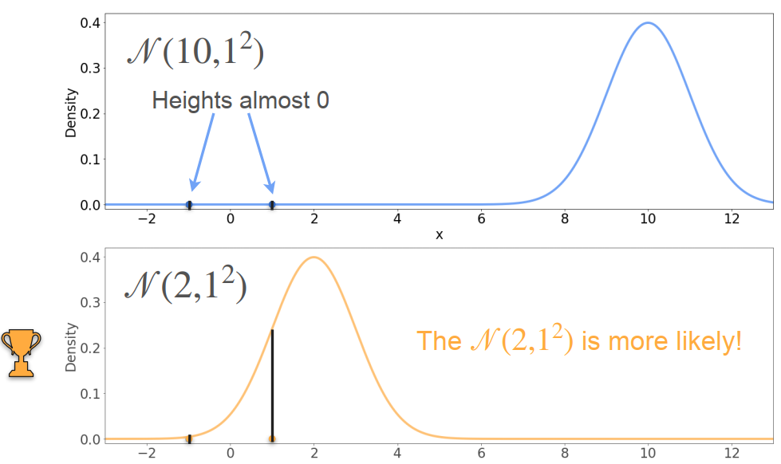

- PDF的函数值可以看作是-1或1来自这一分布的**可能性**，注意不是概率！

- 再比如下面三个分布：
  - 具体的做法是将所有观测值（样本）对应的PDF值相乘，看哪个分布的值最大
  - <b style = "color: red; background-color: yellow">最佳的分布是该分布的均值和方差和样本的均值和方差相同</b>

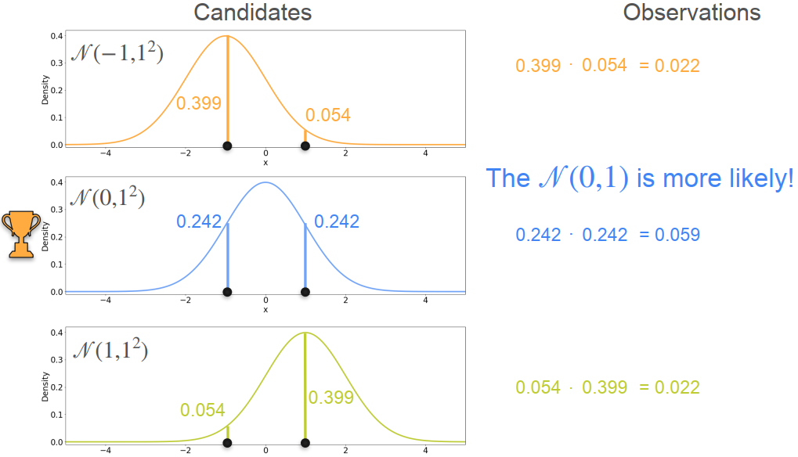

> 线性回归与MLE：
>
> 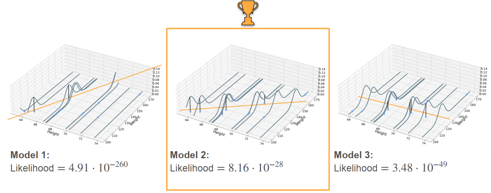

### 3.5.2 Regularization：正则化

- 正则化的目的是为了防止过拟合，即：**修改Loss，惩罚过于复杂的模型**

### 3.5.3 贝叶斯定理和正则化

- 给定模型，计算生成训练样本的概率P(Data|Model)，显然Model3能使得最大似然函数取到更大的值
- 但是Model3似乎不太常见，我们认为Model2或许是更好的模型，因此我们需要乘以**先验概率P(Model)**，得到训练数据和模型同时出现的概率

- 先验概率如何计算？

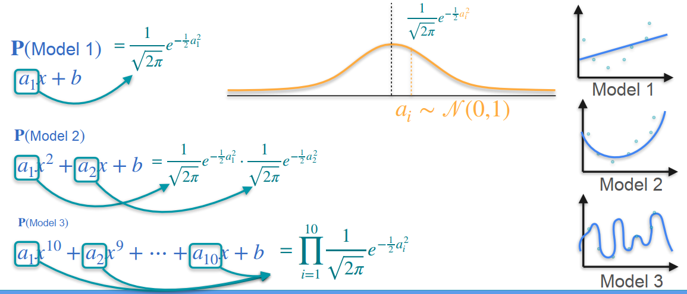

+ 乘以P(Model)再最大化似然函数，相当于损失函数在后面加了正则项~

# Week 4: Confidence Intervals and Hypothesis testing

## 4.1 Confidence Interval （Known Standard Deviation）

- 置信水平(1-α)、显著性水平α、置信区间、边际误差（Margin of Error）

> 如何直观理解显著性水平？（**ChatGPT's Answer**）
>
> 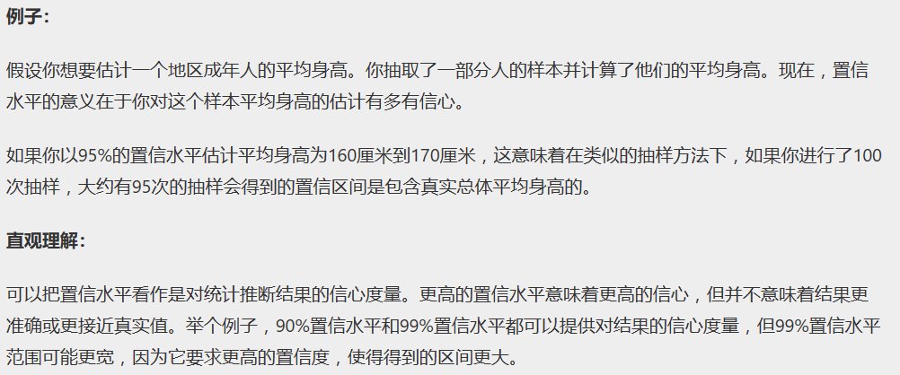
>
> - 如下图，**100次抽样得到的置信区间有95次包含总体的均值：**
>
> 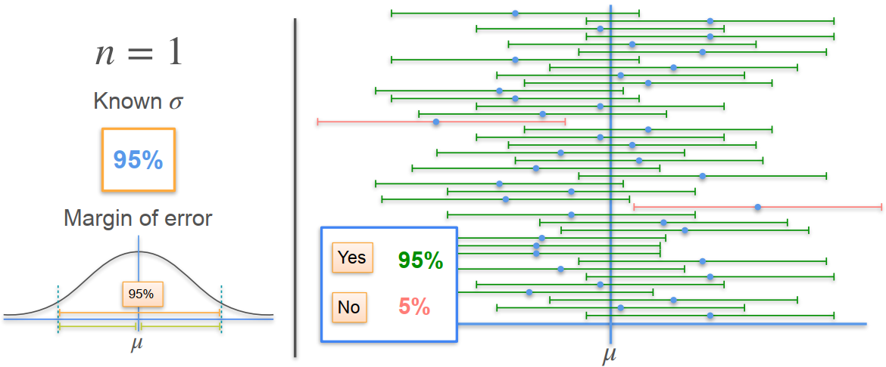

- 由中心极限定理我们知道：样本均值服从正态分布。该正态分布的方差与单次抽样的样本量大小有关，样本量越大，则方差越小
- 因此，当样本量越大时，正态分布的标准差变小，在同样的置信水平下，置信区间会变小
- 当样本量相同时，置信水平越大，则置信区间越大（因为要囊括的面积占比更大）

## 4.2 z-value & margin of error

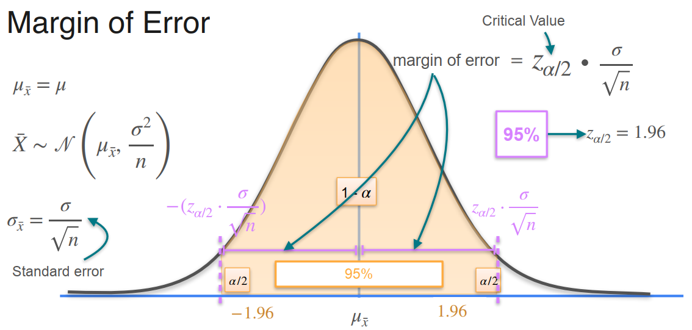

- 相同置信水平下，标准正态分布的z-value乘以一般正态分布的标准差，即可得到边际误差

## 4.3 Confidence Interval Calculation

:star:使用上述方式计算置信区间有一定的要求：

- Simple random sample
- <b style = "color: red; background-color: yellow">Sample size > 30 or population is approximately normal</b>

> - 求置信区间：总体的标准差已知，取一个样本，容量为49，样本的均值为170cm，求在95%置信水平下该样本的置信区间
>
> 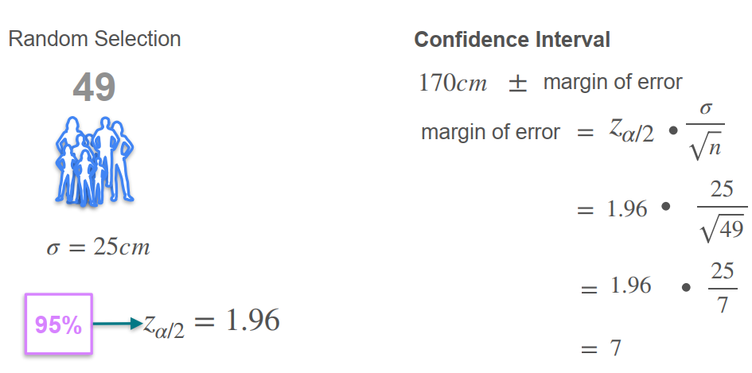
>
> - 求样本容量：上面的题目计算出的边际误差是7cm，这太大了，我们希望边际误差在3cm，那么我们应该采样多少？
>
> 

## 4.4 Difference Between Confidence and Probability

- 95%的置信水平究竟意味着什么？
  - **The confidence interval contains the true population parameter approximately 95% of the time. (√)**
  - There's 95% probability that the population parameter falls within the confidence interval. (×)

- Population mean:
  - Fixed but unknown
  - Does not have a probability distribution
  - In the interval or not
  - Does not fall within a specific interval 95% of the time
- 具体而言：重复采样许多次，95%的次数对应的置信区间包含总体均值

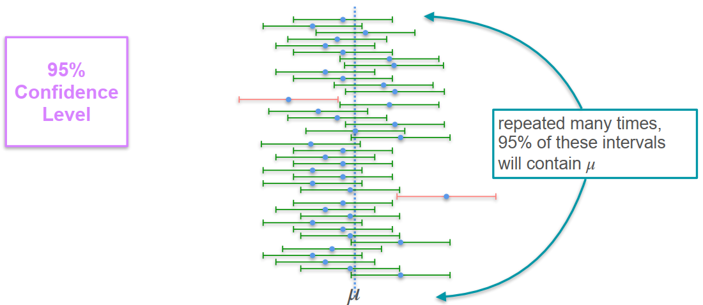

- 它并不是指一个特定的区间包含总体均值的概率，因为总体均值要么在这个区间中，要么不在这个区间中

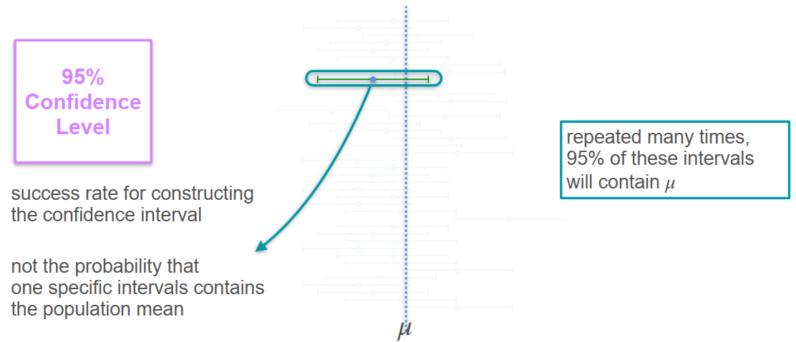

## 4.5 Confidence Interval （Unknown Standard Deviation）

- 上述的置信区间的计算建立在已知总体的标准差的基础上，如果我们不知道总体的标准差该怎么办？

- 此时我们只能使用**样本的标准差**
- 这时我们的分布将不再是正态分布，而是**学生t分布**

- 与正态分布相比，**t分布的峰度更大，意味着“厚尾”**，即：**从t分布中采样，更有可能采样到距离中心很远的点**

- 此时，置信区间的计算方式不再使用z-score，因为z-score基于正态分布，我们应当换成**t-score**

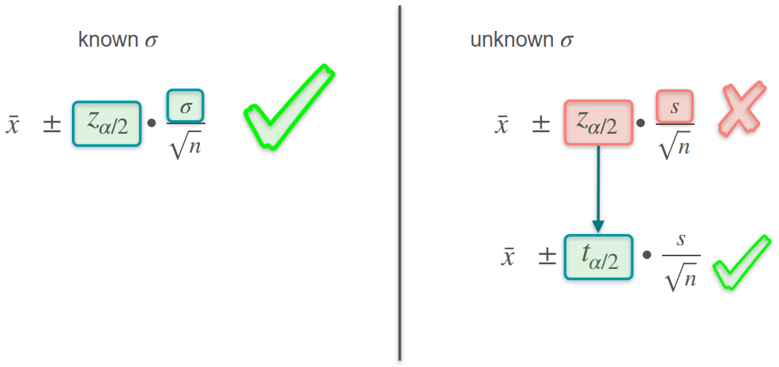

- t分布的自由度：（n-1），自由度越大，越接近于正态分布（因为自由度越大，样本数目越多，则样本的标准差越接近于总体的标准差）

## 4.6 Confidence Intervals for Proportion

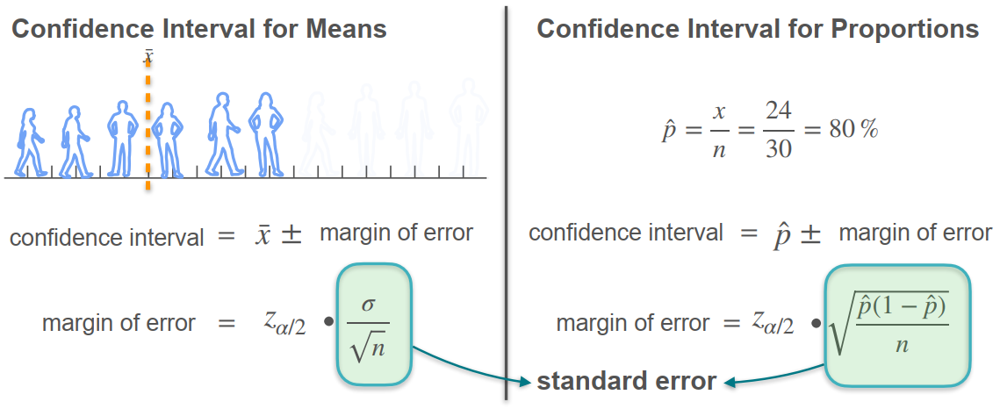

## 4.7 Hypothesis Test

### 4.7.1 Define Hypothesis

- 对于一个垃圾邮件分类系统，**原假设H0是：邮件不是垃圾邮件；备择假设H1是：邮件是垃圾邮件**
- 备择假设往往是你想要证明的，**更加关注的事情**
- 如果由大量的**证据**与原假设相反，则我们将会拒绝原假设，接受备择假设

### 4.7.2 Type Ⅰ and Type Ⅱ errors

- **Ⅰ类错误是假阳性**，<u>拒绝H0</u>时出现的错误
- **Ⅱ类错误是假阴性**，<u>接受H0</u>时出现的错误

> 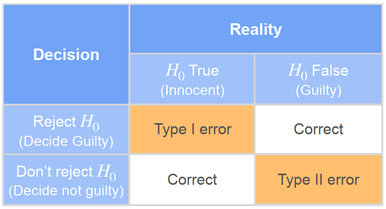

### 4.7.3 Significance Level

- **Ⅰ类错误比Ⅱ类错误更加严重**，因为我们宁愿在邮箱中收到一封垃圾邮件，也不希望我们永远无法阅读到正常的邮件

- <b style = "color: red;background-color: yellow">犯Ⅰ类错误的最大概率被称为显著性水平（α），α ∈ [0, 1]</b>
- 当α = 0时，Emails are always considered ham; 当α = 1时，Every email is considered spam

- 我们希望Ⅰ类错误的概率（α）尽可能低，但是不能无限制的低，这样做会增加Ⅱ类错误的概率
- 正式定义Ⅰ类错误：

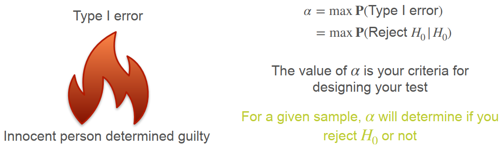

### 4.7.4 Right-Tailed, Left-Tailed and Two-Tailed tests

- H1在H0的左边，称为左尾检验
- H1在H0的右边，称为右尾检验
- H1在H0的两边，称为双侧检验

### 4.7.5 p-value

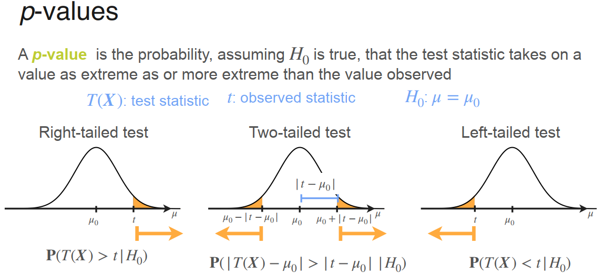

- p值就是当原假设为真时，比所得到的样本观察结果更极端的结果出现的概率
- 除了使用$$\bar{X}$$作为检验统计量，也可以使用Z统计量，如下：
- Z统计量只是在$$\bar{X}$$统计量的基础上做了标准化
- **小的p-value表示观测到该数据的概率很小**

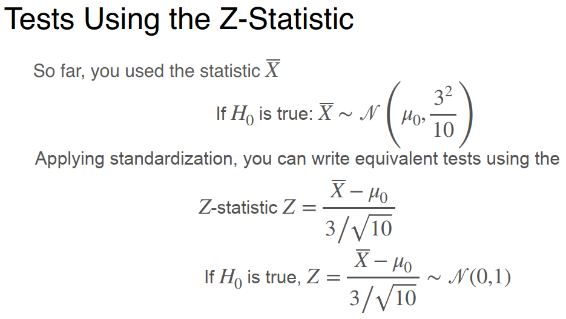

- 一个例子：

### 4.7.6 Critical Values：临界值

- 临界值就是p-value刚好等于显著性水平时，检验统计量对应的值

- **样本点落在拒绝域内部，则拒绝原假设H0**

### 4.7.7 Independent Two-Sample t-Test

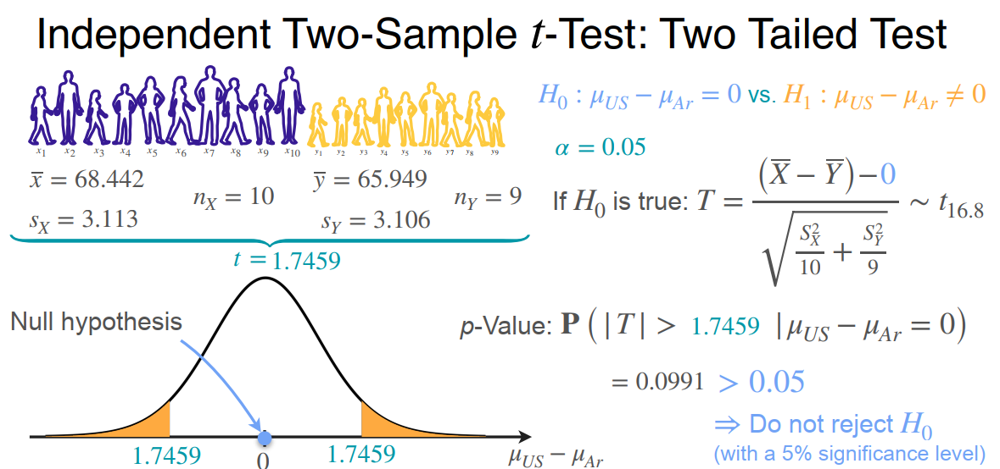

### 4.7.8 Paired t-test

- 研究锻炼前后体重有无明显差异：

- 如果两个样本均服从正态分布，那么它们的差也服从正态分布

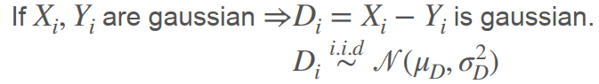

- 具体假设检验过程：

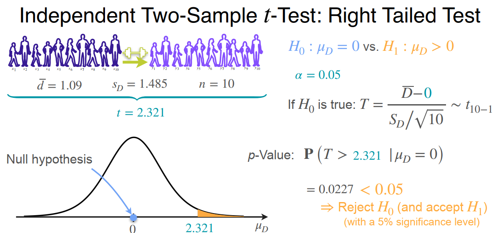

> 👨双样本的t分布的自由度计算比较麻烦，可以用工具包进行计算
