
<b>📕机器学习--线性代数</b>

[[课程链接: Coursera](https://www.coursera.org/specializations/mathematics-for-machine-learning-and-data-science)]
[[课程链接: Bilibili](https://www.bilibili.com/video/BV1Pg4y1X7Pa?p=1)]
[[课程链接: Github](https://github.com/Ryota-Kawamura/Mathematics-for-Machine-Learning-and-Data-Science-Specialization)] -- Homework

[TOC]

# Week 1: System of linear equations

## 1.1 句子系统：System of sentences

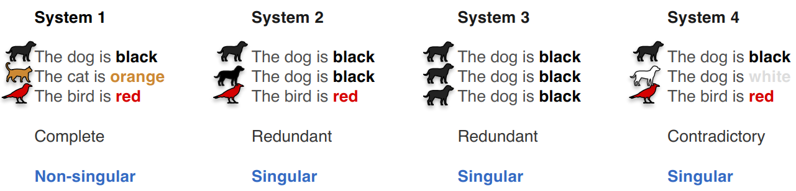

> - 对于第一个系统，每一个句子我们都能get到一份独特的信息，我们称之为完整的系统
> - 对于第二个系统，前两个句子我们get到的是同一个信息（狗是黑色的），我们称之为冗余的系统
> - 对于第三个系统，三个句子我们get到的是一样的信息，因此也是冗余的系统
> - 对于第四个系统，前两个句子表述的信息相矛盾（狗究竟是黑色的还是白色的？），我们称之为矛盾的系统
> - 只有完整的系统**（一句话对应一个独特的信息）**我们才称之为非奇异性系统，其余均为奇异性系统
> - 句子系统可以类比到线性方程组，其中每一个线性方程代表一个句子，因此，线性方程组也分为奇异性的和非奇异性的

## 1.2 矩阵的奇异性判断：Singular or Non-singular?

- **计算对应的线性方程组：**如果只有一个解，则为完整的（Complete）系统，不具有奇异性；如果有无数个解，则为冗余的（Redundant）系统，具有奇异性；如果没有解，则为矛盾的（Contradictory）系统，具有奇异性（:star:）

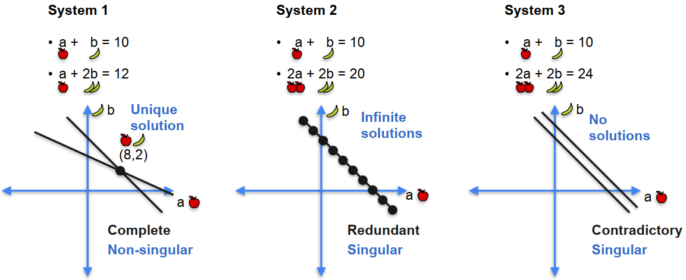

> ✨类比句子系统，系统2的两个线性方程表述的是同一个信息，系统3的两个线性方程表述的信息相互矛盾，因此均为奇异性的~
>
> - 此外，需要注意的是：线性方程组的常数项并不影响方程组整体的奇异性！`我们可以把常数项全部视为0`

- **观察是否具有线性相关的行：**如果行之间线性相关，则具有奇异性；如果行之间线性不相关，则不具有奇异性（:star::star:）

> 🎈分析：如果有线性相关的行，那么这两行所对应的线性方程所表述的信息一定是相同（常数项相同）或者相矛盾（常数项不同）的，因此是奇异性的~

- **计算矩阵对应的行列式的值：**如果行列式值为0，则具有奇异性；如果行列式的值不为0，则不具有奇异性（:star::star::star:）

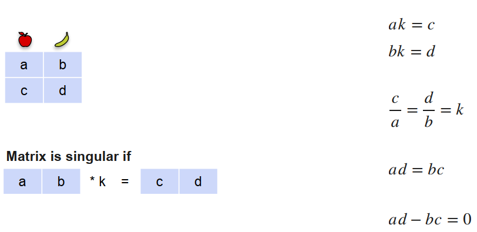

> 🎨<b style = "color: red; background-color: yellow">记忆：奇异性矩阵 = 行线性相关 = 行列式值为0 = 无解/无数解</b>

# Week 2: Solving system of linear equations

## 2.1 高斯消元法解线性方程组：Gaussion Elimination

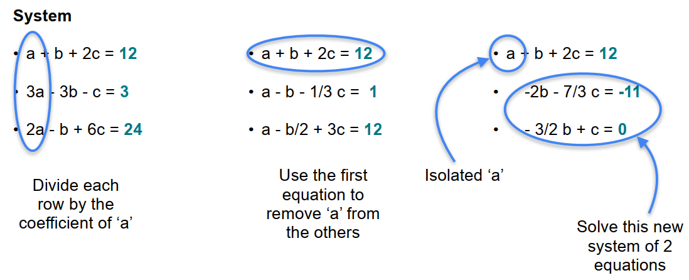

## 2.2 行操作（保持矩阵的奇异性）：Row operations that preserve singularity

- Operation 1: Switching rows -- 行列式的值变成原来的相反数
- Operation 2: Multiplying a row by a <b style = "color: red">(non-zero)</b> scalar -- 行列式的值变为原来的scalar倍
- Operation 3: Adding a row to another -- 行列式的值不变

## 2.3 矩阵的秩：Rank of a matrix

### 2.3.1 秩的定义

:star::star::star: <b style = "color: red; background-color: yellow">秩：表示一个矩阵或其对应的线性方程组所携带的信息的数目！！！ </b>:star::star::star:

> 类比到线性方程组和矩阵上：
>
> 

### 2.3.2 秩的计算

- <b style = "color: red; background-color: yellow">方式一：Rank = (Number of rows) - (Dimension of solution space) , 即：矩阵的秩 = 行数 - 解空间维度</b>

> 关于解空间：
>
> 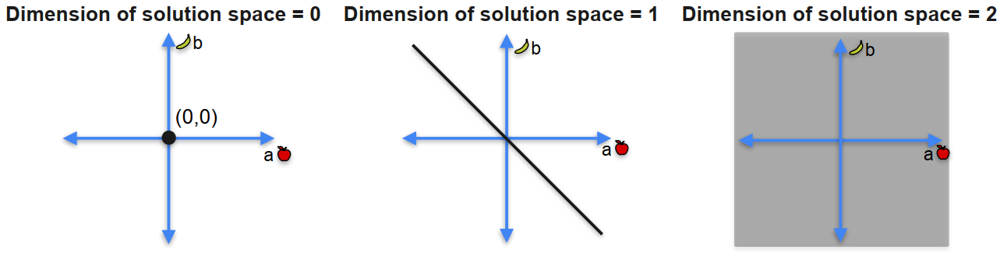
>
> - 第一个线性方程组的解只有(0, 0)这一点，因此解空间的维度是0
> - 第二个线性方程组的解在一条直线上，因此解空间的维度是1
> - 第三个线性方程组的解在一个平面上，因此解空间的维度是2

- <b style = "color: red; background-color: yellow">方式二：矩阵的秩 = 行阶梯矩阵主元的个数</b>

>👑关于行阶梯矩阵：（Row echelon form）
>
>
>
>- 全0的行在矩阵的最下面
>- 每一行都有一个主元（最左边的非0的数字）
>- 位于下面行的主元的位置必须在上面行主元的右边
>- 矩阵的秩就是行阶梯矩阵中主元的个数
>
>👑关于简化的行阶梯矩阵：（Reduced Row echelon form） -- 行最简形矩阵
>
>
>
>- 同样也要满足行阶梯矩阵的条件
>- 每一个主元必须是1
>- 位于主元上面的数字必须是0（也就是主元所在的列除了主元本身其余均为0）
>- 同样的，矩阵的秩就等于主元（1）的个数

# Week 3: Vectors and Linear Transformation

## 3.1 范数：Norms

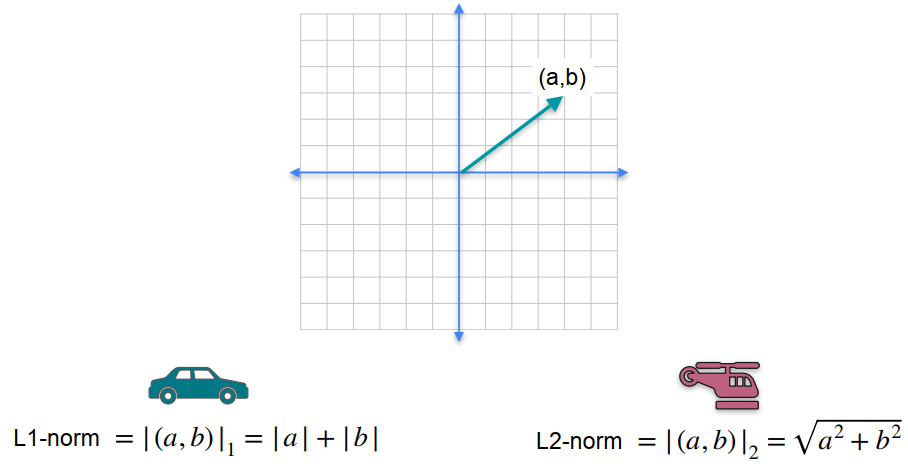

- L1范数可以看作折线距离
- L2范数可以看作直线距离

## 3.2 向量的加减：Sum and difference of vectors

### 3.2.1 向量相加：平行四边形法则

### 3.2.2 向量相减：三角形法则，指向被减向量

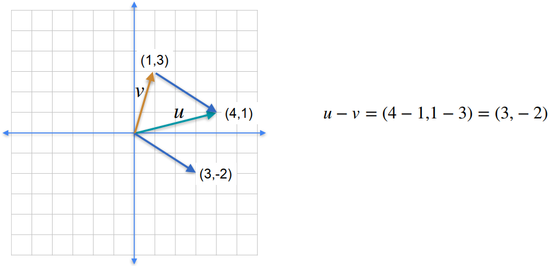

## 3.3 向量之间的距离:star:

## 3.4 点积：The dot product

- 点积就是<b style = "color: red">两个向量元素相乘再相加</b>

- 用点积表示一个向量的L2范数：

> 一个向量的L2范数 = 这个向量自己和自己做点积再开根号

- 两个向量之间做点积：

- 点积的几何意义：

>- 两个向量点积=0，说明两个向量相互垂直
>- 两个向量点积>0，说明两个向量夹角为锐角
>- 两个向量点积<0，说明两个向量夹角为钝角

## 3.5 Matrices as linear transformations:star:

- <b style = "color: red; background-color: yellow">一个二维矩阵，相当于把二维平面中的一个点映射到了另一个二维平面中，这两个二维平面的横纵坐标的意义不同</b>

> 如下：第一天买了3个苹果和1个香蕉，第二天买了1个苹果和2个香蕉，该方程组的系数矩阵相当于一个线性变换，将以（苹果价格-香蕉价格）为（x-y）的二维平面上的点映射到了以（第一天的花销-第二天的花销）为（x-y）的二维平面上，例如（1，1）映射为了（4，3）

## 3.6 Linear transformations as matrices:star:

- 如何从已知的线性变换，推出线性变换矩阵？

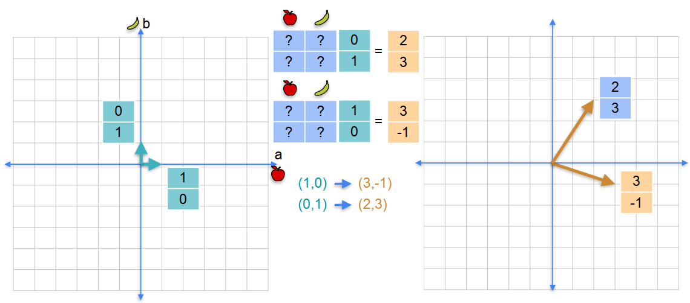

> （1，0）向量被映射为了（3，-1）向量；（0，1）向量被映射为了（2，3）向量。
>
> - 通过简单的矩阵运算，即可得到最终的结果：
>
> 
>
> - You only look at where the two fundamental vectors (1, 0) and (0, 1) go, and those are your columns of the matrix.
> - <b style = "color: red; background-color: yellow">因此，我们只需要关注基向量被映射到了哪里，即可确定线性变换矩阵中的每个元素！</b>

## 3.7 Matrix multiplication：视为多个线性变换的结合

- 矩阵乘法可以看作两个矩阵相乘，一堆向量之间进行点积
- 矩阵乘法可以看作是***多个线性变换结合成了一个新的线性变换***（:star::star::star:）

> 如下图，定义：第一个平面到第二个平面的线性变换矩阵为A，第二个平面到第三个平面的线性变换矩阵为B，第一个平面直接到第三个平面的线性变换矩阵为C，则：BA = C

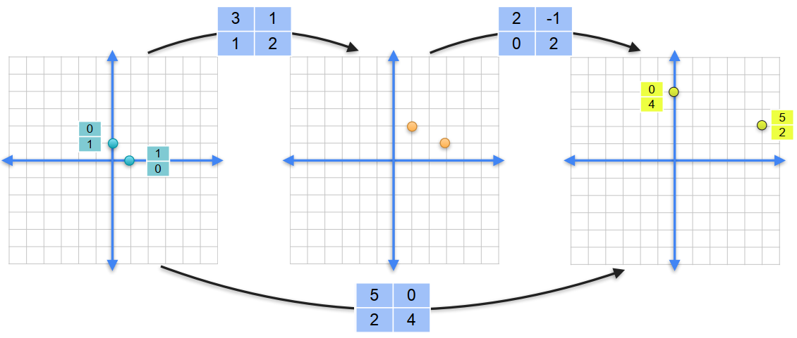

🎄**Notice：BA的顺序不能错，第一次线性变换矩阵在后面，第二次线性变换矩阵在前面！！！**

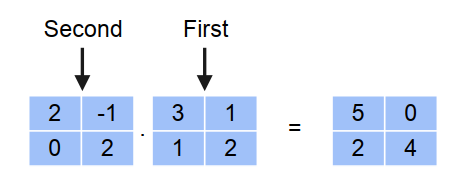

## 3.8 单位矩阵：The identity matrix，对应数字1

> 👓观察上面的单位矩阵，它是基于五维空间的一个线性变换，五维空间的**基向量（1，0，0，0，0）被映射到了单位矩阵的第一列（1，0，0，0，0）**，以此类推，可以发现：<b style = "color: red; background-color: yellow">单位矩阵不会改变线性变换前后空间的分布</b>	
>
> 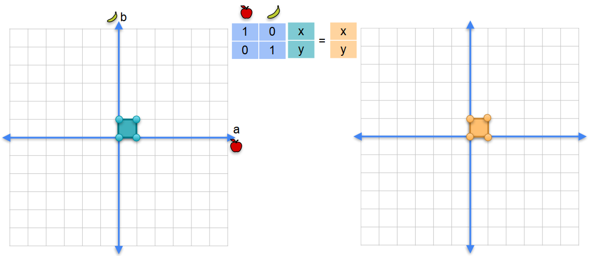

## 3.9 逆矩阵：Matrix Inverse，对应倒数

> <b style = "color: red; background-color: yellow">逆矩阵能够将线性变换后的空间反转回来</b>

### 3.9.1 求解逆矩阵

> 利用矩阵乘法的意义（线性变换组合成另一个线性变换），求解线性方程组

### 3.9.2 什么样的矩阵拥有逆矩阵？非奇异矩阵！

> - 非奇异矩阵（行列式的值不为0）是可逆的
> - 奇异矩阵（行列式的值为0）是不可逆的

# Week 4: Determinants and Eigenvectors

## 4.1 线性变换的奇异性和秩：Singularity and rank of linear transformations

- 线性变换后的图像是平面**（能够覆盖整个二维坐标平面）**，则称该线性变换是非奇异性的
- 线性变换后的图像是直线或点**（不能覆盖整个二维坐标平面）**，则称该线性变换是奇异性的
- <b style = "color: red">变换后的图像的维度即为线性变换的秩</b>

## 4.2 Determinant as an area

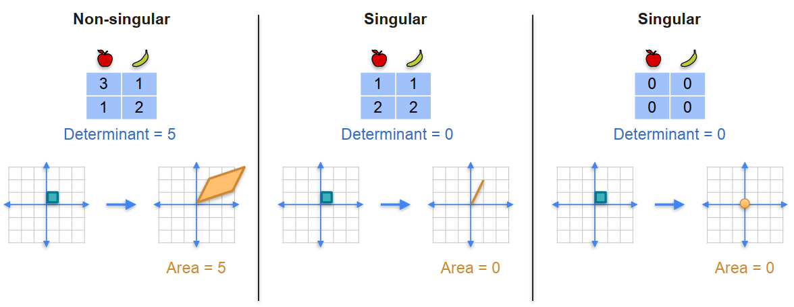

- 由二维空间的最简单的基线性变换后构成的图形的面积即为矩阵对应行列式的值
- 如果线性变换后的图像的面积是0，即行列式的值为0，说明是奇异矩阵

> - 行列式的值可能是负数，那对应线性变换后图像的面积也是负数？🙄
>
> 如下图，（0，1）顺时针旋转与（1，0）重合，经过线性变换后，（0，1）映射到了（3，1），（1，0）映射到了（1，2），而（3，1）需要经过逆时针旋转与（1，2）重合，与前面basis的旋转方向相反，此时定义右边平行四边形的面积是负数，即-5，行列式的值同样为-5，但面积的正负并不影响对矩阵奇异性的判断，因为只要行列式值不等于0，就说明矩阵是非奇异的~
>
> 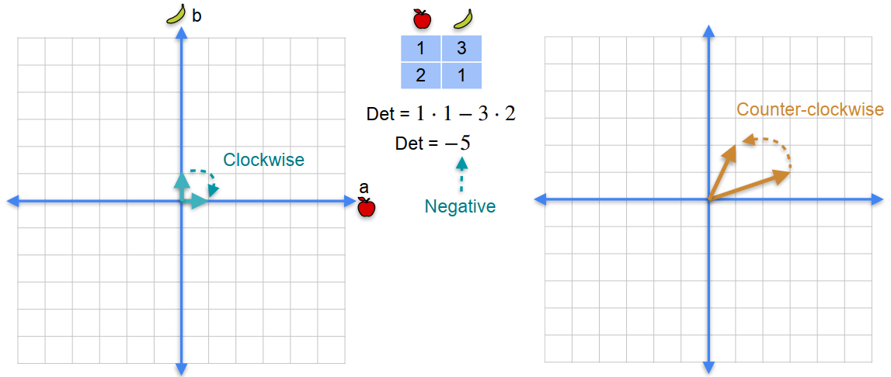

## 4.3 Determinant of a product

- <b style = "color: red; background-color: yellow">公式：det(AB) = det(A)det(B)</b>

> - 行列式的值x也可以解释为：左边的基础图形面积扩大了x倍到右边
> - **行列式的值 = 面积扩大的倍数**

Quiz：

The product of a singular and a non-singular matrix (in any order) is:
- Singular
- Non-singular
- Could be either one  

> 解析：由det(AB) = det(A)det(B)，如果A为奇异矩阵，则det(A) = 0，则det(AB) = 0，即AB矩阵一定是奇异的！
>
> 因此：<b style = "color: red; background-color: yellow">奇异矩阵 × 任意矩阵 = 奇异矩阵</b>
>
> 

## 4.4 Determinant of inverse

$$
\det \left( A^{-1} \right) =\frac{1}{\det \left( A \right)}
$$
- 推导：
$$
\det \left( AB \right) =\det \left( A \right) \det \left( B \right)
$$
$$
if\ B=A^{-1}:
$$
$$
\det \left( AA^{-1} \right) =\det \left( A \right) \det \left( A^{-1} \right) 
$$
$$
\det \left( I \right) =\det \left( A \right) \det \left( A^{-1} \right) 
$$
$$
1=\det \left( A \right) \det \left( A^{-1} \right)
$$
$$
\det \left( A^{-1} \right) =\frac{1}{\det \left( A \right)}
$$

## 4.5 基：Bases

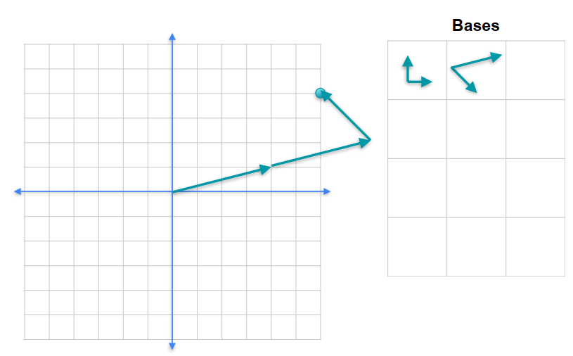

- 基是一系列向量，<b style = "color: green">向量的个数足够但不会太多</b>，沿着这些向量的方向“行走”，可以走到空间中的任意一个点
- 也就是说，基向量之间线性组合，可以覆盖到向量空间中的任意一点
- 基向量之间是线性无关的
- 基有很多组，但其中基向量的个数是一定的，<b style = "color: blue">n维空间则有n个基向量</b>

## 4.6 跨度：Span

- 一组向量的跨度就是这组向量通过线性组合能够得到的所有向量（沿着这组向量的方向走，能走到哪？）
- A basis is a minimal spanning set

> 对于右边的一组向量，其中两个向量的跨度就可以覆盖整个平面，因此这三个向量不构成一组基！***（太多了！）***

## 4.7 Eigenbasis

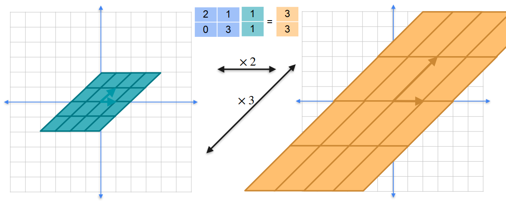

> - Eigenbasis是一组特殊的基向量，这组基向量构成的平行四边形（左）可以被线性变换到另一个平行四边形（右），并且这两个平行四边形之间是相互平行的<b style = "color: brown">（基向量被映射后只是做了伸缩变换）</b>
> -  如上图，底边映射后被拉伸了2倍，斜边被拉伸了3倍
>
> 
>
> - 这组基向量被称为特征向量，拉伸的倍数（拉伸因子）被称为特征值

## 4.8 Eigenvalues and eigenvectors✍

- 上面已经提到，特征向量就是向量空间中的基向量，这个基向量在线性变换中只是做了伸缩变换，且特征值就是伸缩的倍数

从上图中可以很清楚的看出，（1，1）和（1，0）是该矩阵的特征向量，且分别对应特征值3和2，让我们来看看它和对角阵diag(A) = [2, 2]和diag(B) = [3, 3]的关系：（以对角阵B为例）

和对角阵B相同的是，它们都能将y = x方向上的向量经过线性变换后长度拉伸3倍，且方向不发生偏移（如上图）

因此，它们组成的线性方程组应该有无数个共同解（y = x方向上的向量均为它们的共同解）

两式相减，可以得到**HX = 0**，这个方程组应该有无数个解，说明**H**矩阵是奇异性的，因此det(**H**) = 0

> 😁将该过程公式化，可以得到：
>
> 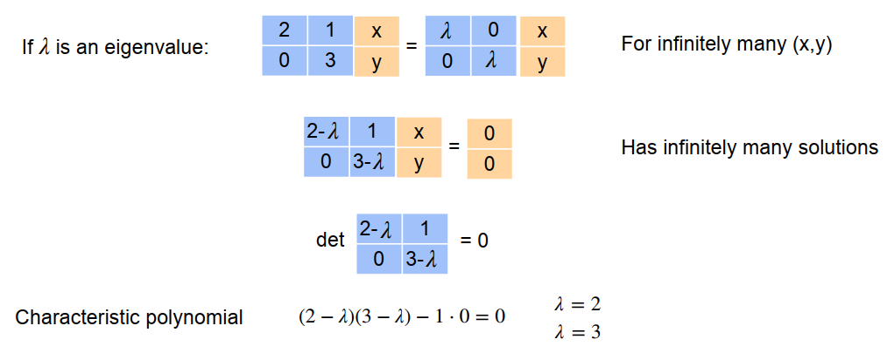
>
> 通过计算上述特征多项式，我们就可以计算出特征值，接下来便可以由特征值计算特征向量：
>
> 
>
> 👨‍⚕️需要注意的是：特征向量不止两个，k[1, 0]或者k[1, 1]均为该矩阵的特征向量 (k ≠ 0)
