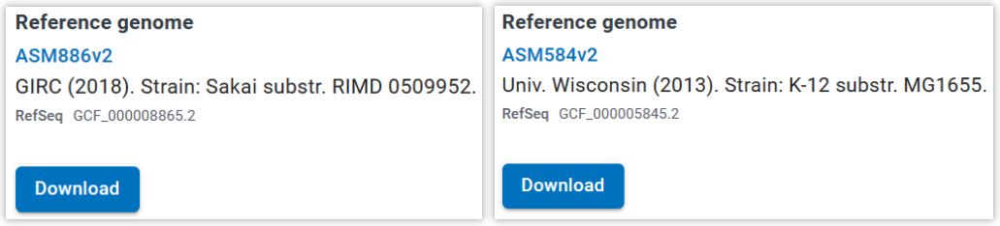
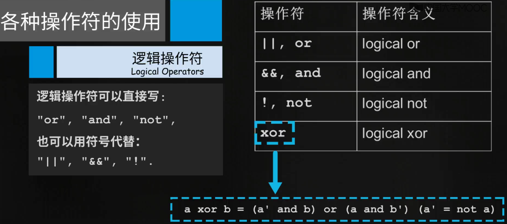

# 生物信息学

[TOC]

# 1. 生信数据库避坑指南

## 1.1 从NCBI找大肠杆菌（大肠埃希氏菌）的基因组

> 大肠杆菌有两个参考基因组（Reference genome）：
>
> 
>
> 参考基因组是学术界的研究重点，其基因组注释也更加完善

## 1.2 从UCSC Genome Browser下载大型的真核基因组

以人类基因组为例：

- Downloads --> Genome Data --> Human genomes

> 人类每条染色体Fasta序列文件位置如下：
>
> 
>
> **注意：对于较大的Fasta文件，不要使用电脑自带的记事本打开，请使用 <b style='color:red'>LTF（Large Txt File）软件！</b>**
>
> - 除了每条染色体上的fasta序列文件外，还有一些patch（补丁）文件
>   - 有的基因组片段周围都是非常长的重复序列，所以很难精确定位它在染色体的哪个地方
>   - 有的基因组片段完全不知道它在哪个染色体上（chrUn开头的文件）
>   - 这些补丁文件一般都不会太大
> - **hg19以及之前的参考基因组都是来源于一个人的**，从hg38开始，含有多个人的基因组信息（hg38用了4个人的基因组）
>   - 共有的部分作为主要染色体fasta文件
>   - 个人所独有的片段作为补丁

> 人类所有的mRNA序列：
>
> 
>
> - RefSeq数据库中的序列是经过人工筛选的，序列比较完整，可以作为参考序列使用
> - RefSeq的Accession Number的编码规律：
>   - NC_：染色体
>   - NM_：mRNA
>   - NR_：非编码RNA
>   - NP_：蛋白质
>   - **X**M_：mRNA，**软件预测，没有任何实验证据**
>   - **X**R_：非编码RNA，**软件预测，没有任何实验证据**
>   - **X**P_：蛋白质，**软件预测，没有任何实验证据**

- 如果研究对象不是顶级的模式物种（如人，小鼠，大鼠，大肠杆菌等），尽量去NCBI以外的**针对特定物种的数据库**更加靠谱！

> 人类基因组注释：Annotations --> **refFlat.txt.gz**
>
> - 每一行表示：
>   - **==基因名称 -----> Accession Number -----> 染色体号 -----> 正/负链 -----> 转录起始位置 -----> (转录终止位置+1) -----> 翻译起始位置 -----> (翻译终止位置+1) -----> 外显子个数 -----> 每一个外显子的起始位置 -----> (每一个外显子的终止位置+1)==**
> - 基因名相同而号不同，表示同一个基因的不同剪接变体

# 2. 双序列比对

## 2.1 认识序列

FASTA格式：

​						第一行：大于号加名称或其它注释信息

​						第二行以后：序列，每行60个字母（也有80的，不一定）

## 2.2 序列相似性

🎄相似的序列 --> 相似的结构 --> 相似的功能

- 一致度：如果两个序列**长度相同**，则一致度定义为对应位置上相同的残基的数目占总长度的百分数
- 相似度：如果两个序列**长度相同**，则相似度定义为对应位置上相同和相似的残基的数目占总长度的百分数

**==如何衡量两个残基的相似度？使用替换记分矩阵！==**

- 常见的DNA序列替换记分矩阵：等价矩阵（相同1，不同0）、转换-颠换矩阵、BLAST矩阵（相同+5，不同-4）
- 常见的蛋白质替换记分矩阵：等价矩阵、PAM矩阵（替换频繁的氨基酸之间得分高，==**PAM后面的数字<u>体现</u>氨基酸的差异度**==，但是并不完全等于差异度）、BLOSUM矩阵（==**BLOSUM后面的数字<u>直接等于</u>序列之间的相似度**==）、遗传密码矩阵（常用于进化距离的计算）、疏水矩阵（氨基酸残基替换前后疏水性的变化）
- <b style='color:red'>最常用的：BLOSUM-62</b>

## 2.3 比较两个序列：打点法

1. 连续的对角线及对角线的平行线代表两条序列中相同的区域
2. 自己对自己打点，可以发现序列中重复的片段，发现短串联重复序列。与主对角线平行的短平行线所对应的序列片段就是重复的部分，并且一定有一条主对角线

> 打点法在线软件：
>
> 1. Dotlet
> 2. Dnadot
> 3. Dotter
> 4. Dottup

## 2.4 比较两个序列：序列比对算法

🎨定义：运用特定的算法找出两个或多个序列之间产生最大相似度得分的空格插入和序列排列方案

- 全局序列比对：Needleman-Wunsch算法，从矩阵**右下角（得分）**开始回溯

$$
s\left( 0,0 \right) =0
$$
$$
s\left( 0,j \right) =gap\cdot j\ \ \ \ 1<=j<=m
$$
$$
s\left( i,0 \right) =gap\cdot i\ \ \ \ 1<=i<=n
$$
$$
s\left( i,j \right) =\left\{ \begin{array}{l}
	s\left( i-1,j-1 \right) +w\left( i,j \right)\\
	s\left( i-1,j \right) +gap\\
	s\left( i,j-1 \right) +gap\\
\end{array} \right.
$$

> ⚽  s(i, j)是按照替换记分矩阵得到的前缀q[1...i]与p[1...j]最大相似性得分
>
> 🏐  w(i, j)是字符q[i]和p[j]按照替换记分矩阵计算的得分
>
> 🏀  m, n分别是p, q序列的长度
>
> 在比对中，没有空位对空位的情况

- 局部序列比对：Smith-Waterman算法，从矩阵中的**最大值（得分）**开始回溯**（最优局部比对）**

$$
s\left( 0,0 \right) =0
$$
$$
s\left( 0,j \right) =gap\cdot j\ \ \ \ 1<=j<=m
$$
$$
s\left( i,0 \right) =gap\cdot i\ \ \ \ 1<=i<=n
$$
$$
s\left( i,j \right) =\left\{ \begin{array}{l}
	s\left( i-1,j-1 \right) +w\left( i,j \right)\\
	s\left( i-1,j \right) +gap\\
	s\left( i,j-1 \right) +gap\\
	0\\
\end{array} \right.
$$

- 序列相似性矩阵：PAM250和BLOSUM62矩阵
- BLAST：先找到一个能够完全匹配的序列片段（启发点），再使用Smith-Waterman算法分别比较启发点两端的序列片段，回溯时经过启发点。==**对于相似度比较大的序列，可以设置比较大的启发点（在NCBI上的参数为Word_Size）**==；而对于相似度比较小的序列，由于可能不存在长度较长的启发点，因此需要将Word_Size设置小一些。建议将BLAST部署到本地运行！

> 🎉如果两个序列长度不同，如何计算相似度和一致度？
>
> ***无论两个序列长度是否相同，都要先做双序列全局比对，然后根据比对结果及比对长度计算它们的一致度和相似度***

## 2.5 在线双序列比对工具

- Pairwise Sequence Alignment

> :star:关于比对串：
>
> - "|"  00   上下一致
> - ":"     上下相似
> - "."     上下不相似
> - " "     字母对空位
>
> :star:关于Gap罚分：
>
> - Gap Open和Gap Extend罚分不同
> - Gap Open罚分大，Gap Extend罚分小

- 其它工具：

## 2.6 BLAST搜索

BLAST（Basic Local Alignment Search Tool，基本局部比对搜索工具）：目前最常用的**数据库搜索程序**

- BLAST种类：

> 1. 关于BLASTx：为什么是6条可能的蛋白质序列？
>
> 从核酸序列的第1个位置开始翻译，第2个位置开始翻译，第3个位置开始翻译，或者反过来，从互补链开始翻译，又有3种情况
>
> 2. 为什么要用BLASTx，不直接使用BLASTn？
>
> 因为使用BLASTn可能在核酸序列数据库找不到与待测序列相似的序列，或者找到的序列无法提供有意义的信息，这个时候就可以去蛋白质序列数据库搜索比对试试
>
> 3. 对于需要先翻译再搜索的BLASTx，tBLASTn、tBLASTx，适用于新发现的序列，对于已经研究很透彻的序列，直接使用BLASTp和BLASTn即可
>
> 🎁图解5种BLAST：
>
> 

✨NCBI的BLAST显示结果：

- E value：期望值E值越接近于0，说明**输入序列与当前这条序列为同一条序列的可能性越大**
- Description：点击查看输入序列与当前这条序列的双序列比对
- Accession：查看序列的详细注释
- Total score：匹配得分
- Ident：一致度

> 🎈🎈🎈其它种类的BLAST：
>
> 1. **PSI BLAST（Position-Specific Interated BLAST，位置特异性迭代BLAST）：**基本BLAST只能找到那些和探索序列十分相近的序列，而其它远亲就找不到了。换言之，你找到了你直接认识的朋友，而朋友的朋友都丢掉了（假设你的待搜索序列的第一个位置是A，而A的朋友只有B，B的朋友除了A还有C，第一次搜索只能搜索到第一个位置是A和B的相似序列，而C漏掉了，此时需要进行第二次搜索）。PSI-BLAST的特色是每次用**位置特异权重矩阵（Position-Specific Scoring Matrix，PSSM）**搜索数据库后再利用搜索结果重新构建PSSM，然后用新的PSSM再次搜索数据库，如此反复直至没有新的结果产生为止。
>
> - NCBI的PSI BLAST结果显示：
>   - Selected for PSI blast 列：下一轮搜索用于创建PSSM的序列
>   - Used to build PSSM 列：当前搜索结果所使用的构建PSSM的序列
>   - ==第二轮搜索后，标黄的序列是新搜索到的序列==
>
> 
>
> 2. **PHI-BLAST（Pattern-Hit Initiated BLAST，模式识别BLAST）：**能找到与输入序列相似的并**符合某种特定模式（pattern）的序列**。利用正则表达式进行书写，{}表示除...以外；[]表示其中之一；x表示任意字母；x(3,7)表示3到7个x字符。这种序列特征模式可能代表某个翻译后修饰的发生位点，也可以代表一个酶的活性位点，或者一个蛋白质家族的结构域、功能域
>
> 
>
> - PSI-BLAST和PHI-BLAST可以联合使用，找到更多的“远方亲戚”
>
> 🎁🎁🎁三种BLAST对比：
>
> 
>
> 3. smartBLAST：超级简单明了的输入界面（只需要输入原始fasta序列），是BLASTp的简约强化版。精简搜索结果包括数据库中与输入序列最相似的三条序列，以及研究的最透彻的物种中可以展现一定进化关系的最相似的两条序列

- 互联网上的免费搜索工具（支持跨平台BLAST）：

| 位置   | 服务器  | 网址链接                           |
| ------ | ------- | ---------------------------------- |
| USA    | NCBI    | https://www.ncbi.nlm.nih.gov/BLAST |
| Europe | ExPASy  | https://web.expasy.org/blast       |
| Europe | Uniprot | https://www.uniprot.org/blast/     |
| Japan  | DDBJ    | https://blast.ddbj.nig.ac.jp       |

🎃其它：

- WU-BLAST 代表 Washington University. 比NCBI-BLAST更灵敏，在插入空位的算法上更灵活
- Smith and Waterman（SSEARCH）：有点儿慢，但是比BLAST更准确
- FASTA：有点儿慢，但是对于DNA序列的比较比BLAST更准确
- BLAT：用于小的序列（如cDNA等）在大基因组中的搜索

# 3. 多序列比对

## 3.1 介绍

多序列比对（multiplt alignment）：对两条以上的生物序列进行**全局比对**

:star:用处：

1. **构建进化树，查看物种间或者序列间的进化关系。**例如：将所有脊椎动物的GAPDH蛋白质序列下载下来进行相互比对，看是否能够从GAPDH蛋白序列观察到不同物种从低等到高等的进化过程
2. **找到序列的保守区，一些特别保守的序列片段往往对应重要的功能区域。**利用序列中可变区的差异鉴别物种，用PCR方法将可变区扩增出来，我们需要找到非常保守的区域设计不同序列的通用的引物
3. **确认一个未知序列是否属于某个家族。**
4. 已知推未知。把已知有特殊功能的序列片段通过多序列比对做成模型，然后根据该模型推测未知的序列片段是否也具有该功能
5. 其它：预测蛋白质/RNA二级结构等

> 特别注意：
>
> 1. 太多的序列受不了。多序列比对一般使用10-15条序列，最好别超过50条
> 2. 关系太远的序列受不了。两两序列之间相似度低于30%的一组序列，做多序列比对会有麻烦
> 3. 关系太近的序列受不了。两两序列之间相似度大于90%的一组序列，有再多条都等于只有一条
> 4. 短序列受不了。多序列比对支持一组差不多长的序列，个别很短的序列属于捣乱分子
> 5. 有重复域的序列受不了。如果序列里包含重复域，大多数多序列比对的程序都会出错，甚至崩溃
>
> 序列名字的几点建议：
>
> 1. 名字里面不要有空格，用下划线代替空格
> 2. 不要用特殊字符，如中文，#@&^等
> 3. 名字的长度不要超过15个字符
> 4. 一组序列里，不要有重名的序列
> 5. 如果不按照以上几点建议命名的话，多序列比对工具会在不告知你的情况下修改你的序列名称

## 3.2 在线多序列比对工具

- Clustal Omega（Omega：最终的）输出结果显示：

- TCOFFEE：✨特色（Expresso：Aligns protein sequences using structural information）

## 3.3 多序列比对的保存格式

> 如果比对工具输出的格式里没有我想要的那种，可以通过第三方软件进行格式转换，如：
>
> - fmtseq: http://evol.mcmaster.ca/Pise/5.a/fmtseq.html
> - or: http://www.bioinformatics.org/JaMBW/1/2
>
> 

## 3.4 多序列比对的编辑与发布

- 为了能对多序列比对的结果进行**彩色显示和手工编辑**，人们开发了多序列比对结果编辑器。
- Jalview是一个特别常用的编辑器：http://www.jalview.org

- 其它比对美化工具：Boxshade、ESPript、MView

## 3.5 寻找保守区域1：保守区域

- **序列标识图（sequence logo）**：以图形方式依次绘出序列比对中各个位置上出现的残基。每个位置上残基的累积可反应出该位置上残基的一致性。==**每个残基对应图形字符的大小与残基在该位置上出现的频率成正比（注意：字符大小并不等于频率）。**==但图形字符的大小并不等于频率百分比，而是经过简单统计计算后转化的结果。
- 一款流行的创建序列标识图的软件：WebLogo 3

## 3.6 寻找保守区域2：motif（基序）

- **MEME**是一款可以自动从一组相关的DNA或蛋白质序列中发现序列基序的软件：http://meme-suite.org/
- 在核酸/蛋白质序列中存在<b style="color:red; background-color:yellow">有特定模式（pattern）的序列片段（可以用正则表达式来表述）</b>，这些片段称为序列的**基序（motif）**。<b style="color:red; background-color:yellow">序列基序与生物功能密切相关！</b>
- MEME找到的序列的motif会以sequence logo的形式展示！

## 3.7 寻找保守区域3：PRINTS指纹图谱数据库

- 一个蛋白质的**指纹（Prints）**就是一组保守的序列基序，用于==**刻画蛋白质家族的特征**==。这些基序由多序列比对结果获得，且他们**在氨基酸序列上是不相邻的，但是在三维结构中，他们可能紧密结合在一起，形成蛋白质重要的功能区**
- PRINTS是蛋白质序列指纹图谱数据库，存储了目前已发现的绝大多数`蛋白质家族的指纹图谱`。对于一个陌生的蛋白质，只要看看它的序列是否符合某个家族的图谱就可以对它进行分类并预测它的功能

- 搜索某一序列所匹配的指纹图谱：==**FPScan**==（可以显示最匹配的蛋白质家族中的所有基序在搜索序列中的位置）

# 4. 分子进化与系统发生

## 4.1 如何研究进化

- 方法一：最确凿的证据 --> 生物化石，零散，不完整！
- 方法二：利用比较形态学、比较解剖学和生理学等手段，确定大致的进化框架，细节存在很多的争议！

- 方法三：利用软件，从分子水平上（DNA、RNA、蛋白质序列）构建各种生物间的系统发生树，准确度依赖于软件的优劣及参数的设置！

## 4.2 分子进化理论

🧨分子进化理论：

- 在分子水平上（DNA、RNA、蛋白质序列），而不是基于物种的外在特征，来研究进化过程

- 基本假设：

（1）DNA、RNA或蛋白质序列包含了物种的所有进化史信息

（2）分子钟理论：一个特定的蛋白质的进化变异的速度（==**一定时间内，不同氨基酸/碱基突变的个数**==）在不同物种中是基本恒定的。即两个蛋白质的序列越相近，他们距离共同祖先就越近

## 4.3 同源：直系同源、旁系同源、异同源

> 几个概念：
>
> 1. 同源：来源于**<u>共同祖先</u>**的**<u>相似的序列</u>**为同源序列，<b style='color:red'>相似序列并不一定是同源序列</b>
> 2. 直系同源（Orthologs）：来自于**<u>不同物种</u>**的，由垂直家系（物种形成）进化而来的基因，并且典型的**<u>保留了与原始基因相同的功能</u>**
> 3. 旁系同源（Paralogs）：在同一物种中的来源于**<u>基因复制</u>**的基因，**<u>可能会进化出新的与原来有关的功能</u>**
> 4. 异同源（Xenologs）：通过水平基因转移，来源于**<u>共生或病毒侵染</u>**所产生的相似基因
>
> 🎎图解：
>
> 

🎨🎨🎨 注意：同源性不可量化！

## 4.4 基因在物种之间转换："生命网"

- 树：树上从一个点到另一个点的路径只有唯一的一条
- 网：网上从一个点到另一个点的路径可以是多条
- 编织"生命网"的要素之一：**<u>水平基因转移</u>** -- 是指生物将**遗传物质传递给**其他细胞而**非其子代细胞**的过程

## 4.5 系统发生树（Phylogenetic tree）

- 构建系统发生树的意义？
  - 对于一个未知的基因或蛋白质序列，确定其亲缘关系最近的物种
  - 预测一个新发现的基因或蛋白质的功能
  - 有助于预测一个分子功能的走势
  - 追溯一个基因的起源

- 可以**通过<u>外类群（outgroup）</u>来确定根的位置**，从而将无根树变成有根树
  - 外类群：你所研究的内容之外的一个group。保证它在你要研究的内容之外，但又不能太远，可以不只是一个物种（也不能太多，2-3个即可）。例如：你要研究一个基因在不同人种之间的进化关系，那么就可以额外引入黑猩猩作为外类群一同参与建树！

- 物种树：物种树是基于每个物种整体的进化关系（**<u>基于整个基因组</u>**）构建的
- 分子树：分子树是基于**<u>不同物种里某个基因或蛋白质序列</u>**之间的关系构建的

## 4.6 系统发生树的构建

- 构建方法：

  - 基于距离的方法：UPGMA     neighbor-joining（NJ） -- 算的最快，准确度低
  - 最大简约法：maximum parsimony（MP）
  - **最大似然法：maximum likelihood（ML）** -- <b style="color:red">建议使用！速度和准确度适中！</b>
  - 贝叶斯推断法：Bayesian inference -- 算的最慢，准确度高

  

> （1）如果发生物信息学的文章，需要使用两种方法锁定同一种结果才能审稿通过！
>
> （2）如果实验为主的文章，使用一种方法就行了！

> - 如果我们要研究某个基因的进化，应该选用DNA序列，还是转录后的RNA序列，还是翻译后的蛋白质序列？
>
> 1. 如果DNA序列两两间的一致度大于70%，就选用DNA序列
> 2. 如果DNA序列两两间的一致度小于70%，DNA序列和**<u>蛋白质序列</u>**（经验上更好）都可以用

## 4.7 MEGA 7构建NJ树

# 5. 蛋白质结构

## 5.1 蛋白质二级结构

1. 螺旋：最常见的是α螺旋
2. β折叠（β sheet）：β折叠由β折片平行排列而成
3. 无规则卷曲（coil）：无规则松散结构
4. β转角（turn）：如果肽链发生了急转弯（角度大于90°），这个转弯结构叫β转角

- DSSP（Definition of Secondary Structure of Proteins）：蛋白质二级结构定义词典。DSSP并不预测二级结构，而是根据二级结构的定义**对已经测定三级结构的蛋白质的各个位置指认出是哪种二级结构**

> 🎁记录蛋白质二级结构的文件：<b style='color:red'>.dssp</b>，每一个氨基酸对应哪个二级结构单元
>
> 
>
> **<u>PDB数据库会提供直接下载dssp的网址！！！</u>**

## 5.2 下载蛋白质二级结构序列：以FASTA格式下载

- PDB数据库里存储的所有蛋白质的***一级结构和二级结构都以FASTA的格式存储在一个叫做"ss.txt"的文本文件中***
- http://www.rcsb.org/pdb/files/ss.txt 或者 http://www.rcsb.org/pdb/files/ss.txt.gz

==有没有能够直接能够拿到某个蛋白质一级结构和二级结构序列的工具？==（山东大学老师自己开发）

## 5.3 从氨基酸序列预测二级结构

可以使用多个软件进行预测，综合考虑最终的预测结果

## 5.4 蛋白质三级结构

- 蛋白质三级结构是指整条多肽链的三维空间结构，即：包括骨架和侧链在内的所有原子的空间排列
- 第一个蛋白质的三维空间结构是1958年由Kendrew和Perutz博士用**X-射线晶体衍射法**测定的

- PDB文件记录蛋白质三维空间结构的格式：

## 5.5 三维结构可视化软件

- 可视化软件：**<u>VMD（免费）</u>**，Maestro、Pymol（收费）
- VMD：
  - Graphics --> Representations（Style：显示样式；Color：显示颜色；Selection：显示内容）
  - 显示样式：Drawing Method下拉条（Lines，CPK [原子球、化学键]，NewCartoon [只有碳骨架backbone显示]，Surf [蛋白质外表面，显示材质可以设置为透明（Transparent），Display -- Rendermode -- GLSL可使展示更加柔美]）
  - 显示颜色：Coloring Method下拉条（Name [一种原子一种颜色]，Secondary Structure [不同二级结构有不同颜色]，ResType [不同类型氨基酸（酸性、碱性等）有不同颜色]，ResName [每一种氨基酸一个颜色]）
  - 显示内容：Selected Atoms（all [显示所有原子]，backbone [显示碳骨架]，resid 1 to 10 [显示第1到10个氨基酸]，resname [只显示PRO]） ----------> Selections里面可以设置
  - 可以设置多个显示状态
  - 保存显示状态：File --> Save Visualizaiton State --> 文件名.vmd
  - 背景颜色调整：Graphics --> Colors
  - 标记原子：Mouse --> Label --> Atoms，在Graphics --> Labels --> Properties中调整显示标记的位置
  - 保存图片：File --> Render --> 文件名.bmp

## 5.6 计算方法预测三级结构

- 实验方法：X射线衍射法、核磁共振法、冷冻电子显微技术
- 计算方法：从头计算法、同源建模法、穿线法、综合法

### 5.6.1 同源建模法：SWISS-MODEL

- 原理：相似的氨基酸序列对应着相似的蛋白质结构
- SWISS-MODEL是一款用同源建模法预测蛋白质三级结构的全自动在线软件

- 预测效果：如果目标序列与模板序列的一致度极高，那么同源建模法是最准确的方法。如果序列的一致度能够达到30%，那么模型的准确率就可以达到80%，模型可以用于寻找功能位点以及推测功能关系等；如果序列的一致度能够达到50%，那么模型的准确率就可以达到95%；如果序列的一致度能够达到70%，那么可以认为预测模型完全代表了真实结构

> **<u>如果目标序列与模板序列之间的一致度<30%，那么同源建模法是不适用的</u>**

### 5.6.2 穿线法：I-TASSER

- 原理：不相似的氨基酸序列也可以对应着相似的蛋白质结构

- 已知的蛋白质结构约10万个，其所具有的不同的结构拓扑只有1393个（**<u>1393种结构</u>**），且自2008年就没再有新的结构拓扑产生，**<u>具有同一结构拓扑的蛋白质序列水平上有相似的，也有不相似的</u>**

> 🎠蛋白质的拓扑结构是指各二级结构元件（如α螺旋、β折叠等）的相继次序与其空间结构之间的关系，它也是我们将蛋白质结构进行分类、汇总以及比较的一个重要参考。

- 看看穿到哪个蛋白质拓扑结构能量最低
- I-TASSER是一款用穿线法预测蛋白质三级结构的在线软件，在连续几届蛋白质结构预测比赛中皆排名第一。作者为美国密歇根大学的张阳教授

- CASP (Critical Assessment of protein Structure Prediction)：蛋白质结构生物信息预测国际竞赛。参与者们对一组即将公开的结构进行预测，并根据预测准确度排名

### 5.6.3 从头计算法：QUARK

- 原理：1973年《Science》Anfinsen：**<u>蛋白质的三维结构决定于自身的氨基酸序列</u>**，并且处于最低自由能状态
- 从头计算法会模拟一个肽段在三维空间内所有可能的存在姿态，并计算每一个姿态下的自由能，最终给出自由能最低的姿态作为最终预测结果，计算量极大！

- :star::star::star:适用于氨基酸长度在200以内

### 5.6.4 综合法：ROBETTA

- 原理：综合了同源建模法和从头计算法等多种方法，将氨基酸序列分段，情况不同的片段采用不同的方法
- ROBETTA综合了同源建模法和从头计算法两种方法。能找到模板的区域用同源建模法，找不到的区域用从头计算法
- 整条序列被分成多个domains，每个domain采用不同的方法分别预测

### 5.6.5 总结：到底用哪种计算方法？

### 5.6.6 模型质量评估

- 模型质量评估软件（MQAPs）：对于通过计算方法获得的模型，必须进行必要的模型质量评估，以确定模型的可靠性。
- ==模型质量评估软件并不比较预测模型跟真实结构的差别大小，而是从空间几何学，立体化学和能量分布三方面评估一个模型的自身合理性==
- 

- 
- 

## 5.7 三级结构比对

- 结构比对不同于序列比对，是对蛋白质三维空间结构的相似性进行比较，是蛋白质结构分析的重要手段之一
- 结构比对的结果最常用RMSD（root mean squared deviations）衡量，如果两个结构的的RMSD为0，那么他们的结构一致，可以完全重合；**一般认为，RMSD小于3时，认为两个结构相似**
- 工具：SuperPose、SPDBV（蛋白质结构叠合功能十分出色）

## 5.8 蛋白质分子表面性质

1. 表面形状
2. 表面电荷分布
3. 表面残基可溶性

## 5.9 蛋白质四级结构

### 5.9.1 蛋白质相互作用数据库

+ 蛋白质四级结构是独立的三级结构单元聚集形成的复合物，其中每个独立的三级结构称为亚基，也称为单体。含两个亚基的蛋白质称为二聚体；含三个亚基的则称三聚体，还有四聚体，五聚体，六聚体等

- 蛋白质相互作用关系数据库：
  - DIP：收集实验方法测定的蛋白质之间的相互作用
  - BioGRID：主要收集模式生物物种中涉及的蛋白质间相互作用
  - STRING：实验测定已知的和计算方法预测的蛋白质间相互作用

### 5.9.2 计算方法预测蛋白质四级结构

1. **<u>分子对接（docking）：蛋白质-蛋白质 分子对接</u>**

对接的过程中会考虑如下因素：形状互补，亲疏水性，表面电荷分布

- Rigid Docking 刚性对接：目前可用的大多数软件为刚性对接
  - 软件：ZDOCK、GRAMM-X
- Flexible Docking 柔性对接：计算量大，可用软件少，且多为收费软件

2. <u>**分子对接（docking）：小分子化合物-蛋白质 分子对接**</u>
   - 软件：AutoDock
3. **<u>分子对接（docking）：虚拟筛选（Virtual screening，VS）</u>**
   - **虚拟筛选，也称计算机筛选，**即在进行生物活性筛选之前，在计算机上对化合物分子进行预筛选，以降低实际筛选化合物的数目，同时提高先导化合物的发现效率
   - 例如：我想知道哪些小分子能和蛋白质相互作用，我们不可能每个小分子都做实验试试，那么就可以先用计算机计算哪个小分子和蛋白质结合的最好，挑结合最好的那几个做实验验证

虚拟筛选：化合物**小分子数据库**ZINC

4. **<u>分子对接（docking）：反向对接（Target Fishing）</u>**
   - 反向对接：通过把一个小分子与多个靶标蛋白进行分子对接，**寻找潜在的靶标**（刚好与虚拟筛选相反）
   - 靶标数据库：scPDB：收集了PDB数据库中有可以跟药物结合的位点的蛋白，并记录了结合位点的位置和大小。可根据配体、蛋白、结合方式为特征进行搜索

### 5.9.3 分子动力学模拟

- 分子动力学模拟（Molecular Dynamic Simulation，MDS）：用计算机来模拟原子及分子的物理运动过程
- 软件：NAMD、CHARMM、DESMOND、GAUSS等

# 6. 测序技术

1. 一代测序技术：Sanger测序，利用带有荧光标记的ddNTP
2. Next-generation sequencing：将测序大规模并行化。将一段很长的DNA分子打断成小的片段，并在小片段两端连接上接头（序列已知），这个过程称为**建库**（Library Construction）。最后这些小片段同时进行测序，二代测序需要对这些小片段进行扩增以放大信号，而三代测序不做扩增，单分子直接测。**无论扩增与否，每个片段都会在独立的测序单元中进行并行测序**

> **为什么三代测序错误率这么高？**
>
> 二代测序信号有冗余，三代测序单分子没有冗余
>
> - 错误合成
> - 过早终止
> - 流体冲刷
> - 背景噪声
>
> <b style='color:red'>三代测序的原理决定了三代测序的错误率不可能降得太低</b>

## 6.1 双端测序

- 双端测序的重点在于双端必须对应，即哪两个Reads（Read 1 and Read 2）是对应于同一个待测片段的

## 6.2 原始测序文件数据库

- 专门存放原始测序数据fastaq文件的数据库：
  - SRA：[Home - SRA - NCBI (nih.gov)](https://www.ncbi.nlm.nih.gov/sra)
  - ENA：[ENA Browser (ebi.ac.uk)](https://www.ebi.ac.uk/ena/browser/home)
  - SRA：[Sequence Read Archive (nig.ac.jp)](https://www.ddbj.nig.ac.jp/dra/index-e.html)
  - 以上三个数据库之间数据共享

## 6.3 测序应用

1. Without reference sequences: de novo assembly (从头拼接)
2. With reference sequences: mapping (将短的reads序列往参考序列上比对)

> 几个概念：
>
> 1. Contig: a contiguous length of genomic sequence in which the order of bases is known to a high confidence level
> 2. Scaffold: a portion of the genome sequence reconstructed from end-sequenced whole-genome shotgun clones

# 7. 基本序列算法

## 7.1 后缀树

- 序列算法：为研究生物序列而开发出的计算复杂度尽可能低的算法
- 序列：包括核酸序列，蛋白质序列或其它生物问题转化而来的数字串或字符串

- 比如：如何从序列中快速准确的找到重复序列（构建后缀树）

<b style="color:red">构建后缀树:</b>

<b style="color:red">使用后缀树:</b>

- Function1：查找字符串s是否在字符串S中
  - 方法：从树根开始，与s的字符逐一比对
- Function2：查找字符串s在字符串S中重复的次数
  - 方法：从树根开始按照功能1的方法找到s，然后看s之后有几片树叶，则重复几次
- Function3：找字符串S中最长重复子序列
  - 方法：找到从树根到所有节点（非叶片）的子字符串，从中找到最长的

> $的作用：
>
> 如果某一个后缀是另一个后缀的前缀，那么需要用$标识出一个独立的叶片

## 7.2 最高分-子序列

生物学应用：

1. 预测蛋白质序列跨膜区域。根据氨基酸的亲疏水性不同，将字符串序列转化为实数序列，疏水氨基酸[0, 5]，亲水氨基酸[-5, 0]

2. 预测DNA序列中富含GC的区域

# 8. 数据挖掘

## 8.1 数据库系统

数据库系统 = 数据库 + 数据库管理系统

### 8.1.1 数据库类型

数据库类型：

- 关系型数据库
- 面对对象型数据库

### 8.1.2 常用的数据库系统

- 关系型数据库系统：MySQL     SQL语言

- 面对对象型数据库系统（如XML-DB）：eXist-db     XQuery语言

## 8.2 WEKA

- WEKA存储数据的格式是ARFF（Attribute-Relation File Format），这是一种ASCⅡ文本文件
- WEKA不能直接读取.xls或者.xlsx文件
- Excel --> CSV --> ARFF
- 只是一个傻瓜式的数字挖掘软件，专业人士无需使用，自己编代码即可

# 9. Linux操作系统

1. 查看命令帮助：man ls
2. 显示日期与时间：date
3. 显示日历：cal
4. 简单好用的计算器：bc
5. 终止运行：Ctrl+C
6. 自动补齐：[TAB]
7. 显示当前目录：pwd
8. 切换目录：cd
9. 创建一个新的目录：mkdir
10. 删除一个空的目录：rmdir
11. 复制命令：cp -r
12. 删除命令：rm
13. 移动/更名命令：mv
14. 文本文件的查阅：
    1. cat：第一行到最后一行
    2. tac：最后一行到第一行
    3. more：按页向前/后浏览
    4. less：按页向前/后浏览
    5. head：显示前几行
    6. tail：显示后几行
15. 纯文本编辑器：vi

# 10. Perl语言

- 字符串常用函数

  - length($string)
  - substr($string, offset, length)
  - index($string, \$substring, position)

- 数组常用函数

  - 

  - scalar：

  - reverse和sort：

  - pop和push：

  - shift和unshift：

  - join和split：

    ​						

> Perl基础高级：
>
> 1. if条件语句
>
> 
>
> 
>
> 2. for循环语句
>
> 
>
> 
>
> 3. 文件读入与写出
>
> 
>
> 
>
> 
>
> 4. 获取屏幕输入
>
> 
>
> 5. 获取下载网页
>
> 

# 11. 前端开发和HTML介绍

略

###############################################################################################

######################################## <b style='color:red'>以下为扩充内容</b> ###########################################

###############################################################################################

# 扩充内容1：生物数据库

## 1. 1 文献数据库：PubMed

## 1.2 一级核酸数据库

### 1.2.1 国际核酸序列数据库合作联盟

1. NCBI（National Center for Biotechnology Information）的GenBank
2. EMBL（European Molecular Biology Laboratory）的ENA（European Nucleotide Archive）
3. DDBJ（DNA Data Bank of Japan）

> ==GenBank，ENA和DDBJ==共同构成**国际核酸序列数据库合作联盟**
>
> 英文名称：International Nucleotide Sequence Database Collaboration, **INSDC**

:star:GenBank记录的一个基因（双链DNA片段）的.fa/.fasta文件，用的是这个基因的编码链（和mRNA顺序相同，只是U-->T）

### 1.2.2 基因组数据库

1. Ensemble
2. 下载基因组数据请前往：UCSC Genome Browser

### 1.2.3 微生物宏基因组数据库

1. JCVI：除了微生物基因组，也有部分植物基因组项目

> 微生物宏基因组和微生物基因组的区别：
>
> 1. 微生物宏基因组：关注的是一个生态系统中所有微生物群体的基因组总和，研究范围是不同种类微生物的所有基因组，以及这些基因在生态系统中的相互作用
> 2. 微生物基因组：关注的是单个微生物的基因组，即一个特定的细菌、真菌等微生物的遗传信息，研究范围集中于研究单一微生物的基因组结构、功能和特性

## 1.3 二级核酸数据库

1. RefSeq数据库：参考序列数据库，是通过自动及人工精选出的非冗余数据库，包括基因组序列、转录序列和蛋白质序列
2. dbEST数据库：表达序列标签数据库，包含来源于不同物种的表达序列标签（EST）
3. Gene数据库：为用户提供基因序列注释和检索服务
4. ncRNAdb：非编码RNA数据库，提供非编码RNA的序列和功能信息
5. miRBase：主要存放已发表的microRNA序列和注释。可以分析microRNA在基因组中的定位和挖掘microRNA序列间的关系
6. ......

## 1.4 一级蛋白质数据库

### 1.4.1 一级蛋白质序列数据库：UniProt

1. SwissProt：人工注释的蛋白质序列数据库，拥有注释可信度高，冗余度小的优点。由欧洲生物信息学研究所EMBL-EBI与瑞士生物信息学研究所SIB共同管理
2. TrEMBL（Translation from EMBL）：是一个**计算机注释**的蛋白质序列数据库，它包含EMBL核酸序列数据库中的为蛋白质编码的核酸序列（CDS）的所有翻译产物，并把已包含在SwissProt中的序列剔除。可惜可信度低且冗余度大，也由欧洲生物信息学研究所EMBL-EBI与瑞士生物信息学研究所SIB共同管理
3. PIR蛋白质信息资源数据库（Protein Information Resource, PIR）：设在美国Georgetown大学医学中心（GUMC）。是一个支持基因组学，蛋白质组学和系统生物学研究的综合公共生物信息学资源

> UniProt为三者的联合：
>
> - UniProt三个层次数据库：
>   - UniParc：收录所有UniProt数据库子库中的蛋白质序列，量大、粗糙
>   - UniRef：归纳UniProt几个主要数据库并将重复序列去除后的数据库
>   - UniProtKB：有详细注释并与其他数据库有链接的数据库，分为**==UniProtKB/Swiss-Prot（最常用、人工注释，已检查）==**和UniProtKB/TrEMBL（自动注释，没有检查）

### 1.4.2 一级蛋白质结构数据库：PDB

> 蛋白质结构：
>
> - 一级结构：氨基酸序列
>
> - 二级结构：周期性的结构构象，α螺旋，β折叠等
>
> - 三级结构：整条多肽链的三维空间结构，3D结构
>
> - 四级结构：几个蛋白质分子（亚基）形成的复合体，如四聚体
>
> ==**1. PDB（Protein Data Bank）是全世界唯一存储生物大分子3D结构的数据库**==
>
> ==**2. 这些生物大分子除了蛋白质还包括核酸及两者的复合物**==
>
> ==**3. 只有通过实验方法获得的3D结构才会被收入其中**==
>
> ==**4. 蛋白质结构信息存储在.pdb文件中，存储的是每个原子的3D坐标**==

## 1.5 二级蛋白质数据库

1. Pfam数据库：一个蛋白质结构域家族的集合（蛋白质一般是由一个或多个==**功能区域**==组成，这些功能区域通常称作结构域）
2. CATH结构分类数据库：针对蛋白质的结构域进行分类，而非整个蛋白质。每个结构域有一个分类代码'##.##.##.##'，分别对应四个层次下的分类代码（C、A、T、H）
3. SCOP2结构分类数据库：SCOP2的分类原则主要考虑蛋白质之间的进化关系，并且分类主要依赖人工验证

## 1.6 专项数据库

1. KEGG：京都基因与基因组百科全书 -- 是关于基因、蛋白质、生化反应以及通路的综合生物信息数据库，由多个子库构成

2. 人类孟德尔遗传在线OMIM：将遗传病分类并链接到相关人类基因组中的数据

